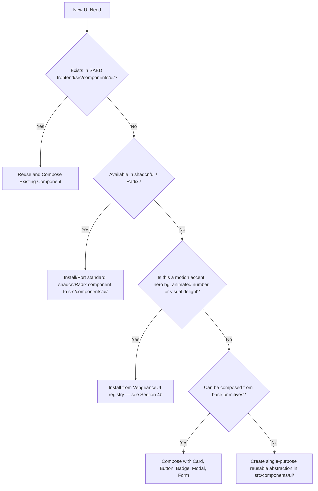

# SAED Frontend Design & Engineering Skill

> **AUTOMATIC ACTIVATION CONTRACT:**
> This skill MUST be applied automatically to EVERY task touching frontend, UI, UX, components, styling, navigation, forms, tables, dashboards, responsive design, or accessibility across the SAED codebase. No explicit user trigger required.

---

## 1. Visual Identity & Product Philosophy

SAED is a high-reliability Multi-Tenant SaaS platform for residential and organizational management. The UI must convey:
- **Enterprise Sobriety & Trust:** Clean, sharp, structured data density suitable for real-estate operators and administrators.
- **Clarity & Efficiency:** High contrast, legible typography, minimal visual noise, zero gratuitous decorations.
- **Strict Anti-Patterns (NEVER DO):**
  - ❌ No generic "AI-generated" rainbow gradients or neon glows.
  - ❌ No oversized cards or inflated padding that destroys information density.
  - ❌ No emojis as primary UI icons (use standard Lucide / Material Symbols).
  - ❌ No excessive border radiuses (stick to SAED standard `rounded-lg` / `rounded-xl`).
  - ❌ No decorative animations that delay user workflows.
  - ❌ No hardcoded arbitrary color utilities (e.g. `bg-blue-500`, `text-gray-700`) when semantic tokens exist.

---

## 2. Hierarchy of Authority

When design or implementation approaches diverge, follow this strict priority:

```
1. SAED Existing Architecture (React 18 + Vite + Tailwind CSS)
   ↓
2. SAED Design System Rules (docs/frontend/SAED_DESIGN_SYSTEM.md)
   ↓
3. shadcn/ui Official Components & Patterns (https://ui.shadcn.com)
   ↓
3.5. VengeanceUI Animated Components (https://vengeanceui.com) — motion accents ONLY
   ↓
4. Radix UI Primitives (Behavior, Focus Management, ARIA & A11y)
   ↓
5. Frontend Production Standards (codex-frontend-skill)
   ↓
6. Frontend Design Systems Architecture (tokens, rhythm, spacing)
   ↓
7. General React / Tailwind Best Practices
```

*Note: Never introduce unapproved component libraries (Material UI, Ant Design, Chakra, Vue, Angular, Next.js).*

---

## 3. Design Tokens & Semantic Styling System

All styles must consume CSS variables and semantic tokens mapped in `tailwind.config.js` and `src/index.css`:

| Token | Semantic Purpose | Tailwind Class |
| :--- | :--- | :--- |
| **Surface / Card** | Container backgrounds, panels, cards | `bg-card text-card-foreground`, `bg-surface` |
| **Background** | Page viewport background | `bg-background text-foreground` |
| **Primary** | Primary brand actions, key callouts | `bg-primary text-primary-foreground`, `text-primary` |
| **Secondary** | Secondary actions, neutral badges | `bg-secondary text-secondary-foreground` |
| **Muted** | Subdued text, subtle backgrounds | `text-muted-foreground`, `bg-muted` |
| **Destructive** | Sanciones, multas, cancelaciones, borrados | `bg-destructive text-destructive-foreground` |
| **Success / Active**| Estados activos, pagos aprobados, OK | `bg-emerald-500/10 text-emerald-600 dark:text-emerald-400` |
| **Border / Input** | Card borders, dividers, form inputs | `border-border`, `border-input` |
| **Ring** | Focus rings for accessible navigation | `ring-2 ring-primary/20 ring-offset-2` |

---

## 4. Component Lifecycle & Selection Protocol

Before writing any new component, follow this mandatory decision flow:



### Prohibición de Duplicidad
- ❌ Prohibido crear variaciones duplicadas: `CustomTable`, `BetterModal`, `SuperTable`, `NewButton`.
- ✅ Extender los componentes base existentes mediante props o variantes `cva` (Class Variance Authority).

---

## 4b. VengeanceUI — Motion Accent Library

VengeanceUI is **pre-installed** in the SAED frontend and available via the `@vengeanceui` registry alias.
Install path: `frontend/src/components/ui/<name>.tsx`
Registry alias: `@vengeanceui` → `https://raw.githubusercontent.com/Ashutoshx7/VengeanceUI/main/public/r/{name}.json`

### Install Command (use in frontend/ directory)
```bash
npx shadcn@latest add https://raw.githubusercontent.com/Ashutoshx7/VengeanceUI/main/public/r/<component-name>.json --yes --overwrite --cwd ./frontend
```

### Already Installed Components
| Component | File | Use Case |
| :--- | :--- | :--- |
| `AnimatedRays` | `animated-rays.tsx` | Aurora/gradient hero background with dark mode detection |

### Recommended Components to Install On Demand
These are the highest-value VengeanceUI components for SAED's SaaS context. Install only when the specific need arises:

| Component | Registry Name | Best Use in SAED |
| :--- | :--- | :--- |
| Animated Number | `animated-number` | KPI counters in dashboards (unidades ocupadas, pagos pendientes) |
| Border Beam | `border-beam` | Highlight active card or selected item |
| Animated Button | `animated-button` | Primary CTA buttons (login, crear, publicar) |
| Animated Tooltip | `animated-tooltip` | Avatar stacks, user presence indicators |
| Cursor Card | `cursor-card` | Feature highlight cards on dashboards |
| Animated Rays | `animated-rays` | ✅ Already installed — page/section hero backgrounds |
| Aurora Hero | `aurora-hero` | Login page / landing hero section |
| Code Block | `code-block` | Display API keys, SQL snippets, reference codes |
| Copy Button | `copy-button` | Alongside code blocks, QR codes, reference numbers |
| Skeleton | (use shadcn) | Loading states — prefer shadcn `Skeleton` over VengeanceUI |

### When to Use VengeanceUI — Decision Rules

**✅ USE VengeanceUI when:**
- Building or improving a **Dashboard hero** section (animated stats, KPI numbers)
- Improving a **Login / splash page** (animated background, aurora effect)
- Adding **micro-interactions** to primary action buttons (hover shine, border beam on focus)
- Creating **empty state illustrations** with subtle motion (when no standard icon suffices)
- Adding **animated counters** to KPI metrics (e.g., "152 unidades registradas")
- Improving **onboarding modals** or feature highlight cards with cursor effects

**❌ DO NOT USE VengeanceUI on:**
- Data tables, forms, filters, or any operational screen where motion would interfere with usability
- Pagination controls, status badges, or state machine indicators
- Any element that must render in under 16ms without layout shift
- Screens viewed by PORTERO role (high-urgency, distraction-free operational context)
- Toast notifications, alerts, or error messages

### SAED Visual Anti-Pattern Override
Even though VengeanceUI is approved, the SAED anti-patterns in Section 1 still apply:
- ❌ No neon glows on data-dense screens
- ❌ No animations that delay form submission or table filtering
- ❌ No auto-playing background effects on screens with active user input (modals, forms)
- ✅ Animations must respect `prefers-reduced-motion` — VengeanceUI components do this by default

---

## 5. Mandatory Screen Construction Checklist

Every screen/page in SAED must satisfy these 6 requirements:

### 1. Robust State Handling (Zero Empty-Assumption UIs)
Every screen fetching async data MUST handle:
- **Loading State:** Render `<Skeleton />` matching the layout or centered spinner.
- **Empty State:** Render `<EmptyState />` with icon, descriptive title, explanation, and action button.
- **Error State:** Display user-friendly error banners or toast notification with retry capability.
- **Success State:** Clear visual feedback upon mutations.

### 2. Form Architecture & Validation
- Standard `<Form />` or controlled inputs with explicit `<Label />`.
- Immediate client-side validation feedback before submission.
- Disabled buttons with loading indicator during flight: `<Button disabled={isSubmitting}>`.
- Keyboard accessible: Enter submits, Escape dismisses modals.

### 3. Data Tables
- Responsive horizontal scroll with clear headers and aligned columns (numbers right-aligned, text left-aligned, status centered).
- Search input and filtering controls.
- Pagination or virtualized limits.
- Action dropdowns with clear distinction for destructive actions.

### 4. Dashboards & Information Hierarchy
- High-level KPIs in `<Card />` components (3 to 4 key metrics max per row).
- Recent activity / operational table below KPI row.
- Zero visual fluff: every metric must correspond to real business value.

### 5. Multi-Role Domain Separation
- **`SUPERADMIN` (Scope GLOBAL):** ONLY platform management (Organizaciones, Propiedades en catálogo, Planes SaaS, Membresías, Auditoría Global, Operadores SAED).
- **`ADMIN_PROPIEDAD` (Scope PROPIEDAD):** Copropiedad (Residentes, Visitas, Cartera, Pagos, Multas, Reservas, Obras, Asambleas).
- **`PORTERO` (Scope PORTERIA):** Operación de acceso (Visitas, Paquetes, QR Scanner, Vehículos).
- **`RESIDENTE` (Scope UNIDAD):** Portal de copropietario/habitante (Cuotas, Visitas frecuentes, PQRS, Reservas).

### 6. Accessibility & Keyboard Navigation (A11y)
- Full tab-index navigation order.
- ARIA live regions for async feedback.
- Semantic HTML tags (`<main>`, `<header>`, `<nav>`, `<aside>`, `<section>`, `<article>`).
- Minimum contrast ratio 4.5:1 for normal text, 3:1 for large text / graphical objects.

---

## 6. Execution Workflow for Agents

When requested to build, update, or refactor any frontend view:

1. **Inspect & Classify:** Identify page role (`SUPERADMIN`, `ADMIN_PROPIEDAD`, `PORTERO`, `RESIDENTE`), data dependencies, and layout.
2. **Consult Reference:** Review [`docs/frontend/SAED_DESIGN_SYSTEM.md`](file:///C:/Users/JUAN/Antigravity%20IDE/SAED/docs/frontend/SAED_DESIGN_SYSTEM.md).
3. **Assemble with Tokens:** Use semantic Tailwind classes and existing shadcn components (`Card`, `Button`, `Badge`, `Skeleton`, `Table`).
4. **Implement All States:** Build loading skeletons, empty state, and error handling.
5. **Verify Build & Types:** Execute `npm run build` in `frontend` to guarantee clean bundling.
