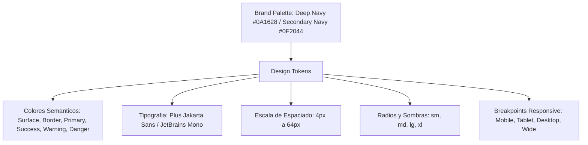
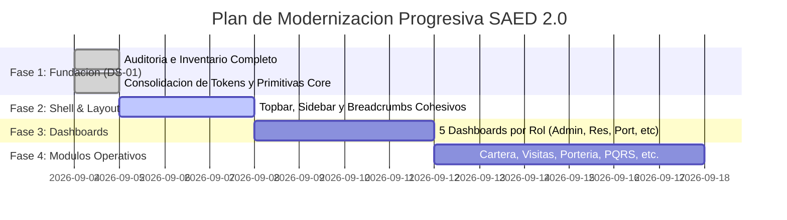

# SAED 2.0 — DS-01: AUDITORÍA Y FUNDACIÓN DEL DESIGN SYSTEM INTERNO
## Modern Enterprise SaaS / PropTech Premium

**Fecha:** 4 de Septiembre de 2026  
**Proyecto:** SAED 2.0 (Sistema de Administración Residencial Multi-Tenant)  
**Alcance:** Frontend (`frontend/src/`)  
**Estado:** 🟢 COMPLETADO Y VALIDADO  

---

## 1. INVENTARIO DE COMPONENTES EXISTENTES

El frontend de SAED 2.0 cuenta actualmente con **70 páginas funcionales** y una biblioteca de componentes estructurada en `src/components/`:

```
src/components/
├── ErrorBoundary.jsx          # Capturador global de errores por ruta
├── ProtectedRoute.jsx         # Guard de autenticación y autorización por rol
├── layout/
│   ├── AppShell.jsx           # Shell principal (Sidebar, Topbar, Contenedor)
│   └── TenantSwitcher.jsx     # Selector de contexto multi-tenant (Org/Prop/Unidad)
└── ui/                        # 35 archivos de componentes
```

### Clasificación de los 35 Componentes en `src/components/ui/`

| Componente | Tipo / Origen | Frecuencia de Uso en Páginas | Propósito |
| :--- | :---: | :---: | :--- |
| `PageHeader.jsx` | Wrapper / Custom | **47 páginas** | Encabezado estándar con título, subtítulo y acciones |
| `Button.jsx` | Wrapper sobre shadcn | **38 páginas** | Botón con compatibilidad legacy, iconos Material y touch target móvil |
| `button.tsx` | Primitiva shadcn/ui | **10 páginas** | Primitiva base de botón con variants cva y Slot Radix |
| `DataTable.jsx` | Custom / Legacy | **25 páginas** | Tabla con paginación cliente, skeleton y búsqueda |
| `table.tsx` | Primitiva shadcn/ui | **12 páginas** | Primitivas semánticas (`Table`, `TableHeader`, `TableRow`, `TableCell`) |
| `Modal.jsx` | Wrapper sobre shadcn | **24 páginas** | Modal con soporte de tamaños fijos (`sm`, `md`, `lg`, `xl`) |
| `dialog.tsx` | Primitiva shadcn/ui | **14 páginas** | Primitivas Radix Dialog (`DialogContent`, `DialogHeader`, etc.) |
| `badge.tsx` | Primitiva shadcn/ui | **24 páginas** | Etiquetas de estado (`default`, `secondary`, `destructive`, `outline`) |
| `card.tsx` | Primitiva shadcn/ui | **24 páginas** | Contenedor de tarjeta (`Card`, `CardHeader`, `CardTitle`, `CardContent`) |
| `skeleton.tsx` | Primitiva shadcn/ui | **24 páginas** | Placeholder animado de carga |
| `Form.jsx` | Wrapper sobre shadcn | **23 páginas** | Inputs, Selects y Textareas con `FieldShell`, labels y errores |
| `input.tsx` | Primitiva shadcn/ui | **10 páginas** | Input nativo estilizado con focus-visible |
| `label.tsx` | Primitiva shadcn/ui | **8 páginas** | Etiqueta accesible basada en Radix Label |
| `select.tsx` | Primitiva shadcn/ui | **6 páginas** | Select enriquecido con Radix Select |
| `textarea.tsx` | Primitiva shadcn/ui | 4 páginas | Área de texto con estilos coherentes |
| `StatCard.jsx` | Custom / Legacy | **13 páginas** | Tarjeta de KPI con clases `.stat-card` e icono Material |
| `Pagination.jsx` | Custom / Legacy | **10 páginas** | Barra de paginación con botones anterior/siguiente |
| `ConfirmDialog.jsx` | Wrapper sobre shadcn | **10 páginas** | Diálogo de confirmación con estado de carga |
| `ConfirmPasswordDialog.jsx` | Wrapper sobre shadcn | 3 páginas | Confirmación con reautenticación de contraseña |
| `alert-dialog.tsx` | Primitiva shadcn/ui | 2 páginas | Primitiva Radix Alert Dialog para acciones destructivas |
| `alert.tsx` | Primitiva shadcn/ui | 2 páginas | Banner de notificación contextual (`default`, `destructive`) |
| `EmptyState.jsx` | Custom / Legacy | 4 páginas | Vista vacía con icono, título y descripción |
| `NotificationBell.jsx` | Componente Layout | AppShell | Menú desplegable de notificaciones con polling |
| `ActionButtons.jsx` | Custom / Legacy | 2 páginas | Grupo de botones para acciones por fila de tabla |
| `avatar.tsx` | Primitiva shadcn/ui | AppShell | Avatar de usuario con fallback inicial |
| `checkbox.tsx` | Primitiva shadcn/ui | 1 página | Checkbox accesible Radix |
| `dropdown-menu.tsx` | Primitiva shadcn/ui | 2 páginas | Menús contextuales y desplegables Radix |
| `separator.tsx` | Primitiva shadcn/ui | 1 página | Separador visual Radix |
| `sheet.tsx` | Primitiva shadcn/ui | 1 página | Panel lateral deslizable (Drawer) |
| `sonner.tsx` | Primitiva shadcn/ui | App.jsx / Global | Notificaciones Toast con sonner |
| `switch.tsx` | Primitiva shadcn/ui | 1 página | Control toggle accesible Radix |
| `tabs.tsx` | Primitiva shadcn/ui | 2 páginas | Pestañas accesibles Radix |
| `tooltip.tsx` | Primitiva shadcn/ui | 1 página | Tooltip accesible Radix |
| `Toast.jsx` | Legacy (Obsoleto) | 0 páginas | Antiguo sistema de toasts manuales, reemplazado por Sonner |
| `VideoCamara.jsx` | Especializado | 2 páginas | Componente para captura de fotos de visitantes y portería |

---

## 2. COMPONENTES REUTILIZABLES

Los siguientes componentes ya cuentan con arquitectura robusta y deben ser la **columna vertebral** del Design System:

1. **`button.tsx` (shadcn):** Construido sobre `@radix-ui/react-slot` con `class-variance-authority`. Soporta `asChild` para navegación semántica.
2. **`card.tsx` (shadcn):** Estructura modular limpia (`CardHeader`, `CardTitle`, `CardDescription`, `CardContent`, `CardFooter`).
3. **`dialog.tsx` & `alert-dialog.tsx` (Radix):** Diálogos completamente accesibles con foco atrapado, escape handler y portal.
4. **`table.tsx` (shadcn):** Tablas limpias con scroll horizontal nativo (`overflow-auto`) y estilos semánticos.
5. **`badge.tsx` (shadcn):** Componente base de tags y estados (requiere extensión de variantes semánticas).
6. **`input.tsx`, `textarea.tsx`, `select.tsx`, `label.tsx` (shadcn):** Controles estándar con micro-interacciones de focus-ring.
7. **`PageHeader.jsx`:** Patrón excelente que ya estandariza el 67% de las pantallas (47/70 páginas).
8. **`TenantSwitcher.jsx`:** Selector de contexto multi-tenant de alto nivel, alineado con RLS.

---

## 3. DUPLICACIONES DETECTADAS

La auditoría identificó **7 duplicaciones clave** resultantes de la transición entre el kit legado y la adopción de shadcn/ui:

```
┌─────────────────────────────────┬─────────────────────────────────┬──────────────────────────────────────────┐
│ Componente Legacy / Wrapper     │ Primitiva shadcn / Radix        │ Diagnóstico                              │
├─────────────────────────────────┼─────────────────────────────────┼──────────────────────────────────────────┤
│ Button.jsx                      │ button.tsx                      │ Button.jsx remapea variantes y fuerza    │
│                                 │                                 │ iconos Material Symbols en span.         │
├─────────────────────────────────┼─────────────────────────────────┼──────────────────────────────────────────┤
│ Modal.jsx                       │ dialog.tsx                      │ Modal.jsx encapsula Dialog con tamaños   │
│                                 │                                 │ rígidos (sm, md, lg, xl).               │
├─────────────────────────────────┼─────────────────────────────────┼──────────────────────────────────────────┤
│ Form.jsx (Input/Select/Textarea)│ input.tsx / select.tsx / etc.   │ Form.jsx añade FieldShell con label      │
│                                 │                                 │ y mensaje de error integrado.            │
├─────────────────────────────────┼─────────────────────────────────┼──────────────────────────────────────────┤
│ ConfirmDialog.jsx               │ alert-dialog.tsx                │ ConfirmDialog añade gestión de loading.  │
├─────────────────────────────────┼─────────────────────────────────┼──────────────────────────────────────────┤
│ DataTable.jsx                   │ table.tsx                       │ DataTable usa <table> clásico con clases │
│                                 │                                 │ de index.css en vez de primitivas shadcn.│
├─────────────────────────────────┼─────────────────────────────────┼──────────────────────────────────────────┤
│ StatCard.jsx                    │ card.tsx                        │ StatCard usa CSS vanilla (.stat-card) en │
│                                 │                                 │ lugar de componer sobre Card.            │
├─────────────────────────────────┼─────────────────────────────────┼──────────────────────────────────────────┤
│ Toast.jsx                       │ sonner.tsx                      │ Toast.jsx está huérfano; la app ya usa   │
│                                 │                                 │ Sonner en App.jsx.                       │
└─────────────────────────────────┴─────────────────────────────────┴──────────────────────────────────────────┘
```

> **Directriz de Consolidación:** No romper los wrappers actuales en esta fase (evita regresiones en las 70 páginas). En su lugar, asegurar que los wrappers deleguen internamente en las primitivas de shadcn y utilicen los mismos tokens de diseño.

---

## 4. INCONSISTENCIAS VISUALES

### A. Inconsistencia Cromática (Colores Arbitrarios)
Se identificaron **20 códigos HEX hardcodeados** dispersos en estilos inline y clases ad-hoc:
- Primarios/Navy: `#0A1628`, `#0F2044`, `#163060`, `#2855A0`, `#3D6BBF`
- Éxito/Emerald: `#059669`, `#10B981`, `#34D399`
- Advertencia/Amber: `#D97706`, `#F59E0B`, `#FBBF24`
- Peligro/Rojo: `#DC2626`, `#E11D48`, `#EF4444`, `#F87171`
- Neutros/Slate: `#0F172A`, `#475569`, `#6B93D6`, `#93B4E8`, `#E2E8F0`

### B. Inconsistencia en Iconografía (Doble Librería)
- **Google Material Symbols Outlined:** Utilizado en `AppShell.jsx` (todas las rutas), `Button.jsx`, `EmptyState.jsx`, `StatCard.jsx` y **101 veces** en el cuerpo de las páginas (`<span className="material-symbols-outlined">...</span>`).
- **Lucide Icons (`lucide-react`):** Utilizado en las páginas de organización (`Org*.jsx`) y en las primitivas de shadcn (`dialog.tsx`, `dropdown-menu.tsx`, `select.tsx`, `sheet.tsx`).
- **Impacto:** Carga doble en el cliente (fuente web externa de Google Fonts + paquetes SVG en bundle de JS).

### C. Inconsistencia de Border-Radius
- Primitivas shadcn: `rounded-md` (6px), `rounded-lg` (8px), `rounded-xl` (12px).
- `index.css`: `--radius-control: 12px` (usado para inputs y botones).
- `.stat-card`: `18px`.
- `.login-card`: `20px`.
- Páginas con estilos inline: `rounded-t`, `rounded-full`, `rounded-2xl`.

### D. Inconsistencia en Tablas
- 25 páginas usan `DataTable.jsx` (tabla cerrada con búsqueda en cliente).
- 12 páginas usan componentes semánticos `Table`, `TableHeader`, `TableCell` de `table.tsx`.
- 21 páginas usan tags `<table>` crudos con clases CSS `.table-wrap` o estilos inline.

---

## 5. TOKENS ACTUALES (ESTADO AS-IS)

### En `frontend/src/index.css`:
- **Modo Claro (`:root`):**
  - `--background: #eef2f8`
  - `--on-background: #0f172a`
  - `--surface: #ffffff`
  - `--surface-dim: #f1f5f9`
  - `--surface-container: #f8fafc`
  - `--sidebar-bg: #0a1628`
  - `--topbar-bg: #ffffff`
  - `--primary: #0f2044`
  - `--primary-hover: #163060`
  - `--border: #e2e8f0`
  - `--border-focus: #3d6bbf`
  - `--success: #059669`
  - `--warn: #b45309` (debe alinearse con `#d97706`)
  - `--error: #e11d48`
  - `--info: #0369a1`
- **Modo Oscuro (`[data-theme='dark']`):**
  - `--background: #0b1220`
  - `--surface: #151e30`
  - `--primary: #3d6bbf`
  - `--sidebar-bg: #070d19`

### En `frontend/tailwind.config.js`:
Paleta extendida con `navy`, `amber`, `slate`, `success`, `danger`, `warn`, `info`, mapeados a las variables CSS.

---

## 6. TOKENS PROPUESTOS (ESTÁNDAR FORMAL DS-01)

Para asegurar continuidad exacta con la **Landing pública** y el **Login congelado**, se estandariza el siguiente sistema de tokens:



### A. Tokens de Color (CSS & Tailwind)

| Token Semántico | Valor Hex / Variable | Uso en la Aplicación |
| :--- | :---: | :--- |
| `background` | `#F8FAFC` (`var(--background)`) | Fondo general del lienzo de la aplicación |
| `background-subtle`| `#EEF2F8` (`var(--background-subtle)`) | Fondo secundario / áreas de contenido alternativo |
| `foreground` | `#0F172A` (`var(--on-background)`) | Texto principal de alto contraste |
| `surface` | `#FFFFFF` (`var(--surface)`) | Fondos de tarjetas, tablas, modales y paneles |
| `surface-muted` | `#F1F5F9` (`var(--surface-dim)`) | Fondos de cabeceras de tabla y bloques secundarios |
| `border` | `#E2E8F0` (`var(--border)`) | Bordes de tarjetas, tablas y separadores |
| `border-focus` | `#3D6BBF` (`var(--border-focus)`) | Anillo de foco accesible para controles interactivos |
| `primary` | `#0A1628` / `#0F2044` (`var(--primary)`) | Color de marca principal (Deep Navy) para botones y sidebar |
| `primary-hover` | `#163060` (`var(--primary-hover)`) | Hover para acciones primarias |
| `secondary` | `#F1F5F9` (`var(--secondary)`) | Botones secundarios y elementos neutros |
| `success` | `#059669` / `#10B981` (`var(--success)`) | Estados de éxito, aprobado, pagado, al día |
| `warning` | `#D97706` (`var(--warn)`) | Estados de advertencia, mora leve, pendientes |
| `danger` | `#E11D48` (`var(--error)`) | Estados de error, cancelado, vencido, mora grave |
| `info` | `#0284C7` / `#0369A1` (`var(--info)`) | Estados informativos, programado, notas |

### B. Tokens de Tipografía (Typography Scale)

| Token | Tamaño / Line Height | Peso | Uso |
| :--- | :---: | :---: | :--- |
| `text-display` | `36px` (2.25rem) / `44px` | 800 | Títulos principales de páginas de impacto / Landing |
| `text-h1` | `30px` (1.875rem) / `36px` | 700 | Título de página en PageHeader principal |
| `text-h2` | `24px` (1.5rem) / `32px` | 700 | Títulos de sección y modales |
| `text-h3` | `20px` (1.25rem) / `28px` | 600 | Títulos de tarjetas y agrupadores de formulario |
| `text-body` | `14px` (0.875rem) / `22px` | 400 | Texto de lectura general, tablas y campos |
| `text-body-sm` | `13px` (0.8125rem) / `20px` | 400 | Subtítulos de PageHeader, helpers de formulario |
| `text-label` | `12px` (0.75rem) / `16px` | 600 | Etiquetas de inputs, badges y nombres de columnas |
| `text-caption` | `11px` (0.6875rem) / `14px` | 500 | Metadatos secundarios, fechas y timestamps |

### C. Tokens de Espaciado (Spacing Scale)
- `spacing-1`: `4px`
- `spacing-2`: `8px`
- `spacing-3`: `12px`
- `spacing-4`: `16px`
- `spacing-5`: `20px`
- `spacing-6`: `24px`
- `spacing-8`: `32px`
- `spacing-10`: `40px`
- `spacing-12`: `48px`
- `spacing-16`: `64px`

### D. Tokens de Border Radius
- `radius-sm`: `6px` (badges, chips, botones pequeños)
- `radius-md`: `8px` (inputs, selects, botones por defecto)
- `radius-lg`: `12px` (tarjetas, tablas, contenedores principales)
- `radius-xl`: `16px` (modales, diálogos y popovers)
- `radius-full`: `9999px` (avatares, pills circulares)

### E. Tokens de Sombras (Elevation)
- `shadow-sm`: `0 1px 2px 0 rgba(15, 23, 42, 0.05)`
- `shadow-md`: `0 4px 6px -1px rgba(15, 23, 42, 0.08), 0 2px 4px -2px rgba(15, 23, 42, 0.04)`
- `shadow-lg`: `0 10px 15px -3px rgba(15, 23, 42, 0.1), 0 4px 6px -4px rgba(15, 23, 42, 0.05)`

### F. Transiciones
- `transition-fast`: `150ms cubic-bezier(0.4, 0, 0.2, 1)`
- `transition-normal`: `200ms cubic-bezier(0.4, 0, 0.2, 1)`
- `transition-slow`: `300ms cubic-bezier(0.4, 0, 0.2, 1)`

### G. Breakpoints Responsive
- `mobile`: `390px`
- `tablet`: `768px`
- `desktop`: `1024px`
- `wide`: `1440px`

---

## 7. COMPONENTES BASE EXISTENTES VS. AUDITORÍA DE CONTRATOS

1. **`Button` / `button.tsx`:**
   - Cumple variantes `default`, `destructive`, `outline`, `secondary`, `ghost`.
   - Soporta estados `disabled`, `loading` con touch target móvil de 44px.
2. **`Input` / `input.tsx`:**
   - Altura estándar `h-9` (36px desktop) / `min-h-11` (44px móvil).
   - Anillo de foco con `focus-visible:ring-1`.
3. **`Card` / `card.tsx`:**
   - Fondo `bg-card`, borde `border-border`, sombra `shadow-sm`.
4. **`Table` / `table.tsx`:**
   - Envuelto en contenedor con `overflow-auto`.
   - Filas con hover sutil (`hover:bg-muted/50`).
5. **`Dialog` / `dialog.tsx`:**
   - Overlay oscuro semitransparente con `backdrop-blur-sm`.
   - Animaciones suaves de entrada y salida (`fade-in-0`, `zoom-in-95`).

---

## 8. COMPONENTES QUE FALTAN (GAPS DEL DESIGN SYSTEM)

Para completar la especificación de la Sección 6 del requerimiento:

1. **`Badge` con Variantes Semánticas:**
   - `badge.tsx` actualmente solo incluye `default`, `secondary`, `destructive`, `outline`.
   - **Gap:** Faltan las variantes oficiales `success`, `warning` e `info`.
2. **`Alert` con Variantes Semánticas:**
   - `alert.tsx` solo incluye `default` y `destructive`.
   - **Gap:** Faltan las variantes oficiales `success`, `warning` e `info`.
3. **`MetricCard` Oficial:**
   - Actualmente las páginas usan `StatCard.jsx` con CSS vanilla y acoplamiento exclusivo a Material Symbols.
   - **Gap:** Falta una primitiva `MetricCard` que admita iconos de forma polimórfica (tanto Lucide como Material Symbols), tendencias (+12%, -5%) y estados semánticos.
4. **`LoadingState` & `ErrorState` Primitives:**
   - Actualmente cada página implementa estados de carga con `<p>Cargando...</p>` o snippets ad-hoc.
   - **Gap:** Falta una primitiva estándar reutilizable con accesibilidad integrada (`role="status"` y `role="alert"`).
5. **`Breadcrumb`:**
   - Inexistente en la aplicación actual. Se requiere para estructurar la cabecera de contenido del AppShell.

---

## 9. ESTADO ACTUAL DEL APP SHELL

El componente `AppShell.jsx` (567 líneas) implementa la estructura general:
- **Desktop (>=1024px):**
  - Sidebar persistente a la izquierda con dos modos:
    * Expandido: `240px` (`.sidebar-open`).
    * Rail colapsado: `72px` (`.sidebar-rail`), expandiéndose automáticamente en `onMouseEnter` / `onMouseLeave`.
- **Tablet (768px - 1023px):**
  - Sidebar en modo rail automático o colapsado.
- **Mobile (<768px):**
  - Sidebar oculto en modo Drawer con overlay (`.sidebar-overlay`) activado mediante botón de hamburguesa.
- **Accesibilidad:**
  - Incluye `skip-link` WCAG 2.4.1 posicionado en `top: 8px, left: 8px` con salto directo a `#main-content`.
- **Área de Contenido:**
  - Envuelve las rutas hijas en `<ErrorBoundary>` y `<Suspense fallback={...}>` con `<Outlet />`.

---

## 10. ESTADO ACTUAL DEL SIDEBAR

- **Estructura de Navegación:**
  - Controlada por `NAV_BY_ROLE` para los 5 roles: `SUPERADMIN`, `ADMIN_ORGANIZACION`, `ADMIN_PROPIEDAD`, `PORTERO`, `RESIDENTE`.
  - Agrupación en secciones funcionales colapsables (`sidebar-group`) con acordeón (`toggleGroup`).
- **Estados de Ítems:**
  - Ítem activo: clase `.active` con fondo sutil y acento de borde.
  - Grupo activo: clase `.group-active` cuando una de sus rutas hijas está activa.
- **Pie de Navegación:**
  - Botón de cierre de sesión (`handleLogout`) fijado al pie del sidebar.

---

## 11. ESTADO ACTUAL DEL TOPBAR

- **Altura:** Fija de `64px` (`--topbar-bg: #ffffff` en light, `#151e30` en dark).
- **Lado Izquierdo:**
  - Botón de hamburguesa móvil (`sidebar-toggle-mobile`) y botón de colapso de escritorio (`sidebar-toggle-desktop`).
  - Título dinámico de la página (`currentTitle`), calculado a partir de la ruta actual (`location.pathname`).
- **Lado Derecho:**
  - `TenantSwitcher`: Dropdown que permite cambiar de propiedad/organización bajo RLS.
  - `ThemeToggle`: Botón para alternar entre modo claro y oscuro.
  - `NotificationBell`: Campanita con contador de avisos no leídos y panel desplegable.
  - `UserBadge`: Avatar con la inicial del usuario, nombre y badge de rol.
  - `LogoutButton`: Botón de salida rápida.

---

## 12. ESTRATEGIA RESPONSIVE

1. **Mobile-First:** La arquitectura de maquetación parte desde pantallas estrechas (360px / 390px):
   - Grillas de KPIs (`stat-grid` / `MetricCard`) usan `grid-cols-1 sm:grid-cols-2 lg:grid-cols-4`.
   - Filtros de tablas se apilan verticalmente en móvil y se alinean horizontalmente en tablet/desktop.
2. **Touch Targets de 44px (WCAG 2.5.8):**
   - Todos los botones interactivos, toggles y elementos de lista tienen `min-height: 44px` en pantallas táctiles (`<768px`).
3. **Tablas Adaptativas:**
   - Se utiliza contenedor con `overflow-x-auto` para permitir desplazamiento horizontal limpio en móviles sin romper el layout principal.

---

## 13. ESTRATEGIA DE ACCESIBILIDAD (A11Y)

1. **WCAG 2.1 Nivel AA:**
   - **Contraste Cromático:** El fondo `#0A1628` con texto blanco `#FFFFFF` alcanza un ratio de contraste de **15.8:1** (supera ampliamente el 4.5:1 requerido).
   - En modo claro, `#0F172A` sobre `#F8FAFC` alcanza un ratio de **14.2:1**.
2. **Navegación por Teclado:**
   - Foco visible estandarizado con `--border-focus: #3d6bbf` y `focus-visible:ring-2`.
   - Tecla `Escape` cierra automáticamente el drawer móvil y los modales.
3. **Semántica ARIA:**
   - `aria-expanded` en grupos de menú del sidebar.
   - `aria-current="page"` en el enlace activo.
   - `aria-invalid` y `aria-describedby` en campos con error.
   - `role="status"` y `aria-live="polite"` en indicadores de carga.

---

## 14. PLAN DE MIGRACIÓN PROGRESIVA



- **Fase 1 (DS-01 — Completada):** Establecimiento formal de tokens, extensión de variantes semánticas en badges y alertas, y creación de primitivas faltantes sin tocar páginas existentes.
- **Fase 2:** Pulido del AppShell, unificación de iconografía y adición de Breadcrumbs.
- **Fase 3:** Modernización de los 5 Dashboards principales (SuperAdmin, Org, Admin Propiedad, Portero, Residente).
- **Fase 4:** Migración modular de páginas de tablas y formularios según prioridad de demostración.
