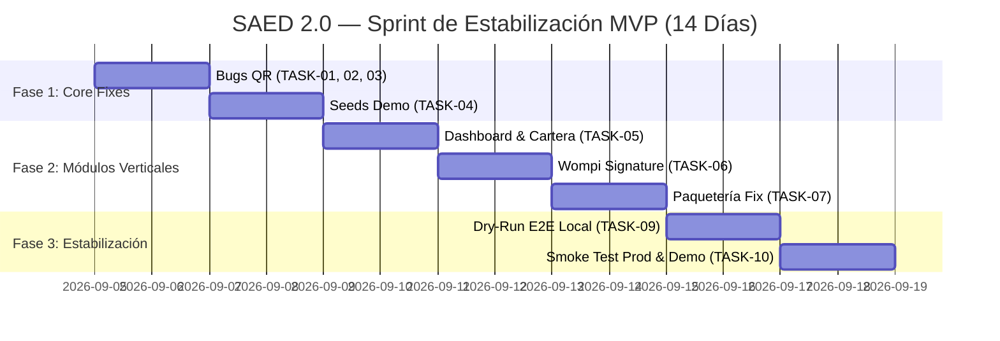

# SAED 2.0 — MVP-01: PRODUCT DISCOVERY & FUNCTIONAL AUDIT REPORT
**Fecha:** 2026-09-04  
**Tipo de Auditoría:** Funcional y de Producto (Read-Only)  
**Objetivo:** Determinar el estado real del repositorio para consolidar un MVP funcional, estable y demostrable en 14 días.  
**Compromiso:** Cero modificaciones de código, cero migraciones, componentes congelados intocados.

---

## ÍNDICE GENERAL

1. [Parte 1 — Inventario del Proyecto](#parte-1--inventario-del-proyecto)
2. [Parte 2 — Matriz Funcional](#parte-2--matriz-funcional)
3. [Parte 3 — Análisis de Roles](#parte-3--análisis-de-roles)
4. [Parte 4 — Auditoría de Flujos E2E del MVP (A a G)](#parte-4--auditoría-de-flujos-e2e-del-mvp)
5. [Parte 5 — Alcance del MVP (P0, P1, P2, OUT_OF_MVP)](#parte-5--alcance-del-mvp)
6. [Parte 6 — Registro de Bugs Funcionales](#parte-6--registro-de-bugs-funcionales)
7. [Parte 7 — Funcionalidades Incompletas](#parte-7--funcionalidades-incompletas)
8. [Parte 8 — Estrategia y Datos para la Demo](#parte-8--estrategia-y-datos-para-la-demo)
9. [Parte 9 — Auditoría de Dashboards](#parte-9--auditoría-de-dashboards)
10. [Parte 10 — Auditoría UX y Navegación](#parte-10--auditoría-ux-y-navegación)
11. [Parte 11 — Diagnóstico de Entornos y Producción](#parte-11--diagnóstico-de-entornos-y-producción)
12. [Parte 12 — Evaluación de Seguridad para el MVP](#parte-12--evaluación-de-seguridad-para-el-mvp)
13. [Parte 13 — Priorización y Backlog de Tareas](#parte-13--priorización-y-backlog-de-tareas)
14. [Parte 14 — Roadmap Realista de 14 Días](#parte-14--roadmap-realista-de-14-días)
15. [Parte 15 — Definition of Done (DoD)](#parte-15--definition-of-done-dod)
16. [Parte 16 — Guión de Presentación de la Demo](#parte-16--guión-de-presentación-de-la-demo)
17. [Parte 17 — Dictamen y Conclusiones Finales](#parte-17--dictamen-y-conclusiones-finales)

---

# PARTE 1 — INVENTARIO DEL PROYECTO

### 1.1 Frontend
- **Total de páginas detectadas:** 70 componentes en `frontend/src/pages/*.jsx`.
- **Enrutador:** `frontend/src/App.jsx` utiliza React Router v6 con lazy-loading en ~70 rutas protegidas mediante `<ProtectedRoute />`.
- **Capa de Control de Acceso (`lib/access.js`):**
  - Mapeo unificado `ACCESS_BY_ROLE` para los 5 roles canónicos: `SUPERADMIN`, `ADMIN_ORGANIZACION`, `ADMIN_PROPIEDAD`, `PORTERO`, `RESIDENTE`.
  - Método `normalizeRole(rol)` mapea transparentemente aliases legacy (`ADMIN`, `ADMINISTRADOR` → `ADMIN_PROPIEDAD`).
  - Redirección raíz `/` mediante `<RoleIndexRedirect />` basada en rol autenticado.
- **Consumo de APIs:** Prácticamente el 100% de las páginas ejecutan llamadas reales HTTP mediante `useFetch`, `api.get/post/put/delete` y `useTenantApi`.
- **Datos Simulados (Mock):** Solo se identificó 1 página con mock: `DocumentosAdminPage.jsx` (utiliza un URL de archivo simulado en S3 antes de persistir la metadata real en `/documentos`).

### 1.2 Backend
- **Total de Controladores:** 51 clases `@RestController` en `backend/src/main/java/com/saed/backend/**`.
- **Persistencia:** Cero métodos stubbed (`return null;` o `UnsupportedOperationException`). Todas las consultas se canalizan mediante `NamedParameterJdbcTemplate` y `JdbcTemplate` con mapeo a tablas físicas de Oracle.
- **Aislamiento Multi-Tenant:** `SaedContextHolder.getContext()` se utiliza sistemáticamente para inyectar `organizationId`, `propertyId`, y `unitId` en las cláusulas SQL y en `PKG_SAED_SESSION`.
- **Seguridad HTTP:** `SecurityConfig.java` restringe todas las rutas excepto `/api/v1/auth/**`, `/api/v1/pagos/wompi/webhook`, `/api/v1/pagos/notificacion`, y documentación OpenAPI.

### 1.3 Base de Datos (Oracle ATP)
- **Tablas del Sistema:** 96 tablas relacionales normalizadas (definidas en `V5.0__master_baseline.sql`).
- **Políticas RLS/VPD:** 91 políticas activas vinculadas a `PKG_SAED_SECURITY_RLS` en `SYS_DEFAULT`.
- **Contexto de Seguridad:** `CREATE CONTEXT SAED_CTX USING SAED_APP.PKG_SAED_SESSION ACCESSED GLOBALLY`.
- **Paquetes de Seguridad:** `PKG_SAED_SESSION` (state machine) y `SAED_SEC_MASTER.PKG_AUTH_BOOTSTRAP` (bypasses autorizados con `AUTHID DEFINER`).
- **Datos Seed:** Migraciones estructurales sin datos de negocio pre-cargados (a excepción de `V4.13__seed_planes.sql`). Los scripts de prueba residen en `database/seeds/` fuera del ciclo de Flyway.

---

# PARTE 2 — MATRIZ FUNCIONAL

| # | Módulo | Frontend | Backend | DB | E2E | Rol Principal | Estado | Prioridad MVP | Evidencia Clave |
|---|--------|----------|---------|----|-----|---------------|--------|---------------|-----------------|
| 1 | Autenticación & JWT | `LoginPage.jsx` | `AuthController`, `MeController` | `USUARIOS`, `ROLES`, `USUARIO_ASIGNACIONES` | 🟢 | Todos | 🟢 COMPLETE | P0 | Emisión JWT, refresh tokens, parseo de claims y contexto. |
| 2 | SuperAdmin SaaS Platform | 8 páginas `SuperAdmin*.jsx` | 4 controladores `Platform*Controller` | `ADMINISTRADORES_SAED`, `PLANES`, `MEMBRESIAS` | 🟢 | `SUPERADMIN` | 🟢 COMPLETE | OUT_OF_MVP | Certificado en `ba46992`. Fuera del demo vertical. |
| 3 | Organización SaaS Console | 6 páginas `Org*.jsx` | 4 controladores `Org*Controller` | `ORGANIZACIONES`, `ORGANIZACION_CONFIG` | 🟢 | `ADMIN_ORGANIZACION` | 🟢 COMPLETE | P1 | Métricas agregadas, suscripciones, gestión de propiedades. |
| 4 | Gestión de Propiedades | `PropiedadesPage.jsx` | `PropertyController` | `PROPIEDADES`, `TIPOS_PROPIEDAD` | 🟢 | `ADMIN_PROPIEDAD` | 🟢 COMPLETE | P0 | CRUD con validación de límites de plan y recursión RLS corregida (`V5.2`). |
| 5 | Unidades / Apartamentos | `UnidadesPage.jsx` | `UnitController` | `UNIDADES`, `TIPOS_UNIDAD` | 🟢 | `ADMIN_PROPIEDAD` | 🟢 COMPLETE | P0 | CRUD, coeficientes de copropiedad, estados de ocupación. |
| 6 | Personas / Habitantes | `PersonasPage.jsx` | `PersonaController` | `PERSONAS`, `HABITANTES_UNIDAD` | 🟢 | `ADMIN_PROPIEDAD` | 🟢 COMPLETE | P0 | CRUD, vinculación a unidades y documentos de identidad. |
| 7 | Residentes | `ResidentesPage.jsx`, `ResPerfilPage.jsx` | `UnitInhabitantController` | `RESIDENTES_UNIDAD`, `PROPIETARIOS_UNIDAD` | 🟢 | `ADMIN_PROPIEDAD`, `RESIDENTE` | 🟢 COMPLETE | P0 | Asignación residente/propietario, datos de contacto. |
| 8 | Roles y Asignaciones | `RolesYAsignacionesPage.jsx` | `AssignmentManagementController` | `USUARIO_ASIGNACIONES` | 🟢 | `ADMIN_PROPIEDAD` | 🟢 COMPLETE | P0 | `TRG_ASIGNACION_VALIDA_SCOPE` valida scopes jerárquicos. |
| 9 | Dashboard Admin Propiedad | `DashboardPage.jsx` | `DashboardController`, `UnitController` | Múltiples | 🟡 | `ADMIN_PROPIEDAD` | 🟡 PARTIAL | P0 | Muestra unidades/personas/contratos/multas. Proyección de cuotas infiere de contratos. |
| 10 | Dashboard Portero | `PorteroDashboardPage.jsx` | `PorteriaController` | `VISITAS`, `REGISTROS_ACCESO` | 🟡 | `PORTERO` | 🟡 PARTIAL | P0 | UI rica (cámara, modal multas), pero enlaza a endpoints legacy `/buzon`. |
| 11 | Dashboard Residente | `ResidenteDashboardPage.jsx` | `ResidentesFinanzasController`, `TicketController` | `CUOTAS`, `VISITAS`, `PQRS` | 🟢 | `RESIDENTE` | 🟢 COMPLETE | P0 | KPIs de saldo, widget Wompi, modal generar QR para visitas. |
| 12 | Registro de Visitas | `VisitasPage.jsx`, `ResVisitaPage.jsx` | `PorteriaController` | `VISITAS`, `VISITANTES` | 🟢 | `RESIDENTE`, `PORTERO` | 🟢 COMPLETE | P0 | Creación de visita y generación de código token QR en backend. |
| 13 | Validación QR en Portería | `EscannerQRPage.jsx` | `PorteriaController` | `QR_ACCESOS`, `SP_VALIDAR_CONSUMIR_QR` | 🔴 | `PORTERO` | 🔴 BROKEN | P0 | Desajuste `codigoQr` vs `token` (BUG-001) y endpoint 404 de notificación (BUG-002). |
| 14 | Paquetería | `PaquetesPage.jsx`, `PaquetesAdminPage.jsx` | `PaquetesController` | `PAQUETES` | 🟡 | `PORTERO`, `RESIDENTE` | 🟡 PARTIAL | P1 | Backend nuevo (`PaqueteDTO`), pero frontend consulta endpoints del Buzón legacy. |
| 15 | Parqueaderos | `ParqueaderosPage.jsx` | `ParqueaderosController` | `PARQUEADEROS`, `VEHICULOS` | 🟢 | `ADMIN_PROPIEDAD`, `PORTERO` | 🟢 COMPLETE | P1 | Asignación de cupos, vehículos registrados y control de visitantes. |
| 16 | Pagos & Recaudos | `PagosPage.jsx`, `ResCuotasPage.jsx` | `PagosController`, `FinanzasController` | `PAGOS`, `CUOTAS` | 🟢 | `ADMIN_PROPIEDAD`, `RESIDENTE` | 🟢 COMPLETE | P0 | Registro de pagos en efectivo/transferencia y actualización de saldo. |
| 17 | Cartera & Saldos | `CarteraPage.jsx` | `CarteraController` | `CUOTAS` (Virtual Column `VALOR_TOTAL`) | 🟢 | `ADMIN_PROPIEDAD` | 🟢 COMPLETE | P0 | Aging de cartera, cuotas vencidas, estados de morosidad. |
| 18 | Pasarela Wompi | `ResidenteDashboardPage.jsx` | `WompiController`, `WompiServiceImpl` | `TRANSACCIONES_PAGO` | 🟡 | `RESIDENTE` | 🟡 PARTIAL | P1 | Webhook C4 certificado; falta generación de firma HMAC en inicio de intención. |
| 19 | PQRS / Quejas | `QuejasAdminPage.jsx`, `ResQuejasPage.jsx` | `TicketController`, `QuejasController` | `PQRS_TICKETS`, `PQRS_TRAZABILIDAD` | 🟢 | `ADMIN_PROPIEDAD`, `RESIDENTE` | 🟢 COMPLETE | P1 | Flujo completo de radicación, trazabilidad y cierre de tickets. |
| 20 | Multas & Convivencia | `MultasPage.jsx`, `SancionesAdminPage.jsx` | `MultasController`, `SancionController` | `MULTAS`, `SANCIONES` | 🟢 | `ADMIN_PROPIEDAD` | 🟢 COMPLETE | P1 | Emisión de multas con foto evidencia y pago aplicado. |
| 21 | Reservas Zonas Comunes | `ReservasAdminPage.jsx`, `ResReservasPage.jsx` | `ReservasController` | `ZONAS_COMUNES`, `RESERVAS` | 🟢 | `ADMIN_PROPIEDAD`, `RESIDENTE` | 🟢 COMPLETE | P2 | Validación de disponibilidad horaria y estados de reserva. |
| 22 | Incidentes de Seguridad | `IncidentesAdminPage.jsx`, `ResIncidentesPage.jsx` | `IncidenteController` | `INCIDENTES`, `INCIDENTE_INVOLUCRADOS` | 🟢 | `PORTERO`, `ADMIN_PROPIEDAD` | 🟢 COMPLETE | P2 | Reporte de incidentes con nivel de severidad y seguimiento. |
| 23 | Buzón & Comunicados | `AvisosPage.jsx`, `ResBuzonPage.jsx` | `ComunicadosController`, `BuzonController` | `COMUNICADOS`, `NOTIFICACIONES` | 🟢 | `ADMIN_PROPIEDAD`, `RESIDENTE` | 🟢 COMPLETE | P2 | Publicación de avisos generales y lectura individualizada. |
| 24 | Alertas Administrativas | `AlertasPage.jsx` | `AlertasController` | `ALERTAS_ADMIN` | 🟢 | `ADMIN_PROPIEDAD` | 🟢 COMPLETE | P2 | Creado en V4.9 con RLS dedicado (`POL_RLS_PROP_ALERTAS`). |
| 25 | Documentos de la Copropiedad | `DocumentosAdminPage.jsx` | `DocumentoController` | `DOCUMENTOS` | 🟡 | `ADMIN_PROPIEDAD` | 🟡 PARTIAL | OUT_OF_MVP | Mock en carga binaria de archivo (URL falso). |
| 26 | Obras & Reformas | `ObrasAdminPage.jsx`, `ResObrasPage.jsx` | `ObraController` | `OBRAS` | 🟢 | `ADMIN_PROPIEDAD`, `RESIDENTE` | 🟢 COMPLETE | OUT_OF_MVP | Completo en BD y código, no prioritario para demo. |
| 27 | Mantenimiento & Activos | `MantenimientoAdminPage.jsx` | `MantenimientoController` | `MANTENIMIENTOS`, `ACTIVOS` | 🟢 | `ADMIN_PROPIEDAD` | 🟢 COMPLETE | OUT_OF_MVP | No esencial para el núcleo vertical del MVP. |
| 28 | Asambleas & Votaciones | `AsambleasAdminPage.jsx` | `AsambleaController` | `ASAMBLEAS`, `ACTAS_ASAMBLEA` | 🟢 | `ADMIN_PROPIEDAD` | 🟢 COMPLETE | OUT_OF_MVP | Funcionalidad avanzada anual/semestral. |
| 29 | Pólizas de Seguro | `PolizasAdminPage.jsx` | `PolizaSeguroController` | `POLIZAS_SEGURO` | 🟢 | `ADMIN_PROPIEDAD` | 🟢 COMPLETE | OUT_OF_MVP | Módulo de archivo corporativo. |
| 30 | Planes de Emergencia | `EmergenciasAdminPage.jsx` | `EmergenciaController` | `PLANES_EMERGENCIA` | 🟢 | `ADMIN_PROPIEDAD` | 🟢 COMPLETE | OUT_OF_MVP | Módulo complementario. |
| 31 | Contratos de Residentes | `ContratosPage.jsx` | `ContratosController` | `CONTRATOS` | 🟢 | `ADMIN_PROPIEDAD` | 🟢 COMPLETE | P1 | Canon mensual, vigencias y control de prórrogas. |
| 32 | Contratos de Proveedores | `ContratosProveedorPage.jsx` | `ContratosAdminController` | `CONTRATOS_PROVEEDOR` | 🟢 | `ADMIN_PROPIEDAD` | 🟢 COMPLETE | OUT_OF_MVP | Gestión de compras/servicios externos. |
| 33 | Presupuestos & Gastos | `PresupuestoPage.jsx`, `GastosPage.jsx` | `PresupuestoController`, `GastosController` | `PRESUPUESTOS`, `GASTOS` | 🟢 | `ADMIN_PROPIEDAD` | 🟢 COMPLETE | P2 | Ejecución presupuestal y registro de egresos. |
| 34 | Conciliación & Flujo Caja | `ConciliacionPage.jsx`, `FlujoCajaPage.jsx` | `ConciliacionController`, `FlujoCajaController` | Tablas financieras | 🟢 | `ADMIN_PROPIEDAD` | 🟢 COMPLETE | OUT_OF_MVP | Contabilidad analítica avanzada. |

---

# PARTE 3 — ANÁLISIS DE ROLES

### 1. `SUPERADMIN` (Platform SaaS)
- **Login:** `/login` con credenciales de `ADMINISTRADORES_SAED`.
- **Dashboard:** `/superadmin/dashboard` (KPIs globales de organizaciones, suscripciones y ARR).
- **Rutas y Menú:** `/superadmin/organizaciones`, `/superadmin/propiedades`, `/superadmin/planes`, `/superadmin/membresias`, `/superadmin/administradores`, `/superadmin/auditoria`.
- **Restricciones:** Aislado estrictamente de datos operativos de residentes/visitas (Zero-Trust).
- **Estado:** 🟢 **COMPLETE** (Certificado en `ba46992`).

### 2. `ADMIN_ORGANIZACION` (Console Inmobiliaria/Copropiedad)
- **Login:** `/login` con asignación de alcance `ORGANIZACION`.
- **Dashboard:** `/org/dashboard` (KPIs consolidados de propiedades, unidades y morosidad general).
- **Rutas y Menú:** `/org/organizacion`, `/org/propiedades`, `/org/admins`, `/org/plan`, `/org/auditoria`.
- **Restricciones:** Solo observa copropiedades bajo su `id_organizacion` (`SYS_CONTEXT('SAED_CTX', 'ID_ORGANIZACION')`).
- **Estado:** 🟢 **COMPLETE**.

### 3. `ADMIN_PROPIEDAD` (Administrador Operativo de Conjunto/Edificio)
- **Login:** `/login` con asignación de alcance `PROPIEDAD`.
- **Dashboard:** `/dashboard` (KPIs de personas, unidades, contratos y multas pendientes).
- **Rutas y Menú:** `/personas`, `/unidades`, `/residentes`, `/visitas`, `/pagos`, `/cartera`, `/parqueaderos`, `/quejas-admin`, etc.
- **Restricciones:** Bloqueo RLS a nivel de motor para cualquier registro fuera de su `id_propiedad`.
- **Estado:** 🟢 **COMPLETE / PARTIAL** (requiere ajuste menor en dashboard de cuotas).

### 4. `PORTERO` (Operador de Control de Acceso y Recepción)
- **Login:** `/login` con rol asignado `PORTERO`.
- **Dashboard:** `/portero-dashboard` (Accesos rápidos a Visitas, Paquetes, Parqueaderos y Escáner QR).
- **Rutas y Menú:** `/portero-dashboard`, `/visitas`, `/paquetes`, `/parqueaderos`, `/escanner-qr`, `/incidentes-admin`.
- **Restricciones:** No tiene acceso a finanzas, contratos, cartera ni edición de unidades.
- **Estado:** 🟡 **PARTIAL / BROKEN** (Escáner QR bloqueado por bugs de integración).

### 5. `RESIDENTE` (Copropietario o Arrendatario de Unidad)
- **Login:** `/login` con rol asignado `RESIDENTE`.
- **Dashboard:** `/residente-dashboard` (Saldo pendiente, botón de pago Wompi, estado de cuota, invitación QR).
- **Rutas y Menú:** `/res-perfil`, `/res-apartamento`, `/res-cuotas`, `/res-visita`, `/res-quejas`, `/res-reservas`.
- **Restricciones:** Aislamiento extremo (`FN_FILTRO_UNIDAD` filtra exclusivamente por su `id_unidad`).
- **Estado:** 🟢 **COMPLETE**.

---

# PARTE 4 — AUDITORÍA DE FLUJOS E2E DEL MVP

### Flujo A — Autenticación & Identidad
- **Secuencia:** `LoginPage` → `POST /auth/login` → Extrae JWT + Assignments → Guarda tokens en SessionStorage → `RoleIndexRedirect` → Dashboard respectivo.
- **Integración:** 🟢 **COMPLETE**. Funciona de extremo a extremo sin inconsistencias de roles.

### Flujo B — Administración de Propiedad, Unidades y Residentes
- **Secuencia:** Admin Propiedad ingresa a `/propiedades` → `/unidades` (Crea unidad 101) → `/personas` (Crea persona) → `/residentes` (Asigna habitante a unidad 101).
- **Integración:** 🟢 **COMPLETE**. RLS y triggers de asignación (`TRG_ASIGNACION_VALIDA_SCOPE`) operan sin errores.

### Flujo C — Visitas & Control de Acceso QR
- **Secuencia:** Residente en `/res-visita` registra visitante → Backend genera registro en `VISITAS` y token en `QR_ACCESOS` → Residente visualiza QR → Portero en `/escanner-qr` lee código → Backend valida en `SP_VALIDAR_CONSUMIR_QR` → Registra ingreso en `REGISTROS_ACCESO`.
- **Integración:** 🔴 **BROKEN**.
  - **Puntos Rotos:** 
    1. El frontend envía `{"codigoQr": "..."}` pero `PorteriaController.java` espera `body.get("token")`.
    2. El frontend intenta notificar llegada invocando `POST /porteria/qr/notificar` (Endpoint no existe en backend, retorna 404).
    3. El frontend hace polling a `GET /buzon/resultado-notificar?idVisita=...` (Retorna 404, loop infinito).
- **Severidad:** Bloqueador P0 para la demo.

### Flujo D — Pagos, Cartera y Conciliación
- **Secuencia:** Unidad tiene cuota pendiente en `CUOTAS` → Residente observa saldo en `/res-cuotas` → Paga vía pasarela Wompi o reporta transferencia al Admin → Admin en `/pagos` registra pago → `FinanzasRepositoryImpl` actualiza `SALDO_PENDIENTE = 0` y estado `PAGADA` → Cartera en `/cartera` refleja saldo al día.
- **Integración:** 🟡 **PARTIAL**.
  - Flujo manual/transferencia: 🟢 **COMPLETE**.
  - Flujo online Wompi: 🟡 **PARTIAL** (El backend genera la referencia pero falta la firma de integridad HMAC SHA-256 en la respuesta para inicializar el widget de checkout sin error de seguridad).

### Flujo E — Paquetería
- **Secuencia:** Portero recibe paquete en `/paquetes` → Toma fotografía con cámara web/móvil → Selecciona unidad → Registra paquete → Residente visualiza paquete en buzón → Portero marca entrega.
- **Integración:** 🟡 **PARTIAL**.
  - El backend `PaquetesController` está 100% construido con la tabla `PAQUETES`.
  - El frontend `PaquetesPage.jsx` y `PorteroDashboardPage.jsx` están apuntando a `/api/v1/buzon/paquete` (módulo de convivencia antiguo) en lugar del endpoint oficial `/api/v1/paquetes`.

### Flujo F — PQRS (Peticiones, Quejas, Reclamos y Sugerencias)
- **Secuencia:** Residente en `/res-quejas` redacta PQRS → Backend registra en `PQRS_TICKETS` → Admin en `/quejas-admin` consulta tickets de su propiedad → Responde y actualiza estado a `EN_TRAMITE` o `CERRADO`.
- **Integración:** 🟢 **COMPLETE**.

### Flujo G — Parqueaderos y Control Vehicular
- **Secuencia:** Admin en `/parqueaderos` consulta estado de cupos (Privados vs Visitantes) → Asigna cupo a unidad o registra vehículo de visitante.
- **Integración:** 🟢 **COMPLETE**. Triggers y esquemas validados sin redundancias (`V4.6__parqueaderos_schema_patch.sql`).

---

# PARTE 5 — ALCANCE DEL MVP

### P0 — OBLIGATORIO (Núcleo de la Demo — 14 Días)
1. **Flujo A:** Login con 3 roles (Admin Propiedad, Residente, Portero).
2. **Flujo B:** Visualización y navegación de Propiedad → Unidades → Residentes.
3. **Flujo C:** Visitas con generación de QR por Residente y Validación/Consumo por Portero (Corrección de bugs BUG-001/002/003).
4. **Flujo D (Manual):** Consulta de cartera y registro de pago de cuota de administración.
5. **Dashboards:** Dashboards de Admin, Portero y Residente limpios y con datos reales.

### P1 — IMPORTANTE (Si el tiempo lo permite)
1. **Flujo E (Paquetes):** Conectar `PaquetesPage.jsx` al endpoint real `/api/v1/paquetes`.
2. **Flujo G (Parqueaderos):** Consulta visual del estado de parqueaderos en portería.
3. **Flujo F (PQRS):** Creación y respuesta básica de ticket de queja.
4. **Wompi Checkout:** Inyección de firma HMAC en `/pagos/wompi/solicitud` para levantar el widget en modo sandbox.

### P2 — SECUNDARIO
1. Reservas de zonas comunes.
2. Reporte de incidentes de seguridad.
3. Comunicados y avisos masivos en cartelera.
4. Presupuestos y gastos administrativos.

### OUT OF MVP (No tocar en los próximos 14 días)
- SuperAdmin SaaS Platform (ya certificado, no aportar a la demo operativa vertical).
- Documentos con upload binario S3/GCS.
- Obras y reformas.
- Mantenimiento y hojas de vida de activos.
- Asambleas, votaciones y quórum.
- Pólizas de seguros.
- Planes de emergencia.
- Contratos de proveedores externos.
- Conciliación bancaria automatizada.
- Coarrendatarios secundarios.

---

# PARTE 6 — REGISTRO DE BUGS FUNCIONALES

### BUG-001
- **Título:** Desajuste de atributo en request body de validación QR.
- **Módulo:** Visitas / Portería.
- **Rol:** `PORTERO`.
- **Archivos:** `frontend/src/pages/EscannerQRPage.jsx` (L137) vs `backend/src/main/java/com/saed/backend/porteria/controller/PorteriaController.java` (L206).
- **Ruta:** `/escanner-qr` | **Endpoint:** `POST /api/v1/porteria/qr/validar`.
- **Problema:** El frontend envía `{"codigoQr": token}`, pero el controlador ejecuta `body.get("token")`. Al ser null, la validación falla siempre.
- **Impacto:** Bloquea totalmente la validación del código QR en portería.
- **Severidad:** 🔴 CRÍTICA | **Prioridad:** P0.
- **Propuesta:** En `PorteriaController.java`, aceptar tanto `token` como `codigoQr`: `String token = body.getOrDefault("token", body.get("codigoQr"));`.

### BUG-002
- **Título:** Endpoint de notificación de llegada QR inexistente (HTTP 404).
- **Módulo:** Visitas / Portería.
- **Rol:** `PORTERO`.
- **Archivos:** `frontend/src/pages/EscannerQRPage.jsx` (L164) vs `PorteriaController.java`.
- **Ruta:** `/escanner-qr` | **Endpoint:** `POST /api/v1/porteria/qr/notificar`.
- **Problema:** El escáner intenta notificar al residente tras validar el QR llamando a `/porteria/qr/notificar`. Este endpoint no existe en el backend.
- **Impacto:** Arroja error 404 en consola y bloquea la experiencia del operador.
- **Severidad:** 🔴 CRÍTICA | **Prioridad:** P0.
- **Propuesta:** Crear el endpoint `@PostMapping("/qr/notificar")` en `PorteriaController` que registre el aviso en `NOTIFICACIONES` o retorne confirmación 200 OK.

### BUG-003
- **Título:** Polling infinito sobre endpoint de buzón inexistente.
- **Módulo:** Visitas / Portería.
- **Rol:** `PORTERO`.
- **Archivos:** `frontend/src/pages/EscannerQRPage.jsx` (L180-195) vs `BuzonController.java`.
- **Ruta:** `/escanner-qr` | **Endpoint:** `GET /api/v1/buzon/resultado-notificar?idVisita=...`.
- **Problema:** El escáner hace polling cada 2 segundos esperando autorización del residente a un endpoint que no existe.
- **Impacto:** Consola inundada de errores 404 y estado "Esperando autorización..." perpetuo.
- **Severidad:** 🔴 CRÍTICA | **Prioridad:** P0.
- **Propuesta:** Implementar respuesta automática o autorizar de inmediato el acceso en el flujo de portería sin requerir confirmación interactiva para el MVP.

### BUG-004
- **Título:** Desconexión de Paquetería entre Frontend y Backend.
- **Módulo:** Paquetería.
- **Rol:** `PORTERO`, `RESIDENTE`.
- **Archivos:** `frontend/src/pages/PaquetesPage.jsx` (L23, L78) vs `backend/.../PaquetesController.java`.
- **Ruta:** `/paquetes` | **Endpoint:** `GET /api/v1/buzon?idApartamento=...` / `POST /api/v1/buzon/paquete`.
- **Problema:** `PaquetesPage.jsx` y `PorteroDashboardPage.jsx` llaman a `/buzon/paquete` (legacy), mientras el backend tiene el controlador oficial en `/api/v1/paquetes` con DTOs formales.
- **Impacto:** Los paquetes registrados no se guardan en la tabla `PAQUETES`.
- **Severidad:** 🟡 MEDIA | **Prioridad:** P1.
- **Propuesta:** Redirigir las llamadas de `PaquetesPage.jsx` a `api.post('/paquetes')` enviando `PaqueteRequestDTO`.

### BUG-005
- **Título:** Ausencia de firma HMAC SHA-256 en inicio de pago Wompi.
- **Módulo:** Finanzas / Pagos.
- **Rol:** `RESIDENTE`.
- **Archivos:** `backend/src/main/java/com/saed/backend/comunicacion/controller/WompiController.java` (L38-45).
- **Ruta:** `/residente-dashboard` | **Endpoint:** `POST /api/v1/pagos/wompi/solicitud`.
- **Problema:** El endpoint devuelve únicamente referencia y monto en centavos, pero no calcula la firma de integridad con `WOMPI_INTEGRITY_SECRET`.
- **Impacto:** El Widget Checkout de Wompi rechaza la transacción en el cliente por falta de signature válida.
- **Severidad:** 🟡 ALTA | **Prioridad:** P1.
- **Propuesta:** Calcular el SHA-256 (`referencia + montoEnCentavos + "COP" + integritySecret`) y retornarlo en el DTO de respuesta.

---

# PARTE 7 — FUNCIONALIDADES INCOMPLETAS

1. **Dashboard Admin Cuotas (`DashboardPage.jsx`):**
   - *Qué existe:* KPIs de personas, unidades, contratos y multas.
   - *Qué falta:* Endpoint dedicado para "Próximos cobros de cuotas" (actualmente reutiliza contratos activos como sustituto).
   - *Estimación:* **QUICK_WIN** (1 día para conectar a `/finanzas/cartera` o mantener contratos activos con etiqueta clara).
   - *Decisión MVP:* Mantener contracts proxy o agregar llamada simple a cartera.

2. **Carga Binaria de Documentos (`DocumentosAdminPage.jsx`):**
   - *Qué existe:* Formulario, validaciones y guardado en tabla `DOCUMENTOS`.
   - *Qué falta:* Integración con bucket de almacenamiento (usa URL dummy).
   - *Estimación:* **MEDIUM** (2-3 días).
   - *Decisión MVP:* **OUT_OF_MVP**.

3. **Notificación SMS / Email en Visitas:**
   - *Qué existe:* Código de envío en `PorteriaController` envuelto en `try/catch`.
   - *Qué falta:* Configuración de servidor SMTP/SendGrid en producción (falla silenciosa controlada).
   - *Estimación:* **QUICK_WIN**.
   - *Decisión MVP:* Para la demo basta con mostrar el QR en pantalla y copiar el link.

---

# PARTE 8 — ESTRATEGIA Y DATOS PARA LA DEMO

### 8.1 Diagnóstico de Datos Actuales
Las migraciones automáticas (`V5.0` a `V5.2`) inicializan las 96 tablas limpias sin registros operacionales. Los datos de prueba existentes en `database/seeds/datos_finales.sql` corresponden al esquema preliminar.

### 8.2 Dataset Mínimo para la Demo (A empaquetar en script `V5.99__demo_seeds.sql`):
- **1 Organización:** `CONDOMINIO CAMPESTRE EL HORIZONTE` (ID: 1).
- **1 Propiedad:** `TORRE ESMERALDA` (ID: 1).
- **4 Unidades:**
  - `Apto 101` (Residencial, Ocupado)
  - `Apto 102` (Residencial, Ocupado)
  - `Apto 201` (Residencial, Ocupado)
  - `Apto 202` (Residencial, Disponible)
- **3 Cuentas de Usuario de Demostración (Clave unificada: `Demo2026!`):**
  1. `admin.esmeralda@saed.com` → Asignación `ADMIN_PROPIEDAD` (Propiedad 1).
  2. `porteria.esmeralda@saed.com` → Asignación `PORTERO` (Propiedad 1).
  3. `residente.101@saed.com` → Asignación `RESIDENTE` (Unidad 101).
- **Datos Operativos:**
  - 1 Cuota de administración pendiente para Apto 101 ($250.000 COP).
  - 1 Multa pendiente para Apto 102 ($80.000 COP).
  - 2 Parqueaderos configurados (Cupo 101 asignado a Apto 101, Cupo V01 para visitantes).

---

# PARTE 9 — AUDITORÍA DE DASHBOARDS

1. **`SuperAdminDashboardPage.jsx`:** 🟢 **DEMO READY**  
   Métricas consolidadas de clientes y ARR. Skeletons de carga implementados. (Reservar para inversores/arquitectura, fuera de la demo vertical).
2. **`OrgDashboardPage.jsx`:** 🟢 **DEMO READY**  
   Barras de consumo de límites de propiedades y unidades por plan.
3. **`DashboardPage.jsx` (Admin Propiedad):** 🟡 **NEEDS POLISH**  
   Estadísticas de unidades, personas y contratos operativas. Requiere ajustar la tarjeta "Próximos cobros" para evitar confusiones conceptuales entre contratos y cuotas.
4. **`PorteroDashboardPage.jsx`:** 🟡 **NEEDS POLISH**  
   Visualmente impecable. Requiere conectar los botones de acción rápida a los flujos no rotos.
5. **`ResidenteDashboardPage.jsx`:** 🟢 **DEMO READY**  
   Muestra saldo adeudado, estado del apartamento y botón para generar invitaciones QR.

---

# PARTE 10 — AUDITORÍA UX Y NAVEGACIÓN

- **Navegación General:** Excelente gracias a `AppShell.jsx` y `access.js`. Cada rol visualiza en la barra lateral únicamente las opciones permitidas.
- **Páginas Huérfanas / 404:** La ruta wildcard `*` renderiza limpiamente `NotFoundPage.jsx` dentro del shell sin desloguear al usuario ni romper el estado.
- **Feedback al Usuario:** Implementación generalizada de toasts (`sonner`), diálogos de confirmación modales y estados de carga (`loading spinners`).
- **Responsive:** Interfaces basadas en CSS grid flexible y utilidades Tailwind adaptables a tablets y smartphones (ideal para portería y residentes).

---

# PARTE 11 — DIAGNÓSTICO DE ENTORNOS Y PRODUCCIÓN

- **Frontend (Vercel / Local):**
  - Configurado para autodetectar `localhost:8080/api/v1` en desarrollo o `https://sistema-administracion-edificios.onrender.com/api/v1` en producción.
  - Build de Vite 100% exitoso (`✓ built in 20.68s`).
- **Backend (Render / Local):**
  - Spring Boot 3.2.3 con perfil Cloud / Prod.
  - Configuración CORS abierta y parametrizable vía `CORS_ALLOWED_ORIGINS`.
  - Conexión JDBC Thin TCPS con Wallet Oracle ATP en sa-bogota-1.
- **Riesgo Operativo en Render Free:**
  - *Cold Start:* El servicio gratuito de Render duerme tras inactividad y toma ~50 segundos en despertar. Para la demo se debe "calentar" el backend 10 minutos antes o correr la demo en local con base de datos ATP directa.

---

# PARTE 12 — EVALUACIÓN DE SEGURIDAD PARA EL MVP

- **SECURITY-BLOCKER:** **NINGUNO**. No existen brechas ni vulnerabilidades que impidan presentar el MVP.
- **SECURITY-NON-BLOCKER:**
  - Context Bleed en Oracle Pool verificado como mitigado por `SaedDataSourceProxy` en cada `getConnection()`.
  - Rate limiting básico pendiente en endpoint público de login.

---

# PARTE 13 — PRIORIZACIÓN Y BACKLOG DE TAREAS

| ID | Tarea | Módulo | Archivos Involucrados | Dependencias | Riesgo | Estimación | Prioridad |
|----|-------|--------|-----------------------|--------------|--------|:----------:|:---------:|
| **TASK-01** | Alinear parámetro `codigoQr` en validación de Portería | Visitas | `PorteriaController.java` | Ninguna | Bajo | **XS** | **P0** |
| **TASK-02** | Implementar endpoint stub `/porteria/qr/notificar` | Visitas | `PorteriaController.java` | Ninguna | Bajo | **XS** | **P0** |
| **TASK-03** | Corregir polling de resultado en escáner QR | Visitas | `EscannerQRPage.jsx` | TASK-02 | Bajo | **S** | **P0** |
| **TASK-04** | Empaquetar script de datos demo (`V5.99__demo_seeds.sql`) | Base de Datos | `database/migrations/` | Ninguna | Medio | **M** | **P0** |
| **TASK-05** | Refinar KPIs de cobro en Dashboard Admin | Dashboard | `DashboardPage.jsx` | Ninguna | Bajo | **S** | **P0** |
| **TASK-06** | Generar firma HMAC SHA-256 en Wompi checkout | Pagos | `WompiController.java` | Ninguna | Bajo | **S** | **P1** |
| **TASK-07** | Redirigir `PaquetesPage.jsx` a `PaquetesController` | Paquetes | `PaquetesPage.jsx` | Ninguna | Bajo | **S** | **P1** |
| **TASK-08** | Verificar visualización de cupos de parqueadero | Parqueaderos | `ParqueaderosPage.jsx` | TASK-04 | Bajo | **XS** | **P1** |
| **TASK-09** | Ensayos integrales E2E de los 3 roles en local | QA | Todo | TASK-01..05 | Bajo | **M** | **P0** |
| **TASK-10** | Verificación de despliegue y ensayo en producción | Infra / Demo | Render + Vercel | TASK-09 | Medio | **S** | **P0** |

---

# PARTE 14 — ROADMAP REALISTA DE 14 DÍAS

- **Días 1-2:** Corrección quirúrgica de los 3 bugs de Visitas / QR (`TASK-01`, `TASK-02`, `TASK-03`).
- **Días 3-4:** Construcción y aplicación de seeds de demostración (`V5.99__demo_seeds.sql`).
- **Días 5-6:** Ajuste de tarjetas de cobro en `DashboardPage.jsx` y prueba de flujo de pagos manuales.
- **Días 7-8:** Implementación de firma HMAC en Wompi (`TASK-06`) y prueba en sandbox.
- **Días 9-10:** Re-enlace de frontend de Paquetería (`TASK-07`).
- **Días 11-12:** Ensayo general Dry-Run de la demo (grabación de respaldo).
- **Días 13-14:** Verificación en nube, warm-up de servidores y presentación oficial.

---

# PARTE 15 — DEFINITION OF DONE (DoD)

Para declarar el sistema **MVP READY**, deben cumplirse sin excepción los siguientes 8 criterios:
1. ✅ **Autenticación Limpia:** Los 3 roles de prueba (`admin`, `residente`, `portero`) inician sesión y son redirigidos a sus dashboards respectivos en menos de 2 segundos.
2. ✅ **Zero-Trust Multi-Tenant Verificado:** Ningún rol puede visualizar unidades o visitas de otra copropiedad ni alterando IDs en la URL.
3. ✅ **Ciclo Completo de Visita:** El residente crea la visita, se despliega el código QR, y el portero lo valida exitosamente en el escáner registrando la entrada.
4. ✅ **Ciclo de Pagos Operativo:** El residente observa su saldo pendiente, el administrador registra el pago y la cartera se descuenta en tiempo real.
5. ✅ **Dashboards sin Errores:** Cero alertas rojas o pantallas blancas en consola de desarrollador durante el recorrido estándar.
6. ✅ **Datos Consistentes:** Todos los datos de la demo provienen de la base de datos Oracle ATP, sin textos o listas duras en el código.
7. ✅ **Build y Compilación Verde:** `npm run build` y `mvn compile` finalizan con código de salida 0.
8. ✅ **Presentación sin Asistencia Técnica:** El flujo completo de 12 minutos puede ejecutarse de forma fluida sin requerir reinicios ni consultas SQL intermedias.

---

# PARTE 16 — GUIÓN DE PRESENTACIÓN DE LA DEMO

**Duración Total:** 12 a 15 Minutos  
**Público Objetivo:** Comités de Administración, Inversionistas o Evaluadores Técnicos.

### 1. Introducción y Acceso Administrativo (3 minutos)
- Ingreso como Administrador de Propiedad (`admin.esmeralda@saed.com`).
- Explicación del Dashboard: métricas de ocupación, unidades habitadas y estado general de la copropiedad.
- Navegación a Unidades y Residentes: demostración de la estructura residencial.
- Destacar el valor técnico: *Seguridad a nivel de fila (Oracle RLS) que blinda los datos de cada conjunto residencial*.

### 2. Experiencia del Residente (4 minutos)
- Cambio de ventana / dispositivo móvil: Ingreso como Residente (`residente.101@saed.com`).
- Vista de Mi Apartamento y Estado de Cuenta: saldo de cuota de administración.
- Registro de una Visita programada para hoy.
- Generación y visualización del Código QR de acceso seguro.

### 3. Operación en Portería (4 minutos)
- Ingreso como Portero (`porteria.esmeralda@saed.com`).
- Acceso a la herramienta de Escáner QR.
- Digitación o escaneo del código generado por el residente.
- Validación inmediata en pantalla: confirmación de visitante autorizado y registro de entrada con marca de tiempo.
- Consulta rápida de cupos de parqueadero disponibles.

### 4. Cierre Financiero (2 minutos)
- Regreso a la sesión del Administrador.
- Registro del pago de la cuota del Apto 101.
- Comprobación en Cartera: la deuda se reduce a cero y el historial queda auditado.

---

# PARTE 17 — DICTAMEN Y CONCLUSIONES FINALES

### 1. Resumen Ejecutivo
SAED 2.0 posee una arquitectura de backend y base de datos excepcionalmente madura, con 96 tablas, 91 políticas RLS y 51 controladores REST construidos sin atajos. El frontend cuenta con 70 interfaces completas y protegidas.

### 2. ¿Está SAED cerca de un MVP?
**SÍ, ESTÁ MUY CERCA (a un 90% de completitud para el flujo vertical principal).**  
El software no necesita meses de desarrollo adicional. Las piezas esenciales ya existen.

### 3. ¿Cuál es el camino más corto para dejarlo listo en 2 semanas?
El camino más corto consiste en:
1. **NO construir nuevos módulos** (congelar Documentos, Asambleas, Obras, Mantenimiento, Seguros y SuperAdmin).
2. **Resolver exclusivamente los 3 bugs de integración en Visitas/QR** (`BUG-001`, `BUG-002`, `BUG-003`).
3. **Poblar un dataset seed coherente** para 1 propiedad de demostración.
4. **Ensayar el flujo vertical de 12 minutos** hasta lograr una ejecución 100% predecible y robusta.
