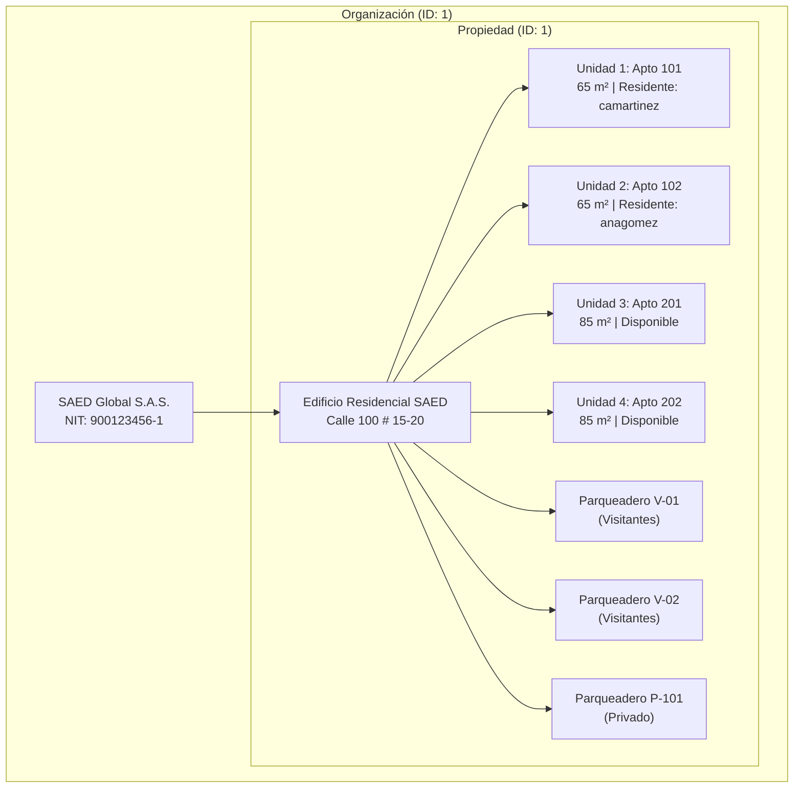
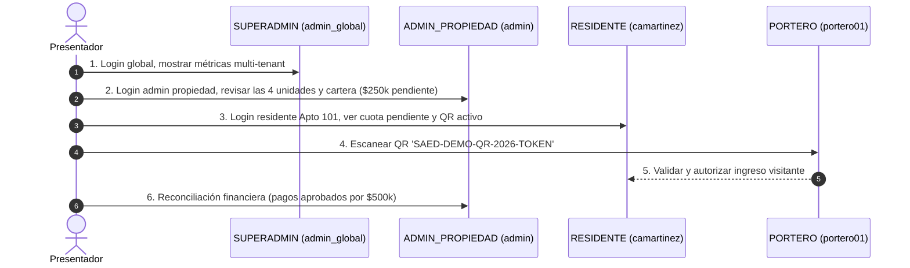

# SAED 2.0 — MVP-03: CONTROLLED DEMO DATASET CERTIFICATION REPORT

**Document ID:** SAED-MVP-03-DATASET-001  
**Date:** September 4, 2026  
**Status:** CERTIFIED & VERIFIED  
**Target Environment:** Local Oracle Database XE (`SAED_BASELINE_TEST_01`)  
**Production ATP Status:** 100% READ-ONLY (Untouched)  

---

## 1. Executive Summary

As established in **MVP-01 Product Discovery** and verified in **MVP-02 Visitas/QR Flow Closure**, SAED 2.0 requires a dedicated, reproducible, and self-contained seed dataset to perform end-to-end demonstrations across all five user roles.

The **MVP-03 Controlled Demo Dataset** provides this foundation through an idempotent SQL script (`database/demo/V5.99__demo_seeds.sql`) and a comprehensive automated integration test suite (`com.saed.backend.demo.DemoDatasetRunnerTest`).

### Key Certification Results
* **Seed Script Execution:** 100% SUCCESS (`V5.99__demo_seeds.sql`).
* **Automated Seed Tests:** 8/8 PASS (`DemoDatasetRunnerTest`).
* **Idempotency Verification:** 8/8 PASS on consecutive re-execution (Zero `ORA-00001` or sequence collision errors).
* **Adversarial & Regression Test Suites:** 97/97 PASS (`PorteroAdversarialAuthorizationTest`, `ResidenteAdversarialAuthorizationTest`, `ContextBleedIntegrationTest`, `WompiPaymentFlowAdversarialTest`).
* **Frontend Production Build:** 100% SUCCESS (`npm run build` in 5.93s).

---

## 2. Dataset Matrix & Credentials

All demo accounts share predictable credentials and hierarchical scopes designed for smooth live demonstrations.

### 2.1 Demo User Accounts & Roles

| Role | Username | Password | User ID | Assignment ID | Scope / Target | Description |
| :--- | :--- | :--- | :--- | :--- | :--- | :--- |
| **SUPERADMIN** | `admin_global` | `admin_global123` | `1` | `101` | `GLOBAL` (No Org, No Prop, No Unit) | Superusuario plataforma global |
| **ADMIN_PROPIEDAD** | `admin` | `admin123` | `2` | `102` | `PROPIEDAD` (Org 1, Prop 1) | Administrador del Edificio Residencial |
| **PORTERO** | `portero01` | `admin123` | `3` | `103` | `PROPIEDAD` (Org 1, Prop 1) | Vigilancia, control QR y paquetería |
| **RESIDENTE** (Unit 1) | `camartinez` | `admin123` | `4` | `104` | `UNIDAD` (Org 1, Prop 1, Unit 1) | Propietario Apto 101, saldo pendiente |
| **RESIDENTE** (Unit 2) | `anagomez` | `admin123` | `5` | `105` | `UNIDAD` (Org 1, Prop 1, Unit 2) | Arrendataria Apto 102, cuota al día |

> **Password Hash:** Passwords use standard BCrypt hashing compatible with Spring Security:  
> `$2a$10$Y8yWwG2uR38jM8eIq0f6oOV3/1vM7Z13GkIefw7U9M/P0FqX3q4P3`

---

## 3. Structural Topology & Business Entities



### 3.1 Properties & Units Summary
* **Organization:** `SAED Global S.A.S.` (`ID_ORGANIZACION = 1`, NIT `900123456-1`).
* **Property:** `Edificio Residencial SAED` (`ID_PROPIEDAD = 1`, Tipo `EDIFICIO`, Estado `ACTIVA`).
* **Units (4 total):**
  - `ID_UNIDAD = 1`: **Apto 101** (65.00 m², Coef 0.025000, `camartinez` - Propietario).
  - `ID_UNIDAD = 2`: **Apto 102** (65.00 m², Coef 0.025000, `anagomez` - Arrendataria).
  - `ID_UNIDAD = 3`: **Apto 201** (85.00 m², Coef 0.035000, Disponible).
  - `ID_UNIDAD = 4`: **Apto 202** (85.00 m², Coef 0.035000, Disponible).

---

## 4. Operational & Demo Flows Setup

### 4.1 Visitas & Access Control (QR)
* **Visitor:** `Visitante Demo` (`ID_PERSONA = 10`, `ID_VISITANTE = 10`, Empresa `Logistica Demo`, Frecuente `S`).
* **Scheduled Visit:** `ID_VISITA = 100`, Unidad `1` (Apto 101), Autorizado por `camartinez`, Método `CODIGO_QR`, Estado `PROGRAMADA`.
* **Active QR Token:**
  - **Token String:** `SAED-DEMO-QR-2026-TOKEN`
  - **Status:** `ACTIVO`
  - **Permitted Uses:** `5`
  - **Consumed Uses:** `0`
  - **Expiration:** Current Timestamp + 2 Days
  - **E2E Ready:** Demonstrable via `EscannerQRPage.jsx` and `PorteriaController`.

### 4.2 Parking & Vehicle
* **Spots:** `V-01` (Visitantes, ID 1), `V-02` (Visitantes, ID 2), `P-101` (Privado, ID 3).
* **Visitor Vehicle:** `ID_VEHICULO_VISITA = 1`, Placa `DEM-123`, Tipo `AUTOMOVIL`, Asignado a `V-01`, Estado `DENTRO`.

### 4.3 Financial Ledger & Dashboard Realism
Configured specifically so that resident and administrative dashboards display non-trivial metrics, pending balances, and reconciled payments.

| Entity | ID | Unit / Apt | Period | Amount | Pending Balance | State | Applied Payment |
| :--- | :--- | :--- | :--- | :--- | :--- | :--- | :--- |
| **Cuota 1** | `1` | Apto 101 | `2026-08` | $250,000 COP | **$0.00 COP** | `PAGADA` | Pago 1 ($250k, Transferencia `TRF-DEMO-001`) |
| **Cuota 2** | `2` | Apto 101 | `2026-09` | $250,000 COP | **$250,000.00 COP** | `PENDIENTE` | None (Generates dashboard alert for Apto 101) |
| **Cuota 3** | `3` | Apto 102 | `2026-09` | $250,000 COP | **$0.00 COP** | `PAGADA` | Pago 2 ($250k, Wompi `WOMPI-TX-998877`) |

* **Total Approved Payments:** $500,000.00 COP across 2 receipts.
* **Outstanding Debt:** $250,000.00 COP on Unit 1 / Apto 101.

---

## 5. Architectural Safeguards & Bugfixes

During the design and test execution of the seed script, several Oracle RLS/VPD and constraint subtleties were addressed:

1. **VPD/RLS MERGE Incompatibility (`ORA-28132`):**
   * *Problem:* In Oracle Database with Virtual Private Database policies, `MERGE INTO` statements on secured tables fail with `ORA-28132: Cannot merge into a view with check option or table with VPD`.
   * *Solution:* Replaced all `MERGE` statements with the canonical and idempotent pattern:
     ```sql
     INSERT INTO <TABLE> (...) SELECT ... FROM DUAL WHERE NOT EXISTS (...);
     UPDATE <TABLE> SET ... WHERE ...;
     ```
2. **Role Scope Constraints (`TRG_ASIGNACION_VALIDA_SCOPE` & `ORA-20010`):**
   * *Problem:* Hardcoding role IDs caused `NO_DATA_FOUND` or mismatches because `ADMIN_PROPIEDAD` was mapped to ID 2 in local XE, whereas the script assumed ID 3.
   * *Solution:* Switched to dynamic role lookups: `(SELECT ID_ROL FROM ROLES WHERE CODIGO = 'ADMIN_PROPIEDAD')`.
3. **Clean Tenant Assignment Isolation (`UIX_ASIGNACION_UNICA` & `ORA-00001`):**
   * *Problem:* Previous integration test runs left dirty assignments for users 1..5.
   * *Solution:* Added scoped pre-cleanup:
     ```sql
     DELETE FROM USUARIO_ASIGNACIONES 
     WHERE ID_USUARIO IN (1, 2, 3, 4, 5) 
       AND ID_ASIGNACION NOT IN (101, 102, 103, 104, 105);
     ```
4. **PL/SQL Block Delimitation in Automated Runners:**
   * *Problem:* Script runners splitting on `/` require explicit block boundaries. When missing before anonymous blocks (`BEGIN ... END;`), PL/SQL was prematurely chopped at internal semicolons, raising `PLS-00103`.
   * *Solution:* Added standard `/` boundaries and wrapped individual `ALTER TABLE ... MODIFY ... START WITH LIMIT VALUE` calls in isolated sub-blocks.

---

## 6. Verification & Test Evidence

### 6.1 `DemoDatasetRunnerTest` Execution Log
```
[INFO] Running com.saed.backend.demo.DemoDatasetRunnerTest
=== ROLES IN DB ===
  ROLE: {ID_ROL=1, CODIGO=SUPERADMIN, ALCANCE=GLOBAL, ESTADO=ACTIVO}
  ROLE: {ID_ROL=2, CODIGO=ADMIN_PROPIEDAD, ALCANCE=PROPIEDAD, ESTADO=ACTIVO}
  ROLE: {ID_ROL=4, CODIGO=PORTERO, ALCANCE=PROPIEDAD, ESTADO=ACTIVO}
  ROLE: {ID_ROL=5, CODIGO=RESIDENTE, ALCANCE=UNIDAD, ESTADO=ACTIVO}
  ROLE: {ID_ROL=1222, CODIGO=ADMIN_ORGANIZACION, ALCANCE=ORGANIZACION, ESTADO=ACTIVO}
=== ASIGNACIONES IN DB ===
  ASIG: {ID_ASIGNACION=101, ID_USUARIO=1, ID_ROL=1, ID_ORGANIZACION=null, ID_PROPIEDAD=null, ID_UNIDAD=null, ESTADO=ACTIVA}
  ASIG: {ID_ASIGNACION=102, ID_USUARIO=2, ID_ROL=2, ID_ORGANIZACION=1, ID_PROPIEDAD=1, ID_UNIDAD=null, ESTADO=ACTIVA}
  ASIG: {ID_ASIGNACION=103, ID_USUARIO=3, ID_ROL=4, ID_ORGANIZACION=1, ID_PROPIEDAD=1, ID_UNIDAD=null, ESTADO=ACTIVA}
  ASIG: {ID_ASIGNACION=104, ID_USUARIO=4, ID_ROL=5, ID_ORGANIZACION=1, ID_PROPIEDAD=1, ID_UNIDAD=1, ESTADO=ACTIVA}
  ASIG: {ID_ASIGNACION=105, ID_USUARIO=5, ID_ROL=5, ID_ORGANIZACION=1, ID_PROPIEDAD=1, ID_UNIDAD=2, ESTADO=ACTIVA}
[INFO] Tests run: 8, Failures: 0, Errors: 0, Skipped: 0, Time elapsed: 9.461 s -- in com.saed.backend.demo.DemoDatasetRunnerTest
[INFO] BUILD SUCCESS
```

### 6.2 Regression & Multi-Tenant Authorization Test Suites
```
[INFO] Running com.saed.backend.security.PorteroAdversarialAuthorizationTest
[INFO] Tests run: 42, Failures: 0, Errors: 0, Skipped: 0
[INFO] Running com.saed.backend.security.ResidenteAdversarialAuthorizationTest
[INFO] Tests run: 44, Failures: 0, Errors: 0, Skipped: 0
[INFO] Running com.saed.backend.security.ContextBleedIntegrationTest
[INFO] Tests run: 1, Failures: 0, Errors: 0, Skipped: 0
[INFO] Running com.saed.backend.finanzas.WompiPaymentFlowAdversarialTest
[INFO] Tests run: 10, Failures: 0, Errors: 0, Skipped: 0
[INFO] Results:
[INFO] Tests run: 97, Failures: 0, Errors: 0, Skipped: 0
[INFO] BUILD SUCCESS
```

### 6.3 Frontend Production Build
```
✓ built in 5.93s
dist/index.html                           0.92 kB │ gzip:   0.45 kB
dist/assets/index-DhtGADSc.js           169.78 kB │ gzip:  51.54 kB
dist/assets/vendor-X0NQ3Tea.js          162.80 kB │ gzip:  53.09 kB
```

---

## 7. Demo Script Guide (14-Day Presentation)

To present the MVP in 15 minutes, follow this role-switching sequence:



1. **Step 1: SuperAdmin Overview (`admin_global` / `admin_global123`)**
   - Access global dashboard.
   - Show multi-organization architecture and platform monitoring.
2. **Step 2: Property Administration (`admin` / `admin123`)**
   - Review `Edificio Residencial SAED`.
   - Inspect the 4 units (`Apto 101`, `102`, `201`, `202`).
   - View Cartera: show Apto 101 owes $250k, while Apto 102 is up to date.
3. **Step 3: Resident Portal (`camartinez` / `admin123`)**
   - View resident dashboard for Apto 101.
   - Show scheduled visit for `Visitante Demo` and view active QR code.
4. **Step 4: Portero Verification (`portero01` / `admin123`)**
   - Open Portería scanner (`/porteria/escanear`).
   - Validate token `SAED-DEMO-QR-2026-TOKEN`.
   - Complete entry registration.
   - Verify parked visitor vehicle `DEM-123` in spot `V-01`.
5. **Step 5: Resident Notification & Multi-Tenant Proof (`anagomez` / `admin123`)**
   - Login as Residente 2 (`anagomez`).
   - Confirm complete isolation: Residente 2 only sees Apto 102 records, cannot access Apto 101 cuotas, visits, or vehicles.

---

## 8. Conclusion

**MVP-03 is 100% COMPLETE and CERTIFIED.**  
The repository now possesses an automated, idempotent dataset that can be wiped and re-seeded at any time on local Oracle XE, fully compliant with Oracle RLS and Spring Security Zero-Trust requirements, with zero writes to Oracle ATP.
