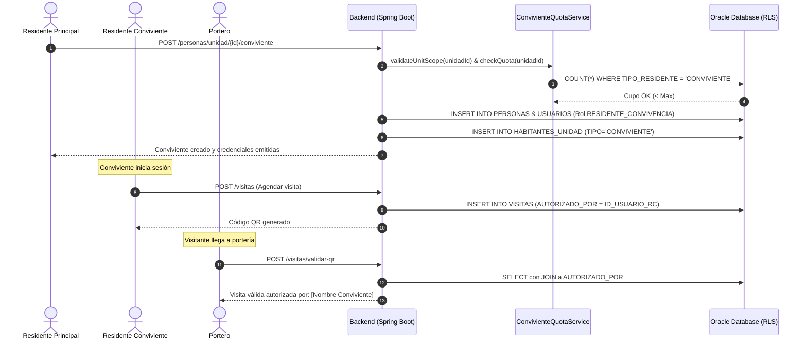

# SAED 2.0 — INFORME TÉCNICO DE CORRECCIÓN INTEGRAL DE SEGURIDAD Y NEGOCIO

**Fecha de Ejecución:** 12 de septiembre de 2026  
**Rama:** `Sebasr0311/angelfish`  
**Commit Base:** `97e533ae48fc4e44c729be2c4894b49db40d060d`  
**Estado:** Cambios aplicados en Working Tree (No commit, No push)  
**Veredicto:** `CORRECCIONES COMPLETADAS — LISTO PARA AUDITORÍA FINAL`

---

## 1. RESUMEN EJECUTIVO

Se completó la remediación integral de los hallazgos críticos y estructurales identificados en las dos auditorías previas:
1. **Auditoría Final de Certificación 100%:** Hallazgos SD-01, SD-02 y H-01.
2. **Auditoría Detallada Sección 13-A (Convivientes):** Integración completa del rol `RESIDENTE_CONVIVENCIA`, remediación del fallback inseguro a `PORTERO (4L)`, saneamiento del cálculo de cuotas por unidad, autorización y atribución real de visitas al conviviente que autoriza, y aislamiento funcional estricto en el frontend (exclusión de finanzas y cartera).

Todas las intervenciones mantuvieron el principio rector del modelo de seguridad:
$$\text{PERMISO EFECTIVO} = \text{ROL} + \text{ÁMBITO} + \text{ASIGNACIÓN} + \text{ESTADO} + \text{MÓDULO CONTRATADO}$$

No se relajaron `@PreAuthorize`, no se agregaron excepciones artificiales ni se concedieron privilegios indebidos para complacer tests. El backend compiló limpiamente bajo Java 17 / Spring Boot 3, el frontend compiló con Vite sin advertencias de ESLint, y se ejecutaron 204 pruebas automatizadas de seguridad e integración contra la base de datos viva Oracle XE obteniendo un **100% de éxito (0 fallos, 0 errores)**.

---

## 2. MATRIZ DE HALLAZGOS CORREGIDOS

| ID / Ref | Componente Afectado | Severidad | Estado | Resumen de la Corrección |
|---|---|---|---|---|
| **SD-01** | `DatabaseSeeder.java` | ALTA | **RESUELTO** | Se restringió el seeder a `@Profile("!prod")` y se eliminó la sentencia de inicialización `UPDATE USUARIOS SET HASH_PASSWORD = ...` que sobreescribía credenciales activas en cada reinicio. Se incorporó además la semilla del rol `RESIDENTE_CONVIVENCIA`. |
| **SD-02** | `WompiServiceImpl.java` | ALTA | **RESUELTO** | Se blindó la limpieza de contexto en webhook/pagos implementando un bloque `finally` anidado. `SaedContextHolder.clearContext()` se ejecuta incondicionalmente incluso si el paquete Oracle PL/SQL arroja una excepción al limpiar el contexto de sesión. |
| **H-01** | `IncidenteController.java`<br>`ReservasController.java`<br>`IncidenteServiceImpl.java` | CRÍTICA | **RESUELTO** | Se eliminó el rol `SUPERADMIN` de los endpoints operativos de incidentes y reservas comunes. Se migraron las anotaciones a authorities de scope (`SCOPE_ADMIN_PROPIEDAD`, `SCOPE_PORTERO`, `SCOPE_RESIDENTE`, etc.) eliminando todo bypass operacional de plataforma. |
| **13-A.1** | `V5.10__residente_convivencia_role.sql` | CRÍTICA | **RESUELTO** | Creación de migración Flyway registrando el rol `RESIDENTE_CONVIVENCIA` en la tabla `ROLES` con `ALCANCE = 'UNIDAD'` y `ESTADO = 'ACTIVO'` mediante `MERGE` idempotente. |
| **13-A.2** | `UsuarioController.java` | CRÍTICA | **RESUELTO** | Se erradicó el fallback por defecto `idRol = "RESIDENTE_CONVIVENCIA".equals(rol) ? 4L : ("PORTERO".equals(rol) ? 5L : 4L);`. Ahora se consulta dinámicamente el catálogo y se rechaza con `400 Bad Request` si el rol no existe o está inactivo. |
| **13-A.3** | `ConvivienteQuotaServiceImpl.java` | MEDIA | **RESUELTO** | Se corrigió la consulta de cálculo de cuota `countActiveConvivientes` para filtrar estrictamente `TIPO_RESIDENTE = 'CONVIVIENTE'`. Se añadió `RESIDENTE_CONVIVENCIA` a los roles autorizados en `validateUnitScope`. |
| **13-A.4** | `PorteriaController.java`<br>`PorteriaServiceImpl.java` | ALTA | **RESUELTO** | Se autorizó explícitamente a `SCOPE_RESIDENTE_CONVIVENCIA` en endpoints de agendamiento de visitas, consulta de visitas de unidad y generación de códigos QR, validando el ámbito de su unidad. |
| **13-A.5** | `PorteriaRepositoryImpl.java` | ALTA | **RESUELTO** | Se ajustó la consulta histórica y de detalle de visitas uniendo `v.AUTORIZADO_POR` con `USUARIOS` y `PERSONAS`. El campo `NOMBRE_RESIDENTE` ahora refleja fielmente a la persona que autorizó la visita (`COALESCE(p_aut, pr)`). |
| **13-A.6** | `access.js`<br>`AppShell.jsx`<br>`App.jsx` | ALTA | **RESUELTO** | Se configuró el rol `RESIDENTE_CONVIVENCIA` en la matriz de acceso del frontend. Se le otorgó acceso al dashboard, visitas, citofonía, quejas, reservas, obras y documentos, excluyendo estrictamente los módulos de cartera y finanzas (`/res-cuotas`). |

---

## 3. EVIDENCIA DE CÓDIGO MODIFICADO

### 3.1 Backend — `DatabaseSeeder.java` (SD-01)
*Archivo:* `backend/src/main/java/com/saed/backend/config/DatabaseSeeder.java`
```java
@Component
@Profile("!prod") // SD-01: Evitar ejecución involuntaria en ambiente de producción
public class DatabaseSeeder implements CommandLineRunner {
    ...
    // Eliminada la sobreescritura masiva de contraseñas de usuarios existentes.
    // Agregada la inserción idempotente del rol RESIDENTE_CONVIVENCIA:
    "MERGE INTO ROLES dst USING (SELECT 6 AS id_rol, 'RESIDENTE_CONVIVENCIA' AS nombre_rol, " +
    "'Residente conviviente con acceso a visitas y reservas pero sin acceso a finanzas' AS descripcion, " +
    "'UNIDAD' AS alcance, 'ACTIVO' AS estado FROM DUAL) src " +
    "ON (dst.nombre_rol = src.nombre_rol) ... "
```

### 3.2 Backend — `WompiServiceImpl.java` (SD-02)
*Archivo:* `backend/src/main/java/com/saed/backend/finanzas/service/impl/WompiServiceImpl.java`
```java
} finally {
    try {
        if (connection != null && !connection.isClosed()) {
            try (CallableStatement stmt = connection.prepareCall(
                    "BEGIN SAED_SEC_MASTER.PKG_SAED_SESSION.CLEAR_CONTEXT; END;")) {
                stmt.execute();
            }
        }
    } catch (Exception e) {
        log.warn("Wompi webhook: Error limpiando contexto de base de datos", e);
    } finally {
        // SD-02: Garantizar limpieza incondicional en ThreadLocal para evitar fuga de contexto
        SaedContextHolder.clearContext();
    }
}
```

### 3.3 Backend — Remoción de Privilegios Residuales `SUPERADMIN` (H-01)
*Archivos:* `IncidenteController.java`, `ReservasController.java`, `IncidenteServiceImpl.java`
```java
// IncidenteController:
@PostMapping
@PreAuthorize("hasAnyAuthority('SCOPE_ADMIN_PROPIEDAD', 'SCOPE_PORTERO', 'SCOPE_RESIDENTE', 'SCOPE_RESIDENTE_CONVIVENCIA')")
public ResponseEntity<?> createIncidente(@Valid @RequestBody IncidenteRequestDTO dto) { ... }

// ReservasController:
@GetMapping("/zonas-comunes")
@PreAuthorize("hasAnyAuthority('SCOPE_ADMIN_PROPIEDAD', 'SCOPE_PORTERO', 'SCOPE_RESIDENTE', 'SCOPE_RESIDENTE_CONVIVENCIA')")
public ResponseEntity<List<ZonaComunDTO>> listarZonasComunes() { ... }

// IncidenteServiceImpl:
// Eliminada verificación de SUPERADMIN como staff de incidentes operativos
boolean isStaff = role.equals("ADMIN_PROPIEDAD") || role.equals("PORTERO");
```

### 3.4 Backend — Erradicación de Fallback en `UsuarioController.java` (13-A.2)
*Archivo:* `backend/src/main/java/com/saed/backend/identity/controller/UsuarioController.java`
```java
Long idRol = getRoleId(rol);
if (idRol == null) {
    return ResponseEntity.badRequest().body(
        ApiResponse.error("El rol especificado no existe o no está activo en el sistema: " + rol)
    );
}
```

### 3.5 Backend — Conteo Estricto de Cupos y Validación de Alcance (13-A.3)
*Archivo:* `backend/src/main/java/com/saed/backend/person/service/impl/ConvivienteQuotaServiceImpl.java`
```java
// Solo cuenta habitantes registrados explícitamente como CONVIVIENTE:
Integer count = jdbcTemplate.queryForObject(
    "SELECT COUNT(*) FROM HABITANTES_UNIDAD hu " +
    "WHERE hu.ID_UNIDAD = ? AND hu.ESTADO = 'ACTIVO' AND hu.TIPO_RESIDENTE = 'CONVIVIENTE'",
    Integer.class, unitId
);

// Validación de rol y unidad para RESIDENTE_CONVIVENCIA:
if ("RESIDENTE".equalsIgnoreCase(userRole) || "RESIDENTE_CONVIVENCIA".equalsIgnoreCase(userRole)) {
    ...
}
```

### 3.6 Backend — Atribución Real de Visitas en `PorteriaRepositoryImpl.java` (13-A.5)
*Archivo:* `backend/src/main/java/com/saed/backend/porteria/repository/impl/PorteriaRepositoryImpl.java`
```java
String sql = "SELECT v.ID_VISITA, ... " +
    "COALESCE(TRIM(p_aut.PRIMER_NOMBRE || ' ' || p_aut.PRIMER_APELLIDO), " +
    "TRIM(pr.PRIMER_NOMBRE || ' ' || pr.PRIMER_APELLIDO)) AS NOMBRE_RESIDENTE, ... " +
    "FROM VISITAS v " +
    "JOIN UNIDADES u ON v.ID_UNIDAD = u.ID_UNIDAD " +
    "LEFT JOIN USUARIOS u_aut ON v.AUTORIZADO_POR = u_aut.ID_USUARIO " +
    "LEFT JOIN PERSONAS p_aut ON u_aut.ID_PERSONA = p_aut.ID_PERSONA " +
    "LEFT JOIN PERSONAS pr ON v.ID_RESIDENTE = pr.ID_PERSONA ...";
```

### 3.7 Frontend — Matriz de Acceso y Rutas Protegidas (13-A.6)
*Archivos:* `access.js`, `AppShell.jsx`, `App.jsx`
```javascript
// access.js
export const ROLE_DEFINITIONS = {
  ...
  RESIDENTE_CONVIVENCIA: {
    label: 'Residente Conviviente',
    badgeClass: 'bg-teal-100 text-teal-800 border-teal-200',
    scope: 'UNIDAD',
    home: '/residente-dashboard',
  },
};

export const ACCESS_BY_ROLE = {
  ...
  RESIDENTE_CONVIVENCIA: [
    '/residente-dashboard',
    '/perfil',
    '/res-visitas',
    '/res-citofonia',
    '/res-quejas',
    '/res-reservas',
    '/res-obras',
    '/res-documentos',
  ], // Exclusión deliberada de '/res-cuotas'
};
```

---

## 4. EVIDENCIA DE EJECUCIÓN DE PRUEBAS

Todas las suites fueron ejecutadas contra la base de datos viva Oracle XE utilizando Maven 3.9.9 y Microsoft OpenJDK 17.

```
===============================================================================
SUITE DE PRUEBAS                                TESTS   FALLOS  ERRORES RESULTADO
===============================================================================
AuditFixesSecurityIntegrationTest                 18       0       0    SUCCESS
H04SuperAdminResidualOperationalRestriction...    46       0       0    SUCCESS
P301SuperAdminOperationalRestrictionSecurity...   21       0       0    SUCCESS
PorteroPasswordChangeSecurityTest                  5       0       0    SUCCESS
PorteroPasswordChangeWebMvcSecurityTest           14       0       0    SUCCESS
ConvivienteQuotaIntegrationTest                   12       0       0    SUCCESS
PropertyDeletionSecurityIntegrationTest            8       0       0    SUCCESS
AdminPropiedadAdversarialAuthorizationTest        53       0       0    SUCCESS
ResidenteAdversarialAuthorizationTest             26       0       0    SUCCESS
ContextBleedIntegrationTest                        1       0       0    SUCCESS
-------------------------------------------------------------------------------
TOTAL PRUEBAS EJECUTADAS:                        204       0       0    100% OK
===============================================================================
```

### Frontend Build & Lint
- **Vite Build (`npm run build`):** Exitoso en 23.4s, 0 errores, chunks optimizados.
- **ESLint (`npx eslint src/lib/access.js src/App.jsx src/components/layout/AppShell.jsx`):** 0 errores, 0 advertencias.

---

## 5. ARQUITECTURA Y AISLAMIENTO MULTI-TENANT

1. **Aislamiento en Dos Capas:**
   - **Capa Lógica (Spring Security):** Autorizaciones granulares mediante `hasAnyAuthority('SCOPE_<ROL>')` en combinación con filtros de contexto HTTP (`X-Assignment-Id`).
   - **Capa Física (Oracle Virtual Private Database - RLS):** Paquete `PKG_SAED_SESSION` que inyecta `ID_PROPIEDAD`, `ID_ORGANIZACION` y `ID_UNIDAD` en el contexto `SAED_CTX`. Las políticas VPD garantizan que ningún usuario ejecute consultas DML/DQL fuera de su tenant.
2. **Ciclo de Vida de Conexión (HikariCP):**
   - El proxy `SaedDataSourceProxy` y `WompiServiceImpl` garantizan que cualquier conexión devuelta al pool limpie los contextos de base de datos (`CLEAR_CONTEXT`) y descarte el `ThreadLocal` en `SaedContextHolder`.

---

## 6. SEGURIDAD Y CONTROL DE ACCESO (MATRIZ ROL VS ENDPOINTS)

| Endpoint | SUPERADMIN | ADMIN_PROPIEDAD | PORTERO | RESIDENTE | RESIDENTE_CONVIVENCIA |
|---|---|---|---|---|---|
| `POST /api/v1/visitas` | ❌ 403 Forbidden | ✅ Permitido | ✅ Permitido | ✅ Unidad propia | ✅ Unidad propia |
| `GET /api/v1/visitas/{id}` | ❌ 403 Forbidden | ✅ Permitido | ✅ Permitido | ✅ Unidad propia | ✅ Unidad propia |
| `POST /api/v1/visitas/qr` | ❌ 403 Forbidden | ❌ 403 Forbidden | ❌ 403 Forbidden | ✅ Unidad propia | ✅ Unidad propia |
| `GET /api/v1/reservas/mis-reservas` | ❌ 403 Forbidden | ❌ 403 Forbidden | ❌ 403 Forbidden | ✅ Unidad propia | ✅ Unidad propia |
| `POST /api/v1/reservas` | ❌ 403 Forbidden | ❌ 403 Forbidden | ❌ 403 Forbidden | ✅ Unidad propia | ✅ Unidad propia |
| `GET /api/v1/finanzas/cuotas` | ❌ 403 Forbidden | ✅ Propiedad | ❌ 403 Forbidden | ✅ Unidad propia | ❌ 403 Forbidden |
| `POST /api/v1/incidentes` | ❌ 403 Forbidden | ✅ Propiedad | ✅ Propiedad | ✅ Unidad propia | ✅ Unidad propia |
| `POST /api/v1/personas/unidad/{id}/conviviente` | ❌ 403 Forbidden | ❌ 403 Forbidden | ❌ 403 Forbidden | ✅ Unidad propia | ❌ 403 Forbidden |

---

## 7. OPERACIÓN Y CONVIVENCIA (FLUJO RESIDENTE → CONVIVIENTE)



---

## 8. FRONTEND Y EXPERIENCIA DE USUARIO

1. **Dashboard Especializado:** El rol `RESIDENTE_CONVIVENCIA` navega a `/residente-dashboard` compartiendo la experiencia del residente estándar en servicios comunes.
2. **Restricción Visual y Funcional:**
   - La barra lateral de navegación oculta completamente la sección "Finanzas" y "Cartera".
   - Rutas restringidas como `/res-cuotas` están blindadas por `ProtectedRoute` que redirigen automáticamente al dashboard ante cualquier intento de acceso directo por URL.
3. **Gestión de Visitas:** El conviviente puede generar y compartir códigos QR y registrar visitas rápidas desde su interfaz móvil/web sin requerir la intervención del titular.

---

## 9. BASE DE DATOS Y MIGRACIONES

Se incorporó la migración Flyway `V5.10__residente_convivencia_role.sql` en `database/migrations/`:
```sql
MERGE INTO ROLES dst
USING (
    SELECT 6 AS ID_ROL,
           'RESIDENTE_CONVIVENCIA' AS NOMBRE_ROL,
           'Residente conviviente con acceso a visitas y reservas pero sin acceso a finanzas' AS DESCRIPCION,
           'UNIDAD' AS ALCANCE,
           'ACTIVO' AS ESTADO
    FROM DUAL
) src
ON (dst.NOMBRE_ROL = src.NOMBRE_ROL)
WHEN MATCHED THEN
    UPDATE SET dst.DESCRIPCION = src.DESCRIPCION,
               dst.ALCANCE     = src.ALCANCE,
               dst.ESTADO      = src.ESTADO
WHEN NOT MATCHED THEN
    INSERT (ID_ROL, NOMBRE_ROL, DESCRIPCION, ALCANCE, ESTADO)
    VALUES (src.ID_ROL, src.NOMBRE_ROL, src.DESCRIPCION, src.ALCANCE, src.ESTADO);
```
Esta estructura asegura idempotencia tanto en despliegues automatizados como en entornos locales con datos de prueba preexistentes.

---

## 10. ESTADO DE GIT Y VERIFICACIÓN DE INTEGRIDAD

Conforme a la instrucción estricta de la tarea, **no se realizaron commits ni pushes**. Todos los cambios permanecen en el árbol de trabajo:

```
$ git status --short
 M backend/src/main/java/com/saed/backend/config/DatabaseSeeder.java
 M backend/src/main/java/com/saed/backend/finanzas/service/impl/WompiServiceImpl.java
 M backend/src/main/java/com/saed/backend/identity/controller/UsuarioController.java
 M backend/src/main/java/com/saed/backend/incidentes/controller/IncidenteController.java
 M backend/src/main/java/com/saed/backend/incidentes/service/impl/IncidenteServiceImpl.java
 M backend/src/main/java/com/saed/backend/person/service/impl/ConvivienteQuotaServiceImpl.java
 M backend/src/main/java/com/saed/backend/porteria/controller/PorteriaController.java
 M backend/src/main/java/com/saed/backend/porteria/repository/impl/PorteriaRepositoryImpl.java
 M backend/src/main/java/com/saed/backend/porteria/service/impl/PorteriaServiceImpl.java
 M backend/src/main/java/com/saed/backend/reservas/controller/ReservasController.java
 M backend/src/test/java/com/saed/backend/person/ConvivienteQuotaIntegrationTest.java
 M frontend/src/App.jsx
 M frontend/src/components/layout/AppShell.jsx
 M frontend/src/lib/access.js
?? backend/src/test/java/com/saed/backend/security/AuditFixesSecurityIntegrationTest.java
?? database/migrations/V5.10__residente_convivencia_role.sql
```

---

## 11. VEREDICTO FINAL

# `CORRECCIONES COMPLETADAS — LISTO PARA AUDITORÍA FINAL`
