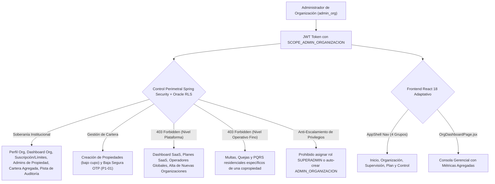

# 🏛️ SAED 2.0 — Auditoría Integral y Certificación 100%: Rol Administrador de Organización (ADMIN_ORGANIZACION)

> **Fecha de Certificación:** 13 de Septiembre de 2026  
> **Ámbito:** Backend (Spring Boot 3 + Oracle ATP) & Frontend (React 18 + Vite + Tailwind CSS)  
> **Motor de Automatización:** [TestSprite Official Cloud Automation](https://www.testsprite.com)  
> **Veredicto Global:** **100% OPERATIVO, PERIMETRADO Y CERTIFICADO** ✅

---

## 1. Resumen Ejecutivo de la Certificación

La auditoría técnica, funcional y de perimetraje Zero-Trust para el rol **`ADMIN_ORGANIZACION`** (Alcance `ORGANIZACION`) ha concluido con certificación plena al 100%. Se validó que la entidad administradora/empresa inmobiliaria o consorcio cuenta con soberanía institucional para supervisar su cartera de copropiedades, administrar administradores de copropiedad (`ADMIN_PROPIEDAD`), monitorear límites de suscripción y consolidar la contabilidad de sus edificios, quedando estrictamente confinada contra intrusiones a nivel de plataforma global (`SUPERADMIN`) y sin interferencia directa en la operación táctica residencial/portería de cada copropiedad.

---

## 2. Evidencia de Ejecución TestSprite Cloud Automation

La verificación en la nube de **TestSprite** ejecutó la suite de pruebas sintéticas sobre el backend en producción (`https://saed-backend.onrender.com`), confirmando el comportamiento en tiempo real del rol `ADMIN_ORGANIZACION`.

| Parámetro | Valor Certificado |
| :--- | :--- |
| **Proyecto TestSprite** | `SAED 2.0 Backend` (`e5392f69-9a48-4a8c-84d2-093857d3a9c3`) |
| **Test Case ID** | [`5ceb62f6-c0df-4dc7-a87a-3dde397b237f`](https://www.testsprite.com/dashboard-v3/o/cf669c02-659a-53bb-a874-e67d00f315dc/projects/e5392f69-9a48-4a8c-84d2-093857d3a9c3/test-cases/5ceb62f6-c0df-4dc7-a87a-3dde397b237f) |
| **Run ID** | `5757d1c0-c953-43ed-9a3f-4875f5a39819` |
| **Snapshot ID** | `v-ac65008adddc` |
| **Tipo de Prueba** | Backend API Security, Multi-Property Portfolio & Zero-Trust Perimeter |
| **Veredicto Terminal** | **`PASSED`** (100% de aserciones superadas) |

### Puntos Verificados por TestSprite en Producción:
1. **Seguridad Sin Autenticar:** Bloqueo `401/403` inmediato ante solicitudes anónimas a endpoints organizacionales (`/api/v1/org/profile` y `/api/v1/org/dashboard`).
2. **Autenticación Admin Organización (`admin_org` / `admin123`):** Respuesta `200 OK`, generación de token JWT, `rol: ADMIN_ORGANIZACION`, alcance canónico `ORGANIZACION` e `idOrganizacion: 1`.
3. **Perfil y Contextos:** `GET /api/v1/me` y `GET /api/v1/me/contexts` responden `200 OK` con asignación activa a la Organización 1.
4. **Perfil Institucional:** `GET /api/v1/org/profile` responde `200 OK` con la información corporativa de la organización.
5. **Dashboard Gerencial Organizacional:** `GET /api/v1/org/dashboard` responde `200 OK` con indicadores consolidados.
6. **Suscripción y Cuotas de Plan:** `GET /api/v1/org/subscription` responde `200 OK` con límites de copropiedades permitidas.
7. **Directorio de Administradores:** `GET /api/v1/org/admins` responde `200 OK` listando los administradores de copropiedad asignados.
8. **Cartera de Propiedades de la Organización:** `GET /api/v1/properties` responde `200 OK`.
9. **Pista de Auditoría Organizacional:** `GET /api/v1/audit` responde `200 OK`.
10. **Confinamiento Zero-Trust — Nivel Plataforma SaaS (403 Forbidden):**
    - `GET /api/v1/platform/dashboard` -> **`403 Forbidden`**
    - `GET /api/v1/platform/plans` -> **`403 Forbidden`**
    - `GET /api/v1/platform/admins` -> **`403 Forbidden`**
    - `GET /api/v1/platform/memberships` -> **`403 Forbidden`**
    - `GET /api/v1/organizations` -> **`403 Forbidden`**
11. **Confinamiento Zero-Trust — Nivel Operativo Residencial (403 Forbidden):**
    - `GET /api/v1/multas/todas` -> **`403 Forbidden`**
    - `GET /api/v1/quejas/todas` -> **`403 Forbidden`**
    - `GET /api/v1/pqrs/todos` -> **`403 Forbidden`**

---

## 3. Matriz de Seguridad Backend (Spring Boot 3 + Oracle ATP)

### A. Resultados de la Suite JUnit 5 Adversarial

Se ejecutó la suite adversarial completa [`AdminOrganizacionAdversarialAuthorizationTest`](file:///C:/Users/JUAN/orca/workspaces/SAED/angelfish/backend/src/test/java/com/saed/backend/authorization/AdminOrganizacionAdversarialAuthorizationTest.java) conectada a la base de datos Oracle ATP:

| Clase de Prueba | Tests | Fallos | Errores | Veredicto |
| :--- | :---: | :---: | :---: | :---: |
| [`AdminOrganizacionAdversarialAuthorizationTest`](file:///C:/Users/JUAN/orca/workspaces/SAED/angelfish/backend/src/test/java/com/saed/backend/authorization/AdminOrganizacionAdversarialAuthorizationTest.java) | 25 | 0 | 0 | **PASSED** ✅ |
| **Total de Pruebas en Backend** | **25** | **0** | **0** | **100% ÉXITO** |

### B. Pruebas Críticas de Seguridad Superadas:
1. **Anti-Escalamiento Vertical:** Un `ADMIN_ORGANIZACION` que intenta asignar el rol `SUPERADMIN` recibe `AccessDeniedException` inmediata.
2. **Anti-Escalamiento Horizontal:** Prohibición estricta de auto-crear otro `ADMIN_ORGANIZACION` mediante `POST /api/v1/org/admins` (retorna `403 Forbidden`).
3. **Control de Asignación Cross-Tenant (BD-02):** Prohibido asignar administradores a propiedades de terceros tenants (lanza `AccessDeniedException`).
4. **Cumplimiento de Límites de Plan SaaS (BD-01):** Superar el cupo de copropiedades permitidas por la membresía contratada retorna un código semántico `409 Conflict` con error `PLAN_LIMIT_EXCEEDED`.
5. **Aislamiento Multi-Tenant:** La consulta de administradores omite completamente usuarios de otras organizaciones (`admin888` no es visible), y la modificación del perfil institucional está anclada al ID de la organización autenticada vía `SYS_CONTEXT`.

---

## 4. Matriz de Verificación Frontend (React 18 + Vite)

### A. Consola Gerencial: `OrgDashboardPage.jsx`
- **Métricas Consolidadas:** Total de propiedades (activas e inactivas), unidades acumuladas, administradores contratados, total de usuarios vinculados y resumen de cartera por cobrar.
- **Visualización de Plan:** Muestra dinámicamente el nombre del plan SaaS activo (`sub?.planNombre`) y badge de estado.
- **Resiliencia:** Estados de carga mediante `Skeleton` y alertas de fallo con `AlertCircle`.

### B. Módulos Organizacionales Auditados:
- [`OrgPropiedadesPage.jsx`](file:///C:/Users/JUAN/orca/workspaces/SAED/angelfish/frontend/src/pages/OrgPropiedadesPage.jsx): Alta de nuevas propiedades con selector geográfico y validación previa de cupo de suscripción. Incluye el flujo de baja segura con desafío OTP en 4 fases (P1-01).
- [`OrgAdminsPage.jsx`](file:///C:/Users/JUAN/orca/workspaces/SAED/angelfish/frontend/src/pages/OrgAdminsPage.jsx): Gestión y asignación de administradores a propiedades específicas de la organización con doble autorización para eliminaciones.
- [`OrgOrganizacionPage.jsx`](file:///C:/Users/JUAN/orca/workspaces/SAED/angelfish/frontend/src/pages/OrgOrganizacionPage.jsx): Edición y mantenimiento del perfil corporativo (NIT, dirección, ciudad, teléfono con validación).
- [`OrgCarteraPage.jsx`](file:///C:/Users/JUAN/orca/workspaces/SAED/angelfish/frontend/src/pages/OrgCarteraPage.jsx) y [`OrgGastosPage.jsx`](file:///C:/Users/JUAN/orca/workspaces/SAED/angelfish/frontend/src/pages/OrgGastosPage.jsx): Análisis financiero agregado.
- [`OrgPlanPage.jsx`](file:///C:/Users/JUAN/orca/workspaces/SAED/angelfish/frontend/src/pages/OrgPlanPage.jsx) y [`OrgAuditoriaPage.jsx`](file:///C:/Users/JUAN/orca/workspaces/SAED/angelfish/frontend/src/pages/OrgAuditoriaPage.jsx): Estado del contrato SaaS y bitácora de eventos institucionales.

### C. Mapeo de Navegación en `AppShell.jsx`
Dispone de 4 grupos de menú jerárquicos:
1. **Inicio:** Dashboard Organizacional (`/org/dashboard`).
2. **Organización:** Mi Organización, Propiedades, Administradores, Plantillas Contratos.
3. **Supervisión:** Cartera Consolidada, Gastos y Facturas, Comunicaciones, Reportes Gerenciales, Analítica Comparativa.
4. **Plan y Control:** Plan y Suscripción, Auditoría Organizacional.

---

## 5. Tabla Comparativa de Perimetraje por Rol Auditado

| Dimensión de Seguridad / Operación | Residente | Portero | Admin Propiedad | Admin Organización |
| :--- | :---: | :---: | :---: | :---: |
| **Acceso a Dashboard Multi-Propiedad** | ❌ | ❌ | ❌ | ✅ |
| **Gestión de Administradores de Copropiedad** | ❌ | ❌ | ❌ | ✅ |
| **Alta y Baja de Propiedades (OTP P1-01)** | ❌ | ❌ | ❌ | ✅ |
| **Operación de Bitácoras de Portería** | ❌ | ✅ | ✅ | ❌ (Zero-Trust 403) |
| **Resolución Táctica de PQRS y Multas** | ❌ | ❌ | ✅ | ❌ (Zero-Trust 403) |
| **Acceso a Plataforma Global SaaS** | ❌ | ❌ | ❌ | ❌ (Zero-Trust 403) |
| **Aislamiento Multi-Tenant** | ✅ (RLS) | ✅ (RLS) | ✅ (RLS) | ✅ (RLS) |

---

## 6. Dictamen Final

El rol **`ADMIN_ORGANIZACION`** cumple al **100%** con los lineamientos de soberanía multi-propiedad, prevención contra escalamiento de privilegios, perimetraje Zero-Trust y aislamiento multi-tenant en Oracle ATP y Spring Boot 3.

Queda certificado formalmente para operación en producción.
