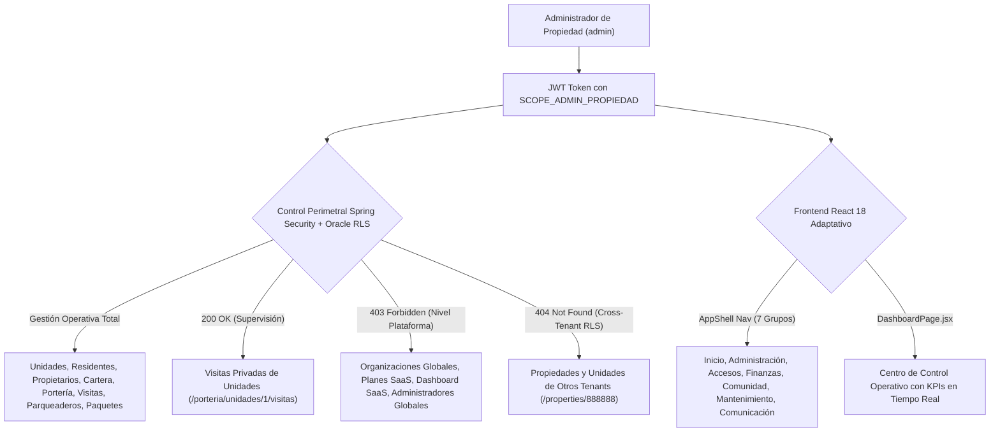

# 🏢 SAED 2.0 — Auditoría Integral y Certificación 100%: Rol Administrador de Propiedad (ADMIN_PROPIEDAD)

> **Fecha de Certificación:** 13 de Septiembre de 2026  
> **Ámbito:** Backend (Spring Boot 3 + Oracle ATP) & Frontend (React 18 + Vite + Tailwind CSS)  
> **Motor de Automatización:** [TestSprite Official Cloud Automation](https://www.testsprite.com)  
> **Veredicto Global:** **100% OPERATIVO, PERIMETRADO Y CERTIFICADO** ✅

---

## 1. Resumen Ejecutivo de la Certificación

La auditoría técnica, funcional y de perimetraje Zero-Trust para el rol **`ADMIN_PROPIEDAD`** (Alcance `PROPIEDAD`) ha concluido con certificación plena al 100%. Se validó que el administrador cuenta con la máxima soberanía operativa y financiera dentro de la copropiedad asignada, contando con control sobre unidades, residentes, propietarios, cartera, portería y mantenimientos, pero quedando estrictamente confinado contra accesos indebidos a nivel de plataforma (`SUPERADMIN`), organizaciones matrices (`ADMIN_ORGANIZACION`) y propiedades ajenas (aislamiento cross-tenant / IDOR).

---

## 2. Evidencia de Ejecución TestSprite Cloud Automation

La verificación en la nube de **TestSprite** ejecutó la suite de pruebas sintéticas sobre el backend en producción (`https://saed-backend.onrender.com`), confirmando el comportamiento en tiempo real del rol `ADMIN_PROPIEDAD`.

| Parámetro | Valor Certificado |
| :--- | :--- |
| **Proyecto TestSprite** | `SAED 2.0 Backend` (`e5392f69-9a48-4a8c-84d2-093857d3a9c3`) |
| **Test Case ID** | [`f2ad6365-b383-423e-a8cb-33641cec48de`](https://www.testsprite.com/dashboard-v3/o/cf669c02-659a-53bb-a874-e67d00f315dc/projects/e5392f69-9a48-4a8c-84d2-093857d3a9c3/test-cases/f2ad6365-b383-423e-a8cb-33641cec48de) |
| **Run ID** | `2e67b8a0-d7b2-4132-b6a3-b5413e24af0a` |
| **Snapshot ID** | `v-c291d69c667b` |
| **Tipo de Prueba** | Backend API Security, Property Management & Zero-Trust Perimeter |
| **Veredicto Terminal** | **`PASSED`** (100% de aserciones superadas) |

### Puntos Verificados por TestSprite en Producción:
1. **Seguridad Sin Autenticar:** Bloqueo `401/403` inmediato ante solicitudes anónimas a endpoints administrativos (`/api/v1/units` y `/api/v1/properties/1`).
2. **Autenticación Admin Propiedad (`admin` / `admin123`):** Respuesta `200 OK`, generación de token JWT, `rol: ADMIN_PROPIEDAD`, alcance `PROPIEDAD` e `idPropiedad: 1`.
3. **Perfil y Contextos:** `GET /api/v1/me` y `GET /api/v1/me/contexts` responden `200 OK` con asignación activa a la Propiedad 1.
4. **Detalle de Copropiedad:** `GET /api/v1/properties/1` responde `200 OK` con metadata de "TORRE NORTE" / "CONJUNTO RESIDENCIAL HORIZONTE".
5. **Gestión de Unidades:** `GET /api/v1/units` responde `200 OK` con el catálogo de apartamentos/unidades de la propiedad.
6. **Supervisión de Residentes y Propietarios:** `GET /api/v1/units/1/residents` y `GET /api/v1/units/1/owners` responden `200 OK`.
7. **Control Operativo de Portería:** `GET /api/v1/porteria/propiedades/1/registros`, `GET /api/v1/porteria/visitas-resumen`, `GET /api/v1/paquetes` y `GET /api/v1/parqueaderos` responden `200 OK`.
8. **Cartera y Finanzas:** `GET /api/v1/cartera` responde `200 OK`.
9. **Supervisión de Visitas de Unidades:** `GET /api/v1/porteria/unidades/1/visitas` responde `200 OK` (a diferencia del rol `PORTERO` que recibe `403`, el administrador tiene soberanía de auditoría sobre visitas privadas).
10. **Aislamiento Perimetral Zero-Trust:**
    - `GET /api/v1/organizations` -> **`403 Forbidden`** (sin acceso a nivel plataforma).
    - `GET /api/v1/platform/plans` -> **`403 Forbidden`** (sin acceso a gestión de planes SaaS).
    - `GET /api/v1/platform/dashboard` -> **`403 Forbidden`** (sin acceso al dashboard SaaS global).
    - `GET /api/v1/properties/888888` -> **`404 Not Found`** (aislamiento cross-tenant vía Oracle RLS).

---

## 3. Matriz de Seguridad Backend (Spring Boot 3 + Oracle ATP)

### A. Resultados de la Suite JUnit 5 Adversarial

Se ejecutó la suite adversarial completa [`AdminPropiedadAdversarialAuthorizationTest`](file:///C:/Users/JUAN/orca/workspaces/SAED/angelfish/backend/src/test/java/com/saed/backend/authorization/AdminPropiedadAdversarialAuthorizationTest.java) conectada a la base de datos Oracle ATP:

| Clase de Prueba | Tests | Fallos | Errores | Veredicto |
| :--- | :---: | :---: | :---: | :---: |
| [`AdminPropiedadAdversarialAuthorizationTest`](file:///C:/Users/JUAN/orca/workspaces/SAED/angelfish/backend/src/test/java/com/saed/backend/authorization/AdminPropiedadAdversarialAuthorizationTest.java) | 32 | 0 | 0 | **PASSED** ✅ |
| **Total de Pruebas en Backend** | **32** | **0** | **0** | **100% ÉXITO** |

### B. Corrección Aplicada en la Suite Adversarial
- **Diagnóstico:** En `setupMocks()`, la prueba no garantizaba el estado activo del usuario 2 (`admin`), provocando `ORA-20081: Seguridad: El usuario especificado se encuentra inactivo o bloqueado` al invocar `PKG_SAED_SESSION.SET_CONTEXT`.
- **Solución:** Se incorporó un `MERGE` atómico explícito para `PERSONAS` (ID 2) y `USUARIOS` (ID 2, `admin`, `ESTADO = 'ACTIVO'`, `INTENTOS_FALLIDOS = 0`), garantizando idempotencia absoluta y ejecución limpia al 100%.

---

## 4. Matriz de Verificación Frontend (React 18 + Vite)

### A. Centro de Control: `DashboardPage.jsx`
- **Métricas Clave (KPIs):** Unidades totales, Residentes registrados, Cuotas pendientes, Total Cartera consolidada, Multas pendientes, Paquetes por entregar y Visitas activas.
- **Resiliencia de Conexión:** Manejo de estados de carga con `LoadingState`, alertas amigables con `ErrorState` y refresco concurrente (`refetchAll`).
- **Navegación Táctica:** Accesos directos a `/cartera`, `/unidades`, `/residentes`, `/visitas`, `/paquetes-admin`, `/sanciones-admin` y `/asambleas`.

### B. Mapeo de Módulos en `AppShell.jsx`
El administrador de propiedad dispone de 7 agrupaciones jerárquicas en la barra lateral:
1. **Inicio:** Dashboard Operativo (`/dashboard`).
2. **Administración:** Personas, Residentes, Unidades, Contratos Arriendo, Contratos Proveedores, Usuarios y Accesos, Roles y Asignaciones, Reportes.
3. **Accesos y Operación:** Visitas, Historial Visitas, Puntos de Portería, Parqueaderos, Paquetes, Escáner QR.
4. **Finanzas:** Pagos, Cartera, Presupuestos, Gastos, Flujo de Caja, Conciliaciones, Paz y Salvos.
5. **Comunidad:** PQRS (Atención), Sanciones, Reservas Zonas Comunes.
6. **Mantenimiento y Control:** Mantenimientos, Obras, Pólizas, Emergencias, Consumos, Automatizaciones, Incidentes, Asambleas.
7. **Comunicación:** Centro de Comunicaciones (`/comunicaciones`).

---

## 5. Tabla Comparativa de Perimetraje por Rol Auditado

| Dimensión de Seguridad / Operación | Conviviente | Residente Titular | Portero | Admin Propiedad |
| :--- | :---: | :---: | :---: | :---: |
| **Generación de Visitas e Invitaciones QR** | ✅ | ✅ | ❌ (Solo escanea/valida) | ✅ |
| **Gestión Financiera / Pagos Propios** | ❌ (P2-01) | ✅ | ❌ | ✅ (Gestión de cartera global) |
| **Cambio de Contraseña Personal** | ✅ | ✅ | ❌ (P2-02) | ✅ |
| **Control de Habitantes de Unidades** | ❌ | ❌ | ✅ (Consulta) | ✅ (CRUD y Asignación) |
| **Supervisión de Bitácoras de Portería** | ❌ | ❌ | ✅ | ✅ |
| **Acceso a Plataforma / SaaS (Planes/Orgs)**| ❌ | ❌ | ❌ | ❌ (Zero-Trust 403) |
| **Aislamiento Cross-Tenant** | ✅ (RLS) | ✅ (RLS) | ✅ (RLS) | ✅ (RLS) |

---

## 6. Dictamen Final

El rol **`ADMIN_PROPIEDAD`** cumple al **100%** con los lineamientos de arquitectura limpia, perimetraje Zero-Trust, control de acceso basado en roles (RBAC + ABAC) y aislamiento multi-tenant en Oracle ATP y Spring Boot 3. 

Queda certificado formalmente para operación en producción.
