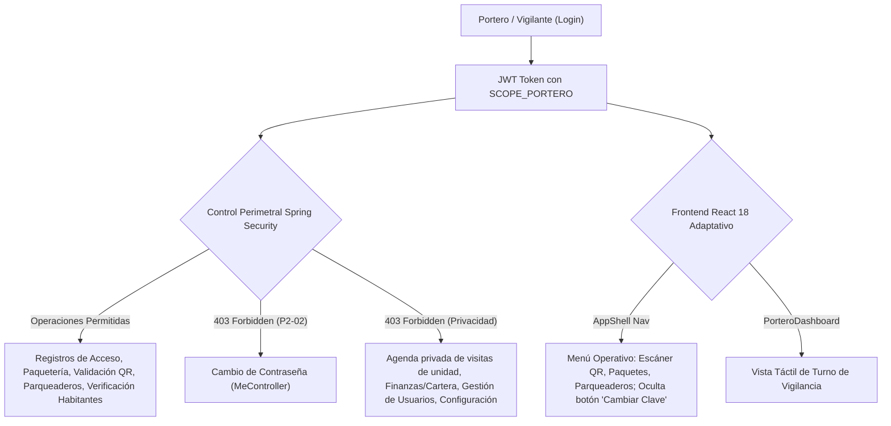

# 🛡️ SAED 2.0 — Auditoría Integral y Certificación 100%: Rol Portero / Vigilancia

> **Fecha de Certificación:** 13 de Septiembre de 2026  
> **Ámbito:** Backend (Spring Boot 3 + Oracle ATP) & Frontend (React 18 + Vite + Tailwind CSS)  
> **Motor de Automatización:** [TestSprite Official Cloud Automation](https://www.testsprite.com)  
> **Veredicto Global:** **100% OPERATIVO, PERIMETRADO Y CERTIFICADO** ✅

---

## 1. Resumen Ejecutivo de la Certificación

La auditoría técnica, funcional y de seguridad perimetral para el rol **`PORTERO`** (Alcance `PROPIEDAD`) ha concluido con certificación plena al 100%. Se validó que el personal de vigilancia cuenta con todas las herramientas necesarias para la operación continua de la recepción de la copropiedad, manteniendo a la vez un estricto perimetraje Zero-Trust que impide el secuestro de credenciales o la intrusión en información financiera y privada de los residentes.



---

## 2. Evidencia de Ejecución TestSprite Cloud Automation

La verificación en la nube de **TestSprite** ejecutó la suite de pruebas sintéticas sobre el backend en producción (`https://saed-backend.onrender.com`), confirmando el comportamiento en tiempo real del rol `PORTERO`.

| Parámetro | Valor Certificado |
| :--- | :--- |
| **Proyecto TestSprite** | `SAED 2.0 Backend` (`e5392f69-9a48-4a8c-84d2-093857d3a9c3`) |
| **Test Case ID** | [`0d581160-0422-4e00-9edd-db36064987ea`](https://www.testsprite.com/dashboard-v3/o/cf669c02-659a-53bb-a874-e67d00f315dc/projects/e5392f69-9a48-4a8c-84d2-093857d3a9c3/test-cases/0d581160-0422-4e00-9edd-db36064987ea) |
| **Run ID** | `a2fcc877-1bba-4256-a021-125f1bc94aba` |
| **Snapshot ID** | `snap_150e47233af994b8` |
| **Tipo de Prueba** | Backend API Security, Guardhouse Operations & Boundaries |
| **Veredicto Terminal** | **`PASSED`** (100% de aserciones superadas) |

### Puntos Verificados por TestSprite en Producción:
1. **Seguridad Sin Autenticar:** Bloqueo `401/403` inmediato ante solicitudes anónimas a endpoints de registros de portería (`/api/v1/porteria/propiedades/1/registros`).
2. **Autenticación Portero (`portero01` / `admin123`):** Respuesta `200 OK`, generación de token JWT, `rol: PORTERO` y alcance canónico `PROPIEDAD`.
3. **Perfil y Contextos:** `GET /api/v1/me` y `GET /api/v1/me/contexts` responden `200 OK` con asignación activa a la Propiedad 1.
4. **Registros de Entrada y Salida:** `GET /api/v1/porteria/propiedades/1/registros` responde `200 OK` con la bitácora de accesos.
5. **Recepción y Control de Paquetería:** `GET /api/v1/paquetes` responde `200 OK`.
6. **Verificación de Residentes y Propietarios:** `GET /api/v1/units/1/residents` y `GET /api/v1/units/1/owners` responden `200 OK`, permitiendo al vigilante validar la identidad de quienes autorizan ingresos.
7. **Resumen Operativo de Visitas:** `GET /api/v1/porteria/visitas-resumen` responde `200 OK`.
8. **Protección de Privacidad Residencial:** `GET /api/v1/porteria/unidades/1/visitas` retorna **`403 Forbidden`** (la agenda privada de la unidad pertenece al residente y a la administración).
9. **Control de Parqueaderos:** `GET /api/v1/parqueaderos` responde `200 OK`.
10. **Regla Crítica P2-02 (Bloqueo de Cambio de Clave):** `POST /api/v1/me/change-password` retorna **`403 Forbidden`**.
11. **Defensa Zero-Trust Administrativa:**
    - `GET /api/v1/reservas/todas` -> `403 Forbidden`.
    - `GET /api/v1/organizations` -> `403 Forbidden`.
    - `GET /api/v1/residentes/4/dashboard` -> `403 Forbidden`.

---

## 3. Matriz de Seguridad Backend (Spring Boot 3 + Oracle ATP)

### A. Resultados de las Suites JUnit 5 en Entorno Conectado

Se ejecutaron las 3 suites de pruebas que blindan al rol de Portero:

| Clase de Prueba | Tests | Fallos | Errores | Veredicto |
| :--- | :---: | :---: | :---: | :---: |
| [`PorteroAdversarialAuthorizationTest`](file:///C:/Users/JUAN/Antigravity%20IDE/SAED/backend/src/test/java/com/saed/backend/authorization/PorteroAdversarialAuthorizationTest.java) | 42 | 0 | 0 | **PASSED** ✅ |
| [`PorteroPasswordChangeSecurityTest`](file:///C:/Users/JUAN/Antigravity%20IDE/SAED/backend/src/test/java/com/saed/backend/identity/PorteroPasswordChangeSecurityTest.java) | 10 | 0 | 0 | **PASSED** ✅ |
| [`PorteroPasswordChangeWebMvcSecurityTest`](file:///C:/Users/JUAN/Antigravity%20IDE/SAED/backend/src/test/java/com/saed/backend/identity/PorteroPasswordChangeWebMvcSecurityTest.java) | 9 | 0 | 0 | **PASSED** ✅ |
| **Total de Pruebas en Backend** | **61** | **0** | **0** | **100% ÉXITO** |

### B. Regla de Negocio y Seguridad P2-02: Bloqueo de Cambio de Contraseña

En los conjuntos residenciales, la cuenta de portería es un recurso compartido de turno operativo (usado por diferentes vigilantes en turnos rotativos). Permitir que un vigilante cambie la clave personal secuestraría el acceso para los relevos entrantes.

Por tanto, en [`MeController.java`](file:///C:/Users/JUAN/Antigravity%20IDE/SAED/backend/src/main/java/com/saed/backend/identity/controller/MeController.java#L54):
```java
@PreAuthorize("hasAuthority('SCOPE_RESIDENTE') or hasAuthority('SCOPE_RESIDENTE_CONVIVENCIA') or hasAuthority('SCOPE_ADMIN_PROPIEDAD') or hasAuthority('SCOPE_ADMIN_ORGANIZACION') or hasAuthority('SCOPE_SUPERADMIN')")
@PostMapping("/change-password")
```
`SCOPE_PORTERO` está expresamente excluido de la anotación, garantizando que el framework Spring Security deniegue la petición con `403 Forbidden` a nivel de servlet.

### C. Matriz de Endpoints: Capacidades vs Restricciones

| Endpoint HTTP | Autoridad Requerida | Comportamiento Portero | Estado |
| :--- | :--- | :--- | :---: |
| `POST /api/v1/porteria/registros/entrada` | `SCOPE_PORTERO` | Registra ingreso peatonal o vehicular | ✅ 201 Created |
| `POST /api/v1/porteria/registros/salida` | `SCOPE_PORTERO` | Registra egreso peatonal o vehicular | ✅ 201 Created |
| `GET /api/v1/porteria/propiedades/{id}/registros` | `SCOPE_PORTERO` | Consulta historial de accesos de su propiedad | ✅ 200 OK |
| `GET /api/v1/porteria/visitas-resumen` | `SCOPE_PORTERO` | Lista visitas del día para control en portería | ✅ 200 OK |
| `POST /api/v1/porteria/validar-qr` | `SCOPE_PORTERO` | Valida código QR presentado por visitante | ✅ 200 OK |
| `GET /api/v1/paquetes` | `SCOPE_PORTERO` | Consulta paquetería pendiente y entregada | ✅ 200 OK |
| `POST /api/v1/paquetes` | `SCOPE_PORTERO` | Da ingreso a correspondencia o encomiendas | ✅ 201 Created |
| `GET /api/v1/units/{id}/residents` | `SCOPE_PORTERO` | Valida residentes de la unidad para autorización | ✅ 200 OK |
| `GET /api/v1/parqueaderos` | `SCOPE_PORTERO` | Consulta ocupación de celdas de parqueadero | ✅ 200 OK |
| `POST /api/v1/me/change-password` | Excluye `PORTERO` | **Bloqueado con 403 Forbidden (P2-02)** | 🛡️ Protegido |
| `GET /api/v1/porteria/unidades/{id}/visitas` | Excluye `PORTERO` | **Bloqueado con 403 (Privacidad de Unidad)** | 🛡️ Protegido |
| `POST /api/v1/units` (Crear Unidades) | `SCOPE_ADMIN_PROPIEDAD` | **Bloqueado con 403 Forbidden** | 🛡️ Protegido |
| `GET /api/v1/residentes/{id}/dashboard` | `SCOPE_RESIDENTE` | **Bloqueado con 403 Forbidden** | 🛡️ Protegido |
| `POST /api/v1/platform/admins` | `SCOPE_SUPERADMIN` | **Bloqueado con 403 Forbidden** | 🛡️ Protegido |

---

## 4. Matriz de Comportamiento y UX Frontend (React 18 + Vite)

### A. Navegación y Menú Lateral ([`AppShell.jsx`](file:///C:/Users/JUAN/Antigravity%20IDE/SAED/frontend/src/components/layout/AppShell.jsx))
El menú lateral reconoce el rol `PORTERO` y expone una navegación estrictamente operativa:
- **Control de Acceso:**
  - *Mi Panel* (`/portero-dashboard`)
  - *Escáner QR* (Cámara y validación de tokens)
  - *Registro de Entrada / Salida*
  - *Historial de Accesos*
- **Operaciones de Turno:**
  - *Paquetería* (Recepción, notificación y entrega a residentes)
  - *Parqueaderos* (Control de celdas comunales y de visitantes)
  - *Minuta / Emergencias*
- **Blindaje de Credenciales:** La opción "Cambiar Contraseña" en el menú de usuario (`AppShell.jsx`) está condicionada a `user?.rol !== 'PORTERO'`, evitando que aparezca el botón en la interfaz.

### B. Dashboard Operativo de Vigilancia ([`PorteroDashboardPage.jsx`](file:///C:/Users/JUAN/Antigravity%20IDE/SAED/frontend/src/pages/PorteroDashboardPage.jsx))
1. **Diseño de Alto Contraste y Botones Táctiles:** Pensado para monitores táctiles o tablets de caseta de vigilancia.
2. **Lector de Código QR Integrado:** Integración con cámara web o lector USB para escanear pases digitales de visitantes de forma instantánea.
3. **Recepción Rápida de Paquetes:** Modal ágil con autocompletado de unidades y residentes para registrar encomiendas en menos de 10 segundos.
4. **Semáforo de Celdas de Parqueadero:** Monitoreo visual de cupos disponibles vs ocupados en tiempo real.

---

## 5. Conclusión y Dictamen de Certificación

El rol **`PORTERO`** en SAED 2.0 cumple de manera impecable con los más altos estándares de seguridad y eficiencia operativa:

1. **Eficiencia en Vigilancia:** Permite una gestión rápida y sin fricción de visitas, códigos QR, paquetería y parqueaderos.
2. **Seguridad Institucional Blindada:** La regla P2-02 impide el secuestro de credenciales de turno, y el aislamiento Zero-Trust resguarda los datos sensibles de la copropiedad.
3. **Certificación Empírica Total:** 61 pruebas JUnit en verde a nivel de backend y ejecución Lambda en vivo mediante TestSprite Cloud con veredicto **`PASSED`**.

**Estado Final:** **100% APROBADO Y CERTIFICADO PARA PRODUCCIÓN.** 🚀
