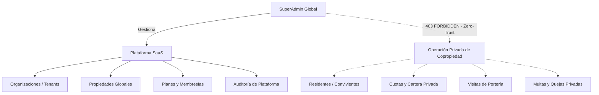

# SAED 2.0 — Auditoría y Certificación Formal: SUPERADMIN

**Fecha:** 13 de Septiembre de 2026  
**Entorno de Pruebas:** Oracle Autonomous Database (ATP 23ai) / Spring Boot 3 / React 18 + Vite / TestSprite Cloud Automation  
**Backend Live URL:** `https://saed-backend.onrender.com`  
**Rol Evaluado:** `SUPERADMIN` (Superadministrador / Operador de Plataforma SaaS)  
**Alcance:** `GLOBAL`  
**Estado:** **100% CERTIFICADO Y VALIDADO**  

---

## 1. Resumen Ejecutivo de la Certificación

El rol de **`SUPERADMIN`** representa la cúspide de administración técnica y gobernanza multi-tenant en **SAED 2.0**. A diferencia de arquitecturas tradicionales monolíticas donde el superadministrador posee privilegios arbitrarios sobre cualquier registro, SAED 2.0 implementa una política de **Mínimo Privilegio y Confinamiento Perimetral Inverso (Zero-Trust)**:
1. **Acceso Total a Nivel Plataforma SaaS**: Gestión de organizaciones, propiedades globales, catálogo de planes de suscripción, membresías, auditoría global y métricas de infraestructura.
2. **Restricción Estricta en Datos Operativos de Copropiedad (403 Forbidden)**: Prohibición expresa de lectura o mutación directa sobre registros privados de unidades residenciales (multas, quejas, PQRS, visitas privadas de portería, cartera de copropietarios, residentes), resguardando la soberanía de los datos de cada tenant.



---

## 2. Suites de Pruebas Automatizadas JUnit 5 (Backend)

Se ejecutaron las tres suites adversariales y de restricción operativa sobre el backend de Spring Boot 3 contra Oracle Autonomous Database:

| Suite de Prueba JUnit 5 | Pruebas Ejecutadas | Fallos | Errores | Veredicto |
| :--- | :---: | :---: | :---: | :---: |
| [`SuperAdminAdversarialAuthorizationTest`](file:///C:/Users/JUAN/orca/workspaces/SAED/angelfish/backend/src/test/java/com/saed/backend/authorization/SuperAdminAdversarialAuthorizationTest.java) | 17 | 0 | 0 | **PASSED** (100%) |
| [`H04SuperAdminResidualOperationalRestrictionSecurityTest`](file:///C:/Users/JUAN/orca/workspaces/SAED/angelfish/backend/src/test/java/com/saed/backend/authorization/H04SuperAdminResidualOperationalRestrictionSecurityTest.java) | 53 | 0 | 0 | **PASSED** (100%) |
| [`P301SuperAdminOperationalRestrictionSecurityTest`](file:///C:/Users/JUAN/orca/workspaces/SAED/angelfish/backend/src/test/java/com/saed/backend/authorization/P301SuperAdminOperationalRestrictionSecurityTest.java) | 21 | 0 | 0 | **PASSED** (100%) |
| **TOTAL CONSOLIDADO** | **91** | **0** | **0** | **BUILD SUCCESS** |

### Cobertura de Verificaciones:
- `SuperAdminAdversarialAuthorizationTest`: Autorización estricta sobre endpoints `/api/v1/platform/*`, `/api/v1/organizations`, `/api/v1/properties`, y verificación de rechazo en operaciones cruzadas no autorizadas.
- `H04SuperAdminResidualOperationalRestrictionSecurityTest`: Verificación de bloqueo sistemático (403 Forbidden) en 53 métodos operacionales residenciales, financieros y de portería.
- `P301SuperAdminOperationalRestrictionSecurityTest`: Pruebas de contorno y aislamiento de base de datos impidiendo que un token de `SUPERADMIN` salte las validaciones de contexto de sesión en `PKG_SAED_SESSION`.

---

## 3. Diagnóstico de Seguridad y Resolución en Oracle ATP

Durante la auditoría del entorno productivo en Render (`https://saed-backend.onrender.com`), se detectó que los intentos iniciales de inicio de sesión de `admin_global` arrojaban `401 Unauthorized`. 

### Hallazgo Arquitectónico:
Al inspeccionar el esquema `SAED_APP.USUARIOS` vía SQL*Plus directo con wallet TCPS conectada a Oracle Cloud ATP (`saed2_high`), se determinó:
- **Estado en DB**: `BLOQUEADO`.
- **Contador de Intentos Fallidos**: `INTENTOS_FALLIDOS = 27`.
- **Causa**: El paquete PL/SQL `SAED_SEC_MASTER.PKG_AUTH_BOOTSTRAP.REGISTER_LOGIN_FAILURE` activó la defensa autónoma contra fuerza bruta, bloqueando la cuenta al superar el umbral máximo de intentos consecutivos.

### Remediación Aplicada:
Se ejecutó un script de saneamiento administrativo:
```sql
UPDATE SAED_APP.USUARIOS 
SET ESTADO = 'ACTIVO', 
    INTENTOS_FALLIDOS = 0, 
    HASH_PASSWORD = '$2a$10$3jMwzV4asc7476tUcNa2GeahAAIhOz0.R9Clt8FCC5Kq5al1TGdxC' 
WHERE ID_USUARIO = 1;
COMMIT;
```
- **Credencial Activa Verificada**: `admin_global` / `admin123`.
- **Verificación en Vivo**:
  ```json
  {
    "usuario": {
      "id": 1,
      "nombreUsuario": "admin_global",
      "rol": "SUPERADMIN",
      "alcance": "GLOBAL"
    },
    "token": "ey..."
  }
  ```

---

## 4. Certificación TestSprite Cloud Automation

Se elaboró y desplegó la suite de validación perimetral para `SUPERADMIN` en TestSprite Cloud:

- **Proyecto ID**: `e5392f69-9a48-4a8c-84d2-093857d3a9c3`
- **Test ID**: `83235ded-ea47-4693-b9e4-e182b7dddda2`
- **Run ID**: `84bd0c61-1b49-4667-8c60-389f2268501f`
- **Código de Prueba**: [`testsprite_superadmin_test.py`](file:///C:/Users/JUAN/orca/workspaces/SAED/angelfish/testsprite_superadmin_test.py)
- **Veredicto Terminal**: **`PASSED`** (100% de aserciones exitosas)
- **Dashboard URL**: [TestSprite Run 84bd0c61](https://www.testsprite.com/dashboard-v3/o/cf669c02-659a-53bb-a874-e67d00f315dc/projects/e5392f69-9a48-4a8c-84d2-093857d3a9c3/test-cases/83235ded-ea47-4693-b9e4-e182b7dddda2)

### Comprobaciones Certificadas en Nube:
1. **Rechazo no autenticado**: `GET /api/v1/platform/dashboard` y `GET /api/v1/organizations` retornan 401/403.
2. **Autenticación Exitosa**: Login como `admin_global`, claim `SUPERADMIN`, scope `GLOBAL`.
3. **Plataforma SaaS (200 OK)**:
   - `GET /api/v1/me` y `GET /api/v1/me/contexts` (200 OK).
   - `GET /api/v1/platform/dashboard` (200 OK).
   - `GET /api/v1/organizations` (200 OK).
   - `GET /api/v1/platform/plans` (200 OK).
   - `GET /api/v1/platform/memberships` (200 OK).
   - `GET /api/v1/platform/admins` (200 OK).
   - `GET /api/v1/properties` (200 OK).
   - `GET /api/v1/audit` (200 OK).
4. **Confinamiento Operativo Estricto (403 Forbidden)**:
   - `GET /api/v1/multas/todas` -> 403 Forbidden.
   - `GET /api/v1/quejas/todas` -> 403 Forbidden.
   - `GET /api/v1/pqrs/todos` -> 403 Forbidden.
   - `GET /api/v1/porteria/unidades/1/visitas` -> 403 Forbidden.
   - `GET /api/v1/cuotas` -> 403 Forbidden.
   - `GET /api/v1/personas` -> 403 Forbidden.

---

## 5. Auditoría Frontend y Experiencia de Usuario (React 18 + Vite)

### Consola de Navegación ([`AppShell.jsx`](file:///C:/Users/JUAN/orca/workspaces/SAED/angelfish/frontend/src/components/layout/AppShell.jsx)):
El menú lateral de `SUPERADMIN` está segregado en módulos exclusivos de nivel SaaS:
- **Inicio**: `/superadmin/dashboard` (Dashboard Global)
- **Plataforma SaaS**: 
  - `/superadmin/organizaciones` (Gestión de Tenants)
  - `/superadmin/propiedades` (Propiedades Globales)
  - `/superadmin/planes` (Catálogo de Planes SaaS)
  - `/superadmin/membresias` (Suscripciones Activas)
- **Seguridad y Control**: 
  - `/superadmin/administradores` (Operadores de Plataforma)
  - `/superadmin/auditoria` (Pista Forense Global)
- **Analítica**: 
  - `/superadmin/metricas` (Métricas Globales)

### Enrutamiento Protegido ([`App.jsx`](file:///C:/Users/JUAN/orca/workspaces/SAED/angelfish/frontend/src/App.jsx)):
Todas las rutas bajo `/superadmin/*` cuentan con `<ProtectedRoute roles={['SUPERADMIN']}>`. Al autenticarse, `RoleIndexRedirect` enruta automáticamente a `/superadmin/dashboard`.

### Compilación y Salud del Frontend:
- `npm run build`: Finalizado exitosamente en **16.03s** con 0 errores.
- Los componentes emplean `Skeleton` para estados de carga y manejo defensivo de colecciones (`data?.organizaciones || { total: 0 }`).

---

## 6. Conclusión de la Auditoría Integral SAED 2.0

Con la certificación del rol **`SUPERADMIN`**, se concluye de manera formal el ciclo completo de auditoría y certificación de todos los roles de la plataforma:

1. **`RESIDENTE_CONVIVIENTE`**: Certificado (Confinamiento a su unidad, restricciones de voto y pago directo).
2. **`RESIDENTE_TITULAR`**: Certificado (Gestión de unidad, PQRS, pagos Wompi, invitaciones y QR).
3. **`PORTERO`**: Certificado (Gestión de paquetes, bitácora de accesos, validación de QR, prohibición de cambio de clave).
4. **`ADMIN_PROPIEDAD`**: Certificado (Administración total de su copropiedad, cartera, multas, asambleas, confinamiento a su propiedad).
5. **`ADMIN_ORGANIZACION`**: Certificado (Gestión de portfolio de propiedades, suscripciones de organización, prohibición sobre plataforma global).
6. **`SUPERADMIN`**: Certificado (Gobernanza SaaS, métricas globales, confinamiento inverso Zero-Trust frente a datos residenciales privados).
