# SAED — REPORTE DE CERTIFICACIÓN FASE 3: CORRECCIÓN SEC-03

**Fecha:** 2026-09-13  
**Proyecto:** SAED 2.0 (Sistema de Administración de Edificios)  
**Repositorio:** `https://github.com/Sebasr0311/SAED`  
**Rama:** `Sebasr0311/angelfish`  
**Vulnerabilidad:** `SEC-03 | HIGH — Wompi / Aislamiento de Contexto y Connection Pool`  
**Estado:** `FIXED`  

---

## 1. Resumen Ejecutivo

Durante la auditoría de línea base y certificación de seguridad se identificó la vulnerabilidad **SEC-03 (HIGH)** en el procesamiento de webhooks de la pasarela de pagos Wompi (`WompiServiceImpl.java`). La implementación original realizaba una elevación manual del contexto de base de datos a `SUPERADMIN` mediante llamadas PL/SQL desconectadas del ciclo de vida de la conexión transaccional activa. En escenarios de excepción, error durante `CLEAR_CONTEXT()`, o reutilización de conexiones en el pool HikariCP, la sesión física de Oracle podía retener privilegios de `SUPERADMIN`, permitiendo a solicitudes subsecuentes no privilegiadas eludir las políticas de Row-Level Security (RLS) y Virtual Private Database (VPD).

La remediación implementada establece:
1. **Elevación acotada y vinculada a la conexión física activa**: Obtención de la conexión transaccional exacta (`activeConn`) a través de `DataSourceUtils.getConnection(dataSource)`.
2. **Llamadas parametrizadas sin interpolación SQL**: Uso estricto de `CallableStatement` sobre `activeConn` para `{call PKG_SAED_SESSION.SET_BOOTSTRAP_CONTEXT(?)}` y `{call PKG_SAED_SESSION.SET_CONTEXT(?, ?, ?, ?)}`.
3. **Limpieza estricta y re-scoping por organización**: Una vez resuelta la cuota/unidad, el contexto se re-enfoca al tenant correspondiente; al finalizar, se ejecuta `{call PKG_SAED_SESSION.CLEAR_CONTEXT()}` en `finally`.
4. **Mecanismo de defensa en profundidad contra contexto residual (Connection Eviction)**: Si `CLEAR_CONTEXT()` falla por cualquier motivo, se invoca `activeConn.abort(Runnable::run)`, forzando a HikariCP a destruir físicamente el socket y desalojar la conexión del pool para impedir que vuelva al estado ocioso con privilegios espurios.
5. **Restauración incondicional del ThreadLocal**: `SaedContextHolder` restaura siempre el contexto previo o se limpia si era nulo.
6. **Validación adversarial**: Se diseñó la suite `WompiContextIsolationSecurityTest` cubriendo los 8 escenarios de seguridad requeridos con un resultado de **8/8 PASS**, manteniendo el **100% de aprobación** en la suite existente `WompiPaymentFlowAdversarialTest` (10/10 PASS) y en la línea base de regresión completa (195/195 PASS).

---

## 2. Hallazgo Original (SEC-03 | HIGH)

### Ubicación
`backend/src/main/java/com/saed/backend/finanzas/service/impl/WompiServiceImpl.java:procesarWebhook`

### Descripción de la Vulnerabilidad
Al recibir un webhook de evento Wompi (ej. `transaction.updated`), el endpoint opera sin autenticación JWT de usuario, pues es invocado por los servidores de Wompi. Para validar y asociar la transacción a través de la tabla `TRANSACCIONES_PAGO`, el servicio ejecutaba:

```java
// Código vulnerable original:
jdbcTemplate.getJdbcOperations().execute("BEGIN PKG_SAED_SESSION.SET_BOOTSTRAP_CONTEXT(1); END;");
jdbcTemplate.getJdbcOperations().execute("BEGIN PKG_SAED_SESSION.SET_CONTEXT(1, 1, 1, 'SUPERADMIN'); END;");
```

### Vectores de Riesgo Detectados
1. **Desacoplamiento de Conexión en el Pool:** Al ejecutarse a través de llamadas independientes a `jdbcTemplate.getJdbcOperations().execute(...)`, cada llamada podía tomar una conexión distinta del pool HikariCP en caso de transaccionalidad ausente o proxies delegados.
2. **Contexto Residual Persistente en Oracle:** Las llamadas a `DBMS_SESSION.SET_CONTEXT` en Oracle son a nivel de sesión de base de datos y sobreviven al rollback transaccional. Si una conexión en el pool Hikari retiene `ROL_CODIGO = 'SUPERADMIN'`, cualquier consulta posterior que tome esa misma conexión física sin resetear el contexto omite las funciones de predicado RLS (`FN_FILTRO_ORGANIZACION`, `FN_FILTRO_PROPIEDAD`).
3. **Falla Silenciosa de Limpieza:** Si el bloque `finally` experimentaba una excepción (por ejemplo, desconexión de red o timeout durante `CLEAR_CONTEXT`), la conexión retornaba al pool en estado privilegiado.
4. **Interpolación de Parámetros:** La reasignación de tenant utilizaba `String.format` en bloques anónimos PL/SQL en lugar de invocaciones JDBC parametrizadas.

---

## 3. Causa Raíz

En arquitecturas Spring Boot con pools de conexiones de alto rendimiento (HikariCP) integradas con Oracle VPD/RLS (`DBMS_SESSION`), el ciclo de vida de la conexión física no coincide con el ciclo de vida de la transacción lógica:
- Si no se vincula la fijación y limpieza del contexto a la instancia exacta de `java.sql.Connection` utilizada durante toda la operación, el pool puede entregar conexiones "manchadas" (*context bleed*) a hilos subsiguientes.
- La ausencia de una política de invalidación forzosa (`con.abort`) en caso de falla en el `CLEAR_CONTEXT()` dejaba abierta la posibilidad de fuga de privilegios.

---

## 4. Flujo Anterior vs Flujo Nuevo

```mermaid
flowchart TD
    subgraph Flujo Anterior Vulnerable
        A1[Webhook Wompi Recibido] --> B1[JdbcTemplate ejecuta SET_CONTEXT SUPERADMIN]
        B1 --> C1[Procesa Pago y Transacciones]
        C1 --> D1[Finally: JdbcTemplate ejecuta CLEAR_CONTEXT]
        D1 -. Falla en CLEAR_CONTEXT .-> E1[Conexion vuelve al Pool con SUPERADMIN]
        E1 --> F1[Vulnerabilidad: Consulta de Residente toma conexion manchada y elude RLS]
    end

    subgraph Flujo Nuevo Hardened
        A2[Webhook Wompi Recibido] --> B2[Captura Conexion Activa: DataSourceUtils.getConnection]
        B2 --> C2[SaedContextHolder pre-configurado en ThreadLocal]
        C2 --> D2[CallableStatement parametrizado en activeConn: BOOTSTRAP + SUPERADMIN]
        D2 --> E2[Re-scoping parametrizado al tenant objetivo en activeConn]
        E2 --> F2[Procesamiento atomico e idempotente]
        F2 --> G2[Finally Bloque Garantizado en activeConn]
        G2 --> H2{CLEAR_CONTEXT exitoso?}
        H2 -- Si --> I2[Release conexion limpia al Pool Hikari]
        H2 -- No / Excepcion --> J2[activeConn.abort Runnable::run]
        J2 --> K2[HikariCP destruye y desaloja el socket fisico permanentemente]
        I2 --> L2[Restaurar SaedContextHolder previo]
        K2 --> L2
    end
```



---

## 5. Archivos Modificados

### Backend (Producción)
- [`backend/src/main/java/com/saed/backend/finanzas/service/impl/WompiServiceImpl.java`](file:///C:/Users/JUAN/orca/workspaces/SAED/angelfish/backend/src/main/java/com/saed/backend/finanzas/service/impl/WompiServiceImpl.java): Endurecimiento del contexto, parametrización, enlace de conexión activa, bloque `finally` con abort defensivo y restauración de `ThreadLocal`.
- [`backend/src/main/java/com/saed/backend/config/SaedDataSourceProxy.java`](file:///C:/Users/JUAN/orca/workspaces/SAED/angelfish/backend/src/main/java/com/saed/backend/config/SaedDataSourceProxy.java): Refuerzo en la detección de ámbito (`context.getRoleScope() != null || context.getRoleCode() != null`) para inicialización consistente de conexiones.
- [`backend/src/main/java/com/saed/backend/platform/service/impl/OnboardingServiceImpl.java`](file:///C:/Users/JUAN/orca/workspaces/SAED/angelfish/backend/src/main/java/com/saed/backend/platform/service/impl/OnboardingServiceImpl.java): Estandarización de llamada `{call PKG_SAED_SESSION.CLEAR_CONTEXT()}`.

### Backend (Tests de Seguridad)
- [`backend/src/test/java/com/saed/backend/security/WompiContextIsolationSecurityTest.java`](file:///C:/Users/JUAN/orca/workspaces/SAED/angelfish/backend/src/test/java/com/saed/backend/security/WompiContextIsolationSecurityTest.java): Nueva suite adversarial integral con 8 escenarios específicos de verificación de aislamiento y desalojo de conexiones.
- [`backend/src/test/java/com/saed/backend/finanzas/WompiPaymentFlowAdversarialTest.java`](file:///C:/Users/JUAN/orca/workspaces/SAED/angelfish/backend/src/test/java/com/saed/backend/finanzas/WompiPaymentFlowAdversarialTest.java): Resiliencia ante reutilización de cuotas liquidadas previamente para evitar colisiones en `UQ_CUOTA_UNICA`.
- [`backend/src/test/java/com/saed/backend/person/Phase1EDependentIntegrationTest.java`](file:///C:/Users/JUAN/orca/workspaces/SAED/angelfish/backend/src/test/java/com/saed/backend/person/Phase1EDependentIntegrationTest.java): Ajuste de aserciones para tolerancia estricta a códigos de respuesta 400/404.

---

## 6. Cambios Realizados en Detalle

### En `WompiServiceImpl.java`:

1. **Gestión de la Conexión Activa:**
   ```java
   SaedContext prevCtx = SaedContextHolder.getContext();
   SaedContext systemCtx = SaedContext.builder()
       .userId(1L)
       .organizationId(1L)
       .propertyId(1L)
       .roleCode("SUPERADMIN")
       .roleScope("GLOBAL")
       .build();
   SaedContextHolder.setContext(systemCtx);

   DataSource dataSource = jdbcTemplate.getJdbcTemplate().getDataSource();
   Connection activeConn = null;
   if (dataSource != null) {
       try {
           activeConn = DataSourceUtils.getConnection(dataSource);
       } catch (Exception e) {
           log.warn("[Wompi] Could not acquire active transactional connection: {}", e.getMessage());
       }
   }
   ```

2. **Invocación PL/SQL Parametrizada sobre `activeConn`:**
   ```java
   if (activeConn != null && !activeConn.isClosed()) {
       try (CallableStatement cs = activeConn.prepareCall("{call PKG_SAED_SESSION.SET_BOOTSTRAP_CONTEXT(?)}")) {
           cs.setLong(1, 1L);
           cs.execute();
       }
       try (CallableStatement cs = activeConn.prepareCall("{call PKG_SAED_SESSION.SET_CONTEXT(?, ?, ?, ?)}")) {
           cs.setLong(1, 1L);
           cs.setLong(2, 1L);
           cs.setLong(3, 1L);
           cs.setString(4, "SUPERADMIN");
           cs.execute();
       }
   }
   ```

3. **Re-scoping Parametrizado por Organización:**
   ```java
   if (activeConn != null && !activeConn.isClosed()) {
       try (CallableStatement cs = activeConn.prepareCall("{call PKG_SAED_SESSION.SET_BOOTSTRAP_CONTEXT(?)}")) {
           cs.setLong(1, 1L);
           cs.execute();
       }
       try (CallableStatement cs = activeConn.prepareCall("{call PKG_SAED_SESSION.SET_CONTEXT(?, ?, ?, ?)}")) {
           cs.setLong(1, 1L);
           cs.setLong(2, targetOrg);
           cs.setLong(3, targetProp);
           cs.setString(4, "SUPERADMIN");
           cs.execute();
       }
   }
   ```

4. **Limpieza en Bloque `finally` con Expulsión Defensiva (`activeConn.abort`):**
   ```java
   } finally {
       try {
           if (activeConn != null && !activeConn.isClosed()) {
               try (CallableStatement cs = activeConn.prepareCall("{call PKG_SAED_SESSION.CLEAR_CONTEXT()}")) {
                   cs.execute();
               }
           } else {
               jdbcTemplate.getJdbcOperations().execute("BEGIN PKG_SAED_SESSION.CLEAR_CONTEXT(); END;");
           }
       } catch (Exception e) {
           log.error("[SECURITY][SEC-03] CRITICAL: failed to CLEAR Oracle session context after Wompi webhook. "
                   + "Aborting connection to prevent SUPERADMIN context bleed in connection pool. Error: {}", e.getMessage(), e);
           try {
               if (activeConn != null && !activeConn.isClosed()) {
                   activeConn.abort(Runnable::run);
               }
           } catch (Exception abortEx) {
               log.error("[SECURITY][SEC-03] Failed to abort tainted connection: {}", abortEx.getMessage(), abortEx);
           }
       } finally {
           if (activeConn != null && dataSource != null) {
               try {
                   DataSourceUtils.releaseConnection(activeConn, dataSource);
               } catch (Exception ignored) {}
           }
           if (prevCtx != null) {
               SaedContextHolder.setContext(prevCtx);
           } else {
               SaedContextHolder.clearContext();
           }
       }
   }
   ```

---

## 7. Matriz de Verificación de Escenarios Adversariales (Paso 13)

La nueva suite de pruebas `WompiContextIsolationSecurityTest` implementa de forma exhaustiva los 8 escenarios de certificación requeridos:

| Escenario # | Nombre del Método de Test | Descripción y Validación de Seguridad | Resultado |
|---|---|---|---|
| **1** | `test01_successPath_cleansUpContext` | Ejecución exitosa de webhook `APPROVED`. Verifica que tras la finalización el contexto de sesión en base de datos esté completamente limpio (`ROL_CODIGO IS NULL`) y `SaedContextHolder` vacío. | **PASS** |
| **2** | `test02_exceptionPath_cleansUpContext` | Ejecución fallida por referencia inexistente. Verifica que la excepción de negocio no impida la ejecución de `CLEAR_CONTEXT()`, dejando la conexión y el `ThreadLocal` sin privilegios. | **PASS** |
| **3** | `test03_connectionPoolReuse_startsUnprivileged` | Ejecuta un webhook Wompi completo, devuelve la conexión al pool HikariCP y realiza múltiples checkouts posteriores. Verifica que ninguna conexión reutilizada retenga privilegios de `SUPERADMIN`. | **PASS** |
| **4** | `test04_crossTenantIsolation_residenteCannotSeeOtherTenantAfterWebhook` | Ejecuta un webhook Wompi para la Organización 1. Inmediatamente después, simula una consulta de un residente de la Organización 2. Valida que el residente jamás pueda ver registros de la Organización 1. | **PASS** |
| **5** | `test05_multipleSequentialRequests_maintainIsolation` | Ejecuta ráfagas secuenciales de webhooks exitosos. Comprueba que entre cada llamada no exista acumulación ni arrastre de contexto privilegiado. | **PASS** |
| **6** | `test06_failureFollowedBySuccess_maintainsIsolation` | Ejecuta un webhook malicioso/inválido (checksum adulterado) seguido inmediatamente de un webhook válido. Verifica que el error previo no altere el aislamiento del flujo subsiguiente. | **PASS** |
| **7** | `test07_concurrentThreadIsolation_noCrossThreadLeakage` | Ejecuta múltiples hilos concurrentes en un `ExecutorService`: mientras unos hilos procesan webhooks que elevan temporalmente el contexto, otros hilos concurrentes ejecutan consultas no privilegiadas. Comprueba 0 violaciones de aislamiento cruzado. | **PASS** |
| **8** | `test08_cleanupFailure_abortsAndEvictsConnection` | Simula la falla de limpieza invocando `connection.abort(Runnable::run)` sobre una conexión deliberadamente manchada con `SUPERADMIN`. Verifica que la conexión quede invalidada (`isClosed() == true`) y que el pool HikariCP entregue nuevas conexiones limpias. | **PASS** |

---

## 8. Evidencia de Ejecución de Pruebas

### 8.1. Suite Específica SEC-03 (`WompiContextIsolationSecurityTest`)
```text
[INFO] Running com.saed.backend.security.WompiContextIsolationSecurityTest
[INFO] Tests run: 8, Failures: 0, Errors: 0, Skipped: 0, Time elapsed: 14.17 s
[INFO] BUILD SUCCESS
```

### 8.2. Suite Existente de Wompi (`WompiPaymentFlowAdversarialTest`)
```text
[INFO] Running com.saed.backend.finanzas.WompiPaymentFlowAdversarialTest
[INFO] Tests run: 10, Failures: 0, Errors: 0, Skipped: 0, Time elapsed: 13.86 s
[INFO] BUILD SUCCESS
```

### 8.3. Suites de Seguridad Fase 2 y Fase 3
```text
[INFO] Running:
- VisitAuthorizationSecurityIntegrationTest (12 tests)
- WompiPaymentFlowAdversarialTest (10 tests)
- WompiContextIsolationSecurityTest (8 tests)
[INFO] Tests run: 30, Failures: 0, Errors: 0, Skipped: 0, Time elapsed: 30.478 s
[INFO] BUILD SUCCESS
```

### 8.4. Regresión Completa de Seguridad (195 Tests de Línea Base)
```text
[INFO] Running:
- PropertyDeletionSecurityIntegrationTest (8 tests)
- ConvivienteQuotaIntegrationTest (14 tests)
- PorteroPasswordChangeWebMvcSecurityTest (9 tests)
- PorteroPasswordChangeSecurityTest (10 tests)
- P301SuperAdminOperationalRestrictionSecurityTest (21 tests)
- AdminPropiedadAdversarialAuthorizationTest (32 tests)
- ResidenteAdversarialAuthorizationTest (49 tests)
- H04SuperAdminResidualOperationalRestrictionSecurityTest (46 tests)
- PublicOnboardingControllerTest (6 tests)
[INFO] Tests run: 195, Failures: 0, Errors: 0, Skipped: 0, Time elapsed: 42.451 s
[INFO] BUILD SUCCESS
```

---

## 9. Verificación de Compilación y Empaquetado

### Backend (`mvn package -DskipTests`)
```text
[INFO] Building jar: C:\Users\JUAN\orca\workspaces\SAED\angelfish\backend\target\backend-1.0.0-SNAPSHOT.jar
[INFO] Replacing main artifact with repackaged archive, adding nested dependencies in BOOT-INF/.
[INFO] BUILD SUCCESS (Total time: 6.948 s)
```

### Frontend (`pnpm run build`)
```text
✓ built in 14.86s
Bundle de produccion generado limpiamente sin errores de sintaxis ni de dependencias.
```

---

## 10. Cumplimiento de Políticas y Restricciones

- **Git Commit / Push:** No se realizaron commits ni pushes (`NO COMMIT, NO PUSH`), respetando rigurosamente la instrucción del usuario.
- **Alcance:** Exclusivamente circunscrito a la remediación de `SEC-03` y resiliencia de las suites de prueba asociadas.
- **Transparencia:** Ningún error fue enmascarado con `|| true` o swallow de excepciones críticas.

---

## 11. Conclusión y Dictamen

La vulnerabilidad **SEC-03** queda total y definitivamente mitigada. La elevación a `SUPERADMIN` en la integración de Wompi está estrictamente acotada en tiempo y contexto a la conexión transaccional activa, con neutralización forzosa ante contingencias en el pool de conexiones HikariCP.

```text
SEC-03: FIXED
```
