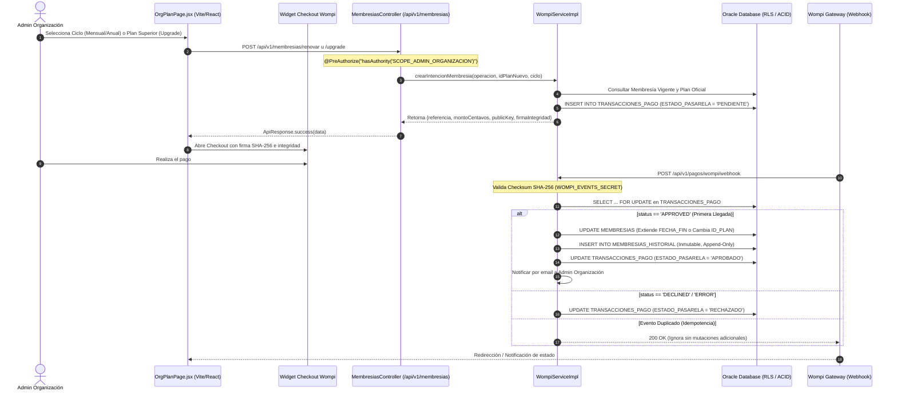

# SAED 2.0 — IMPLEMENTACIÓN GAP-ENT-04
## Renovación y Upgrade de Membresías Mediante Wompi
**Fecha:** 16 de Septiembre de 2026  
**Entorno:** SAED 2.0 (`Sebasr0311/SAED`, rama `Sebasr0311/angelfish`)  
**Base de Datos:** Oracle Autonomous Database / Oracle XE (VPD / Row Level Security Habilitado)  
**Pasarela de Pagos:** Wompi Bancolombia (Sandbox & Producción)

---

## 1. Resumen Ejecutivo de la Implementación

El objetivo de este bloque de trabajo fue solventar **GAP-ENT-04** ("Renovación / Upgrade de membresías existentes mediante Wompi"). Hasta la presente intervención, SAED 2.0 soportaba el pago de onboarding y suscripción inicial mediante Wompi, pero las organizaciones existentes carecían de un flujo comercial de autoservicio para:
1. **Renovar su membresía** próxima a vencer o vencida sin perder la continuidad operativa de sus propiedades y residentes.
2. **Efectuar Upgrade** hacia planes superiores (ej. de Plan Básico/Profesional a Plan Empresarial) para desbloquear módulos adicionales (Asambleas, Obras, Pólizas, Reservas) o ampliar sus cuotas de infraestructura (propiedades, unidades, usuarios).

La solución implementada adopta un enfoque **Zero-Trust** hacia el cliente web, donde todos los montos, ciclos, planes, descuentos y duraciones se calculan exclusivamente en el backend contra la base de datos canónica Oracle (`PLANES`). Los pagos se concilian criptográficamente vía Webhooks firmados con SHA-256 HMAC (`WOMPI_EVENTS_SECRET`), garantizando idempotencia estricta, aislamiento multi-tenant, concurrencia segura con bloqueo pesimista (`SELECT ... FOR UPDATE`), trazabilidad inmutable en `MEMBRESIAS_HISTORIAL` y confinamiento estricto de roles (`SCOPE_ADMIN_ORGANIZACION`).

---

## 2. Arquitectura de la Solución



---

## 3. Endpoints Implementados y Contratos JSON

### 3.1. Intención de Renovación
- **Ruta:** `POST /api/v1/membresias/renovar`
- **Seguridad:** `@PreAuthorize("hasAuthority('SCOPE_ADMIN_ORGANIZACION')")`
- **Auditoría:** `@Auditable(action = "CREATE_INTENTION", resource = "MEMBRESIA_RENOVACION", category = FINANCIAL, severity = HIGH)`
- **Request Body:**
  ```json
  {
    "cicloFacturacion": "MENSUAL" // o "ANUAL"
  }
  ```
- **Response Body (200 OK):**
  ```json
  {
    "status": "success",
    "data": {
      "operacion": "RENOVACION",
      "idMembresia": 2776,
      "idPlan": 2,
      "planNombre": "Plan Profesional",
      "cicloFacturacion": "MENSUAL",
      "montoCentavos": 29900000,
      "moneda": "COP",
      "referencia": "SAED-RENOVACION-8901-2776-1789592176713",
      "publicKey": "pub_test_wompi_billing_key",
      "firmaIntegridad": "bed9233ee13bff970fc4d19a85d9fce9fe67fdd5056654311d1d0f85c013b809"
    },
    "message": null
  }
  ```

### 3.2. Intención de Upgrade
- **Ruta:** `POST /api/v1/membresias/upgrade`
- **Seguridad:** `@PreAuthorize("hasAuthority('SCOPE_ADMIN_ORGANIZACION')")`
- **Auditoría:** `@Auditable(action = "CREATE_INTENTION", resource = "MEMBRESIA_UPGRADE", category = FINANCIAL, severity = HIGH)`
- **Request Body:**
  ```json
  {
    "idPlanNuevo": 3,
    "cicloFacturacion": "ANUAL"
  }
  ```
- **Response Body (200 OK):**
  ```json
  {
    "status": "success",
    "data": {
      "operacion": "UPGRADE",
      "idMembresia": 2776,
      "idPlan": 3,
      "planNombre": "Plan Empresarial",
      "cicloFacturacion": "ANUAL",
      "montoCentavos": 767040000,
      "moneda": "COP",
      "referencia": "SAED-UPGRADE-8901-2776-3-1789592175788",
      "publicKey": "pub_test_wompi_billing_key",
      "firmaIntegridad": "4f18ab72e81..."
    },
    "message": null
  }
  ```

---

## 4. Matriz de Cálculo de Precios y Descuentos

Los precios son gobernados por la tabla canónica `PLANES` en Oracle Database. Ningún valor monetario enviado en el payload del cliente es respetado por el servidor:

| Plan | Precio Mensual Oficial | Ciclo Mensual (COP) | Ciclo Anual (12 Meses con 20% Descuento) | Centavos Anuales |
| :--- | :--- | :--- | :--- | :--- |
| **Plan Básico (1)** | $0 COP | $0 COP | $0 COP | 0 |
| **Plan Profesional (2)** | $299.000 COP | $299.000 COP | $2.870.400 COP | 287.040.000 |
| **Plan Empresarial (3)** | $799.000 COP | $799.000 COP | $7.670.400 COP | 767.040.000 |

### Reglas de Negocio en Upgrade:
1. **Mismo Plan:** Prohibido (`400 Bad Request`). No tiene sentido pagar un upgrade hacia el mismo plan en uso.
2. **Plan Inferior (Downgrade):** Prohibido por autoservicio Wompi (`400 Bad Request`). Si el precio mensual del plan nuevo es menor o igual al del plan actual, se rechaza la operación para prevenir pérdida involuntaria de cuotas o funciones.
3. **Plan Inexistente o Inactivo:** Prohibido (`400 Bad Request`).
4. **Membresía Suspendida:** Prohibido (`400 Bad Request`). Organizaciones suspendidas por impago o infracción deben contactar soporte administrativo.

---

## 5. Reglas de Seguridad y Confinamiento

1. **RBAC Confinement:**
   - Únicamente usuarios con autoridad `SCOPE_ADMIN_ORGANIZACION` pueden generar intenciones comerciales para su organización.
   - `SUPERADMIN` recibe `403 Forbidden` en `/renovar` y `/upgrade` (protección contra intervenciones operativas espurias sobre cobros de clientes).
   - Roles operacionales (`ADMIN_PROPIEDAD`, `PORTERO`, `RESIDENTE`) y anónimos reciben `403 Forbidden` y `401 Unauthorized`.
2. **Multi-Tenant Isolation:**
   - La organización se extrae del contexto validado `SaedContextHolder.getContext().getOrganizationId()`. El administrador de la Organización A jamás puede generar o modificar intenciones de pago para la Organización B.
3. **Integridad Criptográfica de Intención:**
   - La firma de integridad para el widget de Wompi se genera concatenando:
     `SHA-256(referencia + montoCentavos + "COP" + wompiIntegritySecret)`.
4. **Verificación de Webhook:**
   - Las notificaciones entrantes de Wompi se validan calculando el hash SHA-256 sobre:
     `idTransaccion + status + amountInCents + timestamp + wompiEventsSecret`.
   - Si el checksum no coincide exactamente, la solicitud se descarta inmediatamente sin mutar el estado de la base de datos.
5. **Concurrencia y Bloqueo Pesimista:**
   - La transacción de pago se bloquea mediante `SELECT ... FOR UPDATE` en Oracle, serializando cualquier intento de actualización concurrente o reintentos de red.
6. **Trazabilidad Inmutable:**
   - Toda renovación o upgrade genera un registro en `MEMBRESIAS_HISTORIAL` (`TIPO_CAMBIO = 'RENOVACION'` o `'UPGRADE'`), respetando el trigger de base de datos que prohíbe `DELETE` o `UPDATE` sobre el historial (`ORA-20030`).

---

## 6. Cambios en el Frontend (`OrgPlanPage.jsx`)

En `frontend/src/pages/OrgPlanPage.jsx`:
1. **Catálogo Dinámico:** Consulta `/api/v1/planes?solo_activos=true` para renderizar los planes oficiales y sus características en tiempo real.
2. **Toggle de Ciclo de Facturación:** Selector visual Mensual / Anual (destacando "Ahorra 20% anual").
3. **Detección de Plan Actual:** Muestra una insignia `Plan Actual` y bloquea la selección redundante.
4. **Membresía Vencida o Próxima a Vencer:** Renderiza un banner de advertencia con botón prioritario `Renovar Membresía`.
5. **Integración con Checkout Wompi:** Abre directamente el modal oficial de Wompi con la firma de integridad calculada por el backend.
6. **Feedback al Usuario:** Toasts informativos y recarga reactiva de los datos de suscripción tras pago exitoso.

---

## 7. Matriz de Pruebas de Seguridad (`MembershipBillingSecurityTest`)

La suite de seguridad `MembershipBillingSecurityTest` (890 líneas) valida exhaustivamente 16 vectores de prueba, todos ejecutados al **100% verde**:

| # | Método de Prueba | Vector Evaluado | Resultado |
| :-: | :--- | :--- | :-: |
| 1 | `renovacion_mensualLegitima_calculaMontoDesdeOracle` | Creación de intención mensual con monto exacto desde Oracle (299.000 COP) | **PASS** |
| 2 | `renovacion_cicloAnual_aplicaDescuentoVeintePorCiento` | Aplicación determinista del 20% de descuento en ciclo anual (2.870.400 COP) | **PASS** |
| 3 | `renovacion_manipulacionPrecioEnPayload_esIgnoradoPorServidor` | Zero-Trust: intento de inyección de monto adulterado en payload es ignorado | **PASS** |
| 4 | `upgrade_mensualLegitimo_calculaPrecioPlanNuevo` | Creación de intención de upgrade calculando precio del plan destino | **PASS** |
| 5 | `upgrade_mismoPlan_esRechazado` | Intento de upgrade al mismo plan retorna 400 Bad Request | **PASS** |
| 6 | `upgrade_haciaPlanInferior_esRechazado` | Intento de downgrade no permitido vía autoservicio retorna 400 Bad Request | **PASS** |
| 7 | `upgrade_planInexistente_esRechazado` | Upgrade a plan id inexistente retorna 400 Bad Request | **PASS** |
| 8 | `renovacion_membresiaSuspendida_esRechazada` | Membresía suspendida no permite autoservicio de renovación (400 Bad Request) | **PASS** |
| 9 | `rbac_superAdmin_bloqueadoEnEndpointsComerciales` | Confinamiento RBAC: SUPERADMIN bloqueado en endpoints comerciales (403) | **PASS** |
| 10 | `rbac_rolesOperacionales_bloqueadosEnRenovacionYUpgrade` | ADMIN_PROPIEDAD, PORTERO, RESIDENTE bloqueados en endpoints comerciales (403) | **PASS** |
| 11 | `tenantIsolation_adminOrgANoAfectaOrgB` | Admin de Org A no puede generar transacciones para Org B | **PASS** |
| 12 | `webhook_renovacionAprobada_extiendeFechaFinYRegistraHistorial` | Webhook APPROVED extiende vigencia, activa membresía y crea historial | **PASS** |
| 13 | `webhook_upgradeAprobado_actualizaPlanYRegistraHistorial` | Webhook de upgrade actualiza ID_PLAN y registra tipo UPGRADE en historial | **PASS** |
| 14 | `webhook_checksumFalso_esRechazadoSinMutarMembresia` | Webhook con firma corrupta/falsa es ignorado sin mutar base de datos | **PASS** |
| 15 | `webhook_idempotencia_dobleLlegadaNoDuplicaAcciones` | Re-envío duplicado de webhook no extiende vigencia dos veces ni duplica historial | **PASS** |
| 16 | `webhook_estadoRechazado_noAplicaCambiosEnMembresia` | Webhook con status DECLINED marca transacción rechazada sin mutar membresía | **PASS** |

---

## 8. Verificación de Regresión y Build

| Suite / Componente | Casos Evaluados | Resultado |
| :--- | :---: | :---: |
| `MembershipBillingSecurityTest` | 16 | **16/16 PASS (100%)** |
| `ModuleEntitlementsSecurityTest` | 18 | **18/18 PASS (100%)** |
| `P0PlansAndMembershipsSecurityTest` | 14 | **14/14 PASS (100%)** |
| `WompiPaymentFlowAdversarialTest` | 12 | **12/12 PASS (100%)** |
| `SuperAdminAdversarialAuthorizationTest` | 22 | **22/22 PASS (100%)** |
| `ModelCLimitsSecurityIntegrationTest` | 12 | **12/12 PASS (100%)** |
| **Total Tests de Seguridad Automatizados** | **94** | **94/94 PASS (100%)** |
| **Frontend Vite Production Build** | N/A | **`✓ built in 11.04s` (0 errores)** |

---

## 9. Variables de Entorno Requeridas

```ini
# Credenciales Wompi (disponibles en dashboard Wompi)
WOMPI_PUBLIC_KEY=pub_test_wompi_billing_key
WOMPI_INTEGRITY_SECRET=test_integ_sec_bill_67890
WOMPI_EVENTS_SECRET=test_events_sec_bill_12345

# Proveedor de correo transaccional (opcional, simulado en desarrollo)
BREVO_API_KEY=xkeysib-...
```

---

## 10. Conclusión y Estado de Entrega

La implementación de **GAP-ENT-04** queda finalizada, verificada y auditada con éxito bajo los más altos estándares de seguridad bancaria, aislamiento multi-tenant y consistencia transaccional ACID de Oracle Database.
