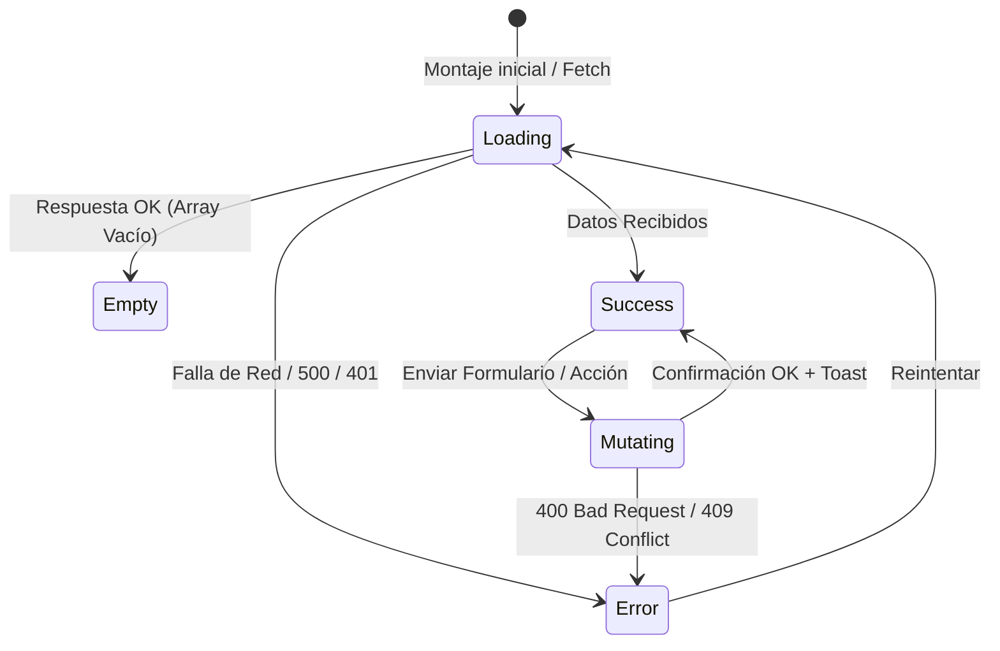

# SAED 2.0 — Master Design System Specification
## Arquitectura Visual, Tokens, Componentes y Accesibilidad de Producción

---

## 1. Filosofía Visual e Identidad del Producto

SAED es una plataforma SaaS de misión crítica para la administración de organizaciones inmobiliarias, copropiedades residenciales y control de acceso.

### Principios Fundamentales de Diseño
1. **Sobriedad y Elegancia Empresarial:** Estética limpia, bordes nítidos, paleta de colores contenida y contrastes certificados WCAG AA.
2. **Densidad de Información Óptima:** Diseñado para operadores que gestionan cientos de unidades y transacciones sin fatiga visual ni padding innecesario.
3. **Cero Estética "AI Generic":**
   - ❌ Prohibidos gradientes arcoíris o fondos con resplandores de neón.
   - ❌ Prohibidas tarjetas gigantes con métricas vacías.
   - ❌ Prohibidos emojis como iconografía de interfaz (se utiliza Lucide Icons y Material Symbols).
   - ❌ Prohibidas animaciones lentas o decorativas que entorpezcan el flujo operativo.
4. **Coherencia Multi-Rol:** Claridad meridiana entre la administración de plataforma global (`SUPERADMIN`) y la operación de edificios (`ADMIN_PROPIEDAD`, `PORTERO`, `RESIDENTE`).

---

## 2. Sistema de Design Tokens y Paleta Semántica

Todos los componentes deben apoyarse en variables CSS y alias semánticos de Tailwind, garantizando paridad automática entre modo claro (`light`) y modo oscuro (`dark`).

### 2.1 Colores y Superficies Semánticas

```
                                  SUPERFICIES & CAPAS
┌──────────────────────────────────────────────────────────────────────────┐
│ Viewport: bg-background (Tokens: var(--background) / var(--on-background)│
│  ┌────────────────────────────────────────────────────────────────────┐  │
│  │ Cards / Paneles: bg-card / bg-surface (var(--surface))            │  │
│  │   ┌──────────────────────────────────────────────────────────────┐ │  │
│  │   │ Modales / Dropdowns: bg-popover / bg-surface-dim             │ │  │
│  │   └──────────────────────────────────────────────────────────────┘ │  │
│  └────────────────────────────────────────────────────────────────────┘  │
└──────────────────────────────────────────────────────────────────────────┘
```

| Token Semántico | Variable CSS | Utilidad Tailwind | Caso de Uso Primario |
| :--- | :--- | :--- | :--- |
| **`background`** | `var(--background)` | `bg-background` | Fondo principal de la aplicación. |
| **`foreground`** | `var(--on-background)` | `text-foreground` | Texto principal de alto contraste. |
| **`card`** | `var(--surface)` | `bg-card text-card-foreground` | Superficie de tarjetas y contenedores. |
| **`primary`** | `var(--primary)` | `bg-primary text-primary-foreground` | Acciones primarias, botones de confirmación, links activos. |
| **`secondary`** | `var(--surface-dim)` | `bg-secondary text-secondary-foreground` | Botones secundarios, filtros neutros, tags. |
| **`muted`** | `var(--surface-dim)` | `text-muted-foreground bg-muted` | Subtítulos, metadatos, descripciones secundarias. |
| **`destructive`** | `var(--btn-danger)` | `bg-destructive text-destructive-foreground` | Multas, sanciones, eliminación, revocación. |
| **`success`** | `var(--accent-green)` | `bg-emerald-500/10 text-emerald-600 dark:text-emerald-400` | Estados activos, pagos aprobados, verificaciones OK. |
| **`border`** | `var(--border)` | `border-border` | Divisores, bordes de tabla, contornos de tarjeta. |
| **`input`** | `var(--outline-variant)` | `border-input bg-background` | Campos de formulario y selectores. |
| **`ring`** | `var(--border-focus)` | `ring-2 ring-primary/20 ring-offset-2` | Indicador visual de foco accesible. |

> [!WARNING]
> Prohibido utilizar clases de color Tailwind arbitrarias (ej. `text-blue-500`, `bg-gray-100`, `text-slate-700`) cuando exista un token semántico (`text-primary`, `bg-muted`, `text-foreground`).

---

## 3. Jerarquía Tipográfica y Espaciado

### 3.1 Familias Tipográficas
* **Primaria (Sans-Serif):** `Plus Jakarta Sans`, `DM Sans`, `system-ui`, `sans-serif`.
* **Datos y Códigos (Monospace):** `JetBrains Mono`, `monospace` (para IDs, NITs, hashes, tokens, fechas y montos financieros).

### 3.2 Escala de Tamaños
* **Page Title / H1:** `text-3xl font-bold tracking-tight text-foreground` (24px - 30px).
* **Section Title / H2:** `text-xl font-semibold text-foreground` (18px - 20px).
* **Card Header / H3:** `text-base font-semibold text-foreground` (15px - 16px).
* **Body Normal:** `text-sm text-foreground` (14px, interlineado `leading-relaxed`).
* **Metadata & Captions:** `text-xs text-muted-foreground` (12px).
* **Badges & Tags:** `text-[11px] font-semibold uppercase tracking-wider` (11px).

### 3.3 Border Radius y Sombras
* **Contenedores de Tarjeta:** `rounded-xl` (14px - 18px).
* **Botones y Campos de Entrada:** `rounded-lg` (8px - 12px).
* **Badges y Tags:** `rounded-md` o `rounded-full` (4px - 9999px).
* **Sombras:** Sutileza extrema (`shadow-sm` para cards, `shadow-xl` con backdrop blur para modales).

---

## 4. Catálogo de Componentes y Reglas de Composición

```
                            ARQUITECTURA DE COMPONENTES
┌──────────────────────────────────────────────────────────────────────────┐
│                        AppShell (Layout Global)                          │
│ ┌──────────────────────┐  ┌────────────────────────────────────────────┐ │
│ │ Sidebar (Desktop)    │  │ Topbar (Breadcrumbs, Tenant, Theme, Avatar)│ │
│ │ Navigation by Role   │  ├────────────────────────────────────────────┤ │
│ │ (SaaS vs Edificio)   │  │ Page Content Area (<Outlet />)             │ │
│ │                      │  │  ┌──────────────────────────────────────┐  │ │
│ │                      │  │  │ PageHeader (Title, Action Buttons)   │  │ │
│ │                      │  │  │ StatCard / KPI Grid (3 - 4 cols)     │  │ │
│ │                      │  │  │ DataTable (Filters, Search, Actions) │  │ │
│ │                      │  │  │ Modal / Sheet (Accessible Forms)     │  │ │
│ └──────────────────────┘  │  └──────────────────────────────────────┘  │ │
│                           └────────────────────────────────────────────┘ │
└──────────────────────────────────────────────────────────────────────────┘
```

### Componentes Base Disponibles en `frontend/src/components/ui/`
1. **Estructura y Layout:** `card.tsx`, `separator.tsx`, `sheet.tsx`, `tabs.tsx`, `PageHeader.jsx`.
2. **Formularios e Inputs:** `input.tsx`, `label.tsx`, `select.tsx`, `checkbox.tsx`, `switch.tsx`, `textarea.tsx`, `Form.jsx`.
3. **Feedback y Diálogos:** `dialog.tsx`, `alert-dialog.tsx`, `alert.tsx`, `skeleton.tsx`, `sonner.tsx` (Toasts), `ConfirmDialog.jsx`, `EmptyState.jsx`.
4. **Datos y Tablas:** `table.tsx`, `DataTable.jsx`, `Pagination.jsx`, `badge.tsx`, `avatar.tsx`, `tooltip.tsx`, `dropdown-menu.tsx`.
5. **Botones e Interactividad:** `button.tsx`, `ActionButtons.jsx`.

---

## 5. Protocolo de Construcción de Pantallas (6 Estados Obligatorios)

Ninguna pantalla debe diseñarse asumiendo únicamente el estado "hay datos listos". Se deben implementar formalmente los 6 estados:



1. **Estado `Loading`:** Skeletons estructurales (`<Skeleton className="h-16 w-full" />`), evitando saltos de layout (CLS).
2. **Estado `Empty`:** Componente `<EmptyState />` con icono contextual, mensaje amigable y botón de acción principal.
3. **Estado `Error`:** Banner de error o Toast (`toast.error()`) con botón de reintento.
4. **Estado `Success`:** Datos presentados en tabla o grid con paginación limpia.
5. **Estado `Mutating`:** Botones deshabilitados (`disabled={isSubmitting}`) con feedback visual inmediato.
6. **Estado `Unauthorized (403)`:** Redirección o aviso claro de falta de privilegios por alcance de rol.

---

## 6. Separación Estricta de Dominios por Rol

| Nivel de Rol | Alcance (`SCOPE`) | Dominio Exclusivo | Vistas Permitidas |
| :--- | :--- | :--- | :--- |
| **`SUPERADMIN`** | **GLOBAL** | **Plataforma SaaS SAED** | `/superadmin/dashboard`, `/superadmin/organizaciones`, `/superadmin/propiedades` *(Catálogo)*, `/superadmin/planes`, `/superadmin/membresias`, `/superadmin/administradores`, `/superadmin/auditoria`, `/superadmin/metricas`. |
| **`ADMIN_ORGANIZACION`** | **ORGANIZACION** | **Organización Cliente** | Gestión de propiedades y administradores de su empresa. |
| **`ADMIN_PROPIEDAD`** | **PROPIEDAD** | **Copropiedad / Edificio** | `/dashboard`, `/residentes`, `/unidades`, `/pagos`, `/cartera`, `/multas`, `/visitas`, `/reservas-admin`, `/asambleas-admin`, `/mantenimiento`. |
| **`PORTERO`** | **PROPIEDAD** | **Control de Acceso** | `/portero-dashboard`, `/visitas`, `/paquetes`, `/parqueaderos`, `/escanner-qr`, `/incidentes-admin`. |
| **`RESIDENTE`** | **UNIDAD** | **Habitante / Copropietario**| `/residente-dashboard`, `/res-perfil`, `/res-apartamento`, `/res-cuotas`, `/res-frecuentes`, `/res-buzon`, `/res-visita`, `/res-quejas`, `/res-reservas`. |

---

## 7. Estándares de Accesibilidad (A11y) y Responsive

### 7.1 Accesibilidad Web (WCAG 2.1 AA)
* **Gestión de Foco:** Teclado completo (Tab, Shift+Tab, Enter, Escape). Radix UI gestiona el focus trapping en diálogos y dropdowns.
* **HTML Semántico:** Uso de `<main>`, `<nav>`, `<aside>`, `<header>`, `<table>`, `<th>`, `<button>`, `<label htmlFor="...">`.
* **Regiones ARIA:** `aria-expanded`, `aria-selected`, `aria-current="page"`, `aria-label` descriptivos en botones de solo icono.
* **Lectores de Pantalla:** Soporte para Skip Links (`Saltar al contenido principal`).

### 7.2 Comportamiento Responsive
* **Desktop (>= 1024px):** Sidebar fijo o colapsable en rail + tabla con múltiples columnas contextuales.
* **Tablet (768px - 1023px):** Sidebar colapsable + tabla con scroll horizontal suave.
* **Mobile (< 768px):** Sidebar transformado en Drawer/Sheet lateral accionado por botón hamburguesa + tablas adaptadas a tarjetas apiladas o scroll controlado.

---

## 8. Mantenimiento y Evolución

Este documento es una especificación viva. Cualquier nuevo módulo frontend añadido al repositorio SAED debe adherirse a esta arquitectura y someterse a verificación con `npm run build` y auditorías de la skill `saed-frontend-design`.
