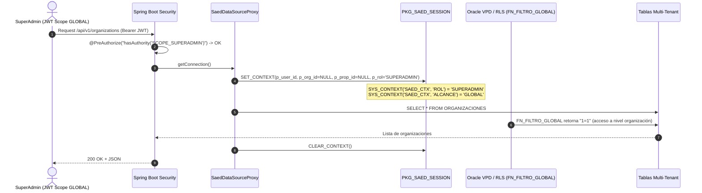

# SUPERADMIN Authorization & Scope Specification v1.0
## Plan Maestro — Rediseño y Consolidación del SUPERADMIN de SAED 2.0

---

## 1. Definición Formal y Dominio de Responsabilidad

El rol `SUPERADMIN` en SAED 2.0 deja de ser un "superusuario con permisos globales irrestrictos" para convertirse estrictamente en el **Operador de la Plataforma SAED** con alcance (`SCOPE`) **GLOBAL**.

```
                         SAED PLATFORM
                               │
               ┌───────────────┴───────────────┐
               │                               │
         SUPERADMIN                      CLIENTES SAED
       (Scope: GLOBAL)                         │
     Dominio: Plataforma SaaS                  │
                                   ┌───────────┴───────────┐
                                   │                       │
                            ADMIN_ORGANIZACION      ADMIN_PROPIEDAD
                        (Scope: ORGANIZACION)     (Scope: PROPIEDAD)
                                   │                       │
                         Organización SaaS          Copropiedad / Edificio
                                                           │
                                              ┌────────────┼────────────┐
                                              │            │            │
                                           PORTERO     RESIDENTE       ...
                                        (Operación)    (Habitante)
```

### Contrato de Identidad y Alcance

| Atributo | Definición Formal |
| :--- | :--- |
| **Rol** | `SUPERADMIN` |
| **Scope** | `GLOBAL` (sin vinculación obligatoria a `id_organizacion` ni `id_propiedad` operativa) |
| **Dominio** | **Plataforma SAED SaaS** (Organizaciones, Propiedades en modo catálogo, Planes, Membresías, Facturación SaaS, Seguridad Global, Auditoría de Plataforma, Métricas). |
| **Exclusiones Terminantes** | **Operación de Copropiedades** (Prohibido crear o editar residentes, registrar visitas, operar portería, emitir sanciones/multas, registrar pagos de cuotas de administración, gestionar reservas, etc.). |

---

## 2. Inventario de Deuda Técnica y Hallazgos Actuales

### 2.1 Backend (Acoplamiento Inadecuado de `SCOPE_SUPERADMIN`)
Se detectó la presencia indebida de `hasAuthority('SCOPE_SUPERADMIN')` o `hasAnyAuthority('SCOPE_SUPERADMIN', ...)` en controladores puramente operativos de copropiedad:

* **Convivencia y Sanciones:** [`MultasController.java`](file:///C:/Users/JUAN/Antigravity%20IDE/SAED/backend/src/main/java/com/saed/backend/convivencia/controller/MultasController.java) y [`QuejasController.java`](file:///C:/Users/JUAN/Antigravity%20IDE/SAED/backend/src/main/java/com/saed/backend/convivencia/controller/QuejasController.java) permiten a SUPERADMIN crear y alterar multas de copropiedad.
* **Portería y Control de Acceso:** [`PorteriaController.java`](file:///C:/Users/JUAN/Antigravity%20IDE/SAED/backend/src/main/java/com/saed/backend/porteria/controller/PorteriaController.java) (10 endpoints) permite a SUPERADMIN registrar visitas, paquetes y escanear QR.
* **Personas y Residentes:** [`PersonaController.java`](file:///C:/Users/JUAN/Antigravity%20IDE/SAED/backend/src/main/java/com/saed/backend/person/controller/PersonaController.java) y [`UnitInhabitantController.java`](file:///C:/Users/JUAN/Antigravity%20IDE/SAED/backend/src/main/java/com/saed/backend/person/controller/UnitInhabitantController.java) permiten a SUPERADMIN mutar residentes de edificios individuales.
* **Finanzas Operativas:** [`ResidentesFinanzasController.java`](file:///C:/Users/JUAN/Antigravity%20IDE/SAED/backend/src/main/java/com/saed/backend/finanzas/controller/ResidentesFinanzasController.java) y [`PagosController.java`](file:///C:/Users/JUAN/Antigravity%20IDE/SAED/backend/src/main/java/com/saed/backend/finanzas/controller/PagosController.java) permiten a SUPERADMIN gestionar pagos de expensas comunes.

### 2.2 Frontend (Colapso Conceptual en `ADMINISTRADOR`)
En [`frontend/src/lib/access.js`](file:///C:/Users/JUAN/Antigravity%20IDE/SAED/frontend/src/lib/access.js), la función `normalizeRole` colapsa tres roles distintos en uno solo:
```javascript
// ANTIPATRÓN IDENTIFICADO:
if (r === 'SUPERADMIN' || r === 'ADMIN_ORGANIZACION' || r === 'ADMIN_PROPIEDAD') {
  return 'ADMINISTRADOR';
}
```
Esto provoca que el `SUPERADMIN` reciba las 16 rutas operativas de un administrador de edificio (`/residentes`, `/contratos`, `/pagos`, `/multas`, `/visitas`, `/parqueaderos`, etc.) y el mismo Dashboard operativo de copropiedad.

---

## 3. Matriz Exhaustiva de Autorización Backend

| Dominio / Recurso | Endpoint Base | GET | POST | PUT / PATCH | DELETE | Autoridad Requerida |
| :--- | :--- | :---: | :---: | :---: | :---: | :--- |
| **Organizaciones (SaaS)** | `/api/v1/organizations` | ✅ | ✅ | ✅ | ❌ | `SCOPE_SUPERADMIN` |
| **Planes SAED (SaaS)** | `/api/v1/platform/plans` | ✅ | ✅ | ✅ | ❌ | `SCOPE_SUPERADMIN` |
| **Membresías SaaS** | `/api/v1/platform/memberships` | ✅ | ✅ | ✅ | ❌ | `SCOPE_SUPERADMIN` |
| **Auditoría Global Plataforma** | `/api/v1/audit/global` | ✅ | ❌ | ❌ | ❌ | `SCOPE_SUPERADMIN` |
| **Métricas Globales Plataforma** | `/api/v1/platform/metrics` | ✅ | ❌ | ❌ | ❌ | `SCOPE_SUPERADMIN` |
| **Administradores SAED** | `/api/v1/platform/admins` | ✅ | ✅ | ✅ | ❌ | `SCOPE_SUPERADMIN` |
| **Propiedades (Visión Catálogo)** | `/api/v1/properties` | ✅ *(Agregado)* | ❌ *(Org Admin)* | ❌ *(Org Admin)* | ❌ | `SCOPE_SUPERADMIN` *(Solo Lectura)* |
| **Unidades (Visión Catálogo)** | `/api/v1/units` | ✅ *(Solo Totales)* | ❌ | ❌ | ❌ | `SCOPE_ADMIN_PROPIEDAD` |
| **Residentes / Habitantes** | `/api/v1/personas`, `/inhabitants` | ❌ **(403)** | ❌ **(403)** | ❌ **(403)** | ❌ | `SCOPE_ADMIN_PROPIEDAD` |
| **Visitas y Portería** | `/api/v1/porteria/**` | ❌ **(403)** | ❌ **(403)** | ❌ **(403)** | ❌ | `SCOPE_PORTERO`, `SCOPE_ADMIN_PROPIEDAD` |
| **Paquetes y Correspondencia** | `/api/v1/paquetes/**` | ❌ **(403)** | ❌ **(403)** | ❌ **(403)** | ❌ | `SCOPE_PORTERO`, `SCOPE_ADMIN_PROPIEDAD` |
| **Multas y Sanciones** | `/api/v1/multas/**`, `/sanciones` | ❌ **(403)** | ❌ **(403)** | ❌ **(403)** | ❌ | `SCOPE_ADMIN_PROPIEDAD` |
| **PQRS de Copropiedad** | `/api/v1/quejas/**`, `/pqrs` | ❌ **(403)** | ❌ **(403)** | ❌ **(403)** | ❌ | `SCOPE_ADMIN_PROPIEDAD`, `SCOPE_RESIDENTE` |
| **Reservas y Zonas Comunes** | `/api/v1/reservas/**` | ❌ **(403)** | ❌ **(403)** | ❌ **(403)** | ❌ | `SCOPE_ADMIN_PROPIEDAD`, `SCOPE_RESIDENTE` |
| **Asambleas de Copropietarios** | `/api/v1/asambleas/**` | ❌ **(403)** | ❌ **(403)** | ❌ **(403)** | ❌ | `SCOPE_ADMIN_PROPIEDAD` |
| **Mantenimiento y Activos** | `/api/v1/mantenimiento/**` | ❌ **(403)** | ❌ **(403)** | ❌ **(403)** | ❌ | `SCOPE_ADMIN_PROPIEDAD` |
| **Pagos y Cartera Edificio** | `/api/v1/pagos/**`, `/finanzas` | ❌ **(403)** | ❌ **(403)** | ❌ **(403)** | ❌ | `SCOPE_ADMIN_PROPIEDAD`, `SCOPE_RESIDENTE` |

---

## 4. Arquitectura de Navegación y Frontend del SUPERADMIN

### 4.1 Árbol de Navegación Exclusivo
```
SUPERADMIN
├── 🏠 Inicio
│   └── Dashboard de Plataforma SAED (/superadmin/dashboard)
├── 🏢 Plataforma SaaS
│   ├── Organizaciones (/superadmin/organizaciones)
│   ├── Catálogo Global de Propiedades (/superadmin/propiedades)
│   ├── Planes SaaS (/superadmin/planes)
│   └── Membresías y Facturación SaaS (/superadmin/membresias)
├── 🛡️ Seguridad y Control
│   ├── Administradores de Plataforma (/superadmin/administradores)
│   └── Pista de Auditoría Global (/superadmin/auditoria)
├── 📊 Analítica
│   └── Métricas y Reportes Globales (/superadmin/metricas)
└── ⚙️ Configuración
    └── Configuración de Plataforma (/superadmin/configuracion)
```

### 4.2 Desacoplamiento de Roles en Frontend
Se elimina la normalización a `ADMINISTRADOR`. Cada rol posee su propio home y whitelist de rutas:
* `ROLE_HOME.SUPERADMIN = '/superadmin/dashboard'`
* `ROLE_HOME.ADMIN_ORGANIZACION = '/org/dashboard'`
* `ROLE_HOME.ADMIN_PROPIEDAD = '/dashboard'`
* `ROLE_HOME.PORTERO = '/portero-dashboard'`
* `ROLE_HOME.RESIDENTE = '/residente-dashboard'`

---

## 5. Integración con Oracle VPD / RLS y Sesión de Base de Datos



> [!IMPORTANT]
> Cuando el `SUPERADMIN` intente invocar un endpoint operativo de copropiedad (ej. `/api/v1/multas` o `/api/v1/porteria`), la capa Spring Security deniega el acceso con **403 Forbidden** inmediatamente en `@PreAuthorize`. Nunca se depende de RLS como sustituto de autorización funcional en la capa de API.

---

## 6. Blindaje de Seguridad y Reglas de Negocio Críticas

1. **Protección del Último SuperAdmin:** Ningún endpoint ni procedimiento en base de datos permitirá desactivar, cambiar de rol o eliminar al último usuario con rol `SUPERADMIN` activo en la plataforma.
2. **Auditoría de Mutaciones Críticas:** Toda acción de suspensión de organizaciones, cambios de planes o modificaciones de administradores registra obligatoriamente:
   - `ID_USUARIO`, `ROL`, `IP_ORIGEN`, `TIPO_EVENTO = 'MUTACION_CRITICA'`, `CORRELATION_ID` y detalle de cambios antes/después en formato JSON estructurado.
3. **Anti-Escalamiento y Anti-Spoofing:** Las solicitudes ignoran cualquier `id_organizacion` o `id_propiedad` inyectado en el cuerpo de la petición cuando la operación pertenezca al contexto administrativo.

---

## 7. Plan de Ejecución y Testing Adversarial

```
                 SUPERADMIN CONSOLIDATION ROADMAP
                               │
            ┌──────────────────┴──────────────────┐
            ▼                                     ▼
   FASE 1: BACKEND SECURITY               FASE 2: FRONTEND UI/UX
   - Eliminar SCOPE_SUPERADMIN de         - Separar roles en access.js
     endpoints operativos (403).          - SuperAdminDashboard exclusivo
   - Crear /api/v1/platform/*             - Menú de navegación SaaS
   - Validar PKG_SAED_SESSION             - Proteger rutas /superadmin/*
            │                                     │
            └──────────────────┬──────────────────┘
                               ▼
                    FASE 3: TEST SUITE & E2E
                    - Unit & Integration Tests
                    - Adversarial Test Suite:
                      * SUPERADMIN -> Multas (403)
                      * SUPERADMIN -> Visitas (403)
                      * SUPERADMIN -> Orgs (200/201)
                    - Playwright E2E Verification
```

---

### Registro de Versionamiento
* **Versión:** 1.0.0
* **Fecha:** 2026-09-01
* **Estado:** Aprobado para Implementación
* **Autor:** Juan Rincón Farelo (Backend Lead & Architect)
