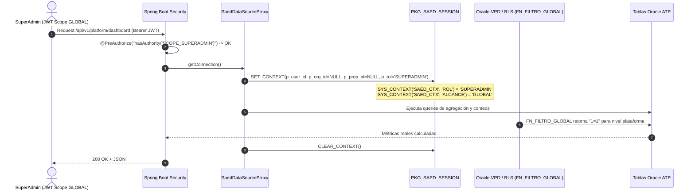

# SAED 2.0 — SUPERADMIN V1 RC1 FROZEN SPECIFICATION
## Documento de Cierre Formal y Congelamiento Arquitectónico

---

## 1. Declaración de Congelamiento (Architectural Freeze)

> [!IMPORTANT]
> **SUPERADMIN V1 RC1 = FROZEN**  
> El rol `SUPERADMIN`, sus controladores en `/api/v1/platform/*`, su modelo de scopes en Spring Security, sus políticas de aislamiento y sus vistas en frontend quedan formalmente **congelados** en su versión Release Candidate 1 (RC1). Cualquier requerimiento adicional deberá evaluarse como `SUPERADMIN V1.1`, `SUPERADMIN V2` o integrarse dentro del rol correspondiente.

---

## 2. Contrato Funcional (Functional Contract)

### 2.1 Definición
`SUPERADMIN` es el **Operador Global de la Plataforma SaaS SAED**. No es un administrador de edificio ni tiene relación jerárquica directa con la operación residencial cotidiana.

```
                      PLATAFORMA SAED SAAS
                               │
               ┌───────────────┴───────────────┐
               │                               │
         SUPERADMIN                      CLIENTES SAED
       (Scope: GLOBAL)                         │
     Dominio: Plataforma                       │
                                   ┌───────────┴───────────┐
                                   │                       │
                            ADMIN_ORGANIZACION      ADMIN_PROPIEDAD
                        (Scope: ORGANIZACION)     (Scope: PROPIEDAD)
                                   │                       │
                         Organización / Empresa     Copropiedad / Edificio
                                                           │
                                              ┌────────────┼────────────┐
                                              │            │            │
                                           PORTERO     RESIDENTE     PROVEEDOR
```

### 2.2 Capacidades Habilitadas (In-Scope)
- **Organizaciones SaaS:** Alta, edición, activación y suspensión de empresas administradoras y constructoras.
- **Catálogo Global de Propiedades:** Visualización consolidada de copropiedades en modo lectura.
- **Planes y Tarifas SaaS:** Gestión de planes comerciales, límites de propiedades, unidades, usuarios y almacenamiento en tabla `PLANES`.
- **Membresías SaaS:** Control de suscripciones, vigencias y estados (`ACTIVA`, `PRUEBA`, `SUSPENDIDA`) en tabla `MEMBRESIAS`.
- **Operadores de Plataforma:** Alta de administradores globales con hash BCrypt y protección del último `SUPERADMIN` activo.
- **Pista de Auditoría Global:** Consulta de eventos append-only de seguridad y mutaciones en `AUDITORIA_LOG`.
- **Métricas Globales (MRR):** Monitoreo en tiempo real de ingresos recurrentes mensuales calculados directamente en Oracle ATP.

### 2.3 Operaciones Terminantemente Excluidas (Out-of-Scope — 403 Forbidden)
- Gestión de habitantes o residentes de edificios individuales.
- Registro y control de visitas, portería y correspondencia.
- Emisión, cobro o gestión de sanciones y multas de copropiedad.
- Emisión y cobro de cuotas de administración residenciales.
- Gestión de contratos locales, pólizas y proveedores de edificio.
- Creación, respuesta o atención de tickets PQRS de copropiedad.
- Control de parqueaderos, vehículos o accesos físicos de un edificio.

---

## 3. Contrato de Seguridad y Scopes (Security Contract)

### 3.1 Scopes Reales del Sistema

| Rol en Base de Datos | Authorities Spring Security Asignadas | Alcance (`SCOPE`) | Contexto Oracle Session |
| :--- | :--- | :--- | :--- |
| `SUPERADMIN` | `ROLE_SUPERADMIN`, `SCOPE_SUPERADMIN`, `SCOPE_GLOBAL` | `GLOBAL` | `SET_CONTEXT(user_id, NULL, NULL, 'SUPERADMIN')` |
| `ADMIN_ORGANIZACION` | `ROLE_ADMIN_ORGANIZACION`, `SCOPE_ADMIN_ORGANIZACION` | `ORGANIZACION` | `SET_CONTEXT(user_id, org_id, NULL, 'ADMIN_ORGANIZACION')` |
| `ADMIN_PROPIEDAD` | `ROLE_ADMIN_PROPIEDAD`, `SCOPE_ADMIN_PROPIEDAD` | `PROPIEDAD` | `SET_CONTEXT(user_id, org_id, prop_id, 'ADMIN_PROPIEDAD')` |
| `PORTERO` | `ROLE_PORTERO`, `SCOPE_PORTERO` | `PROPIEDAD` | `SET_CONTEXT(user_id, org_id, prop_id, 'PORTERO')` |
| `RESIDENTE` | `ROLE_RESIDENTE`, `SCOPE_RESIDENTE` | `UNIDAD` | `SET_CONTEXT(user_id, org_id, prop_id, 'RESIDENTE')` |

### 3.2 Reglas Inviolables de Autorización
1. **Zero-Trust Token:** `JwtAuthenticationFilter` no inyecta scopes subordinados sintéticos al `SUPERADMIN`.
2. **Protección del Último Operador:** Es imposible desactivar o bloquear al último `SUPERADMIN` activo (`PlatformAdminsController` responde `409 CONFLICT`).
3. **Trigger de Validación:** `TRG_ASIGNACION_VALIDA_SCOPE` en Oracle ATP impide insertar o modificar asignaciones de rol `GLOBAL` asociándoles un `ID_ORGANIZACION`, `ID_PROPIEDAD` o `ID_UNIDAD`.

---

## 4. Contrato de API de Plataforma (Platform API Contract)

Todos los endpoints bajo `/api/v1/platform/*` requieren de forma obligatoria la autoridad `SCOPE_SUPERADMIN`.

### 4.1 Endpoints Certificados

| Método | Endpoint | Propósito | Entidades Oracle | Auditoría AOP |
| :--- | :--- | :--- | :--- | :--- |
| `GET` | `/api/v1/platform/dashboard` | KPIs de organizaciones, propiedades, usuarios, MRR y salud del sistema. | `ORGANIZACIONES`, `PROPIEDADES`, `USUARIOS`, `MEMBRESIAS`, `PLANES` | Consulta |
| `GET` | `/api/v1/platform/plans` | Lista todos los planes comerciales SaaS ordenados por precio. | `PLANES` | Consulta |
| `GET` | `/api/v1/platform/plans/{id}` | Detalle de un plan comercial específico. | `PLANES` | Consulta |
| `POST` | `/api/v1/platform/plans` | Crea un nuevo plan comercial con límites y capacidades. | `PLANES` | `CREATE` / `PLAN_SAAS` |
| `PUT` | `/api/v1/platform/plans/{id}` | Actualiza nombre, descripción, precio o límites de un plan. | `PLANES` | `UPDATE` / `PLAN_SAAS` |
| `GET` | `/api/v1/platform/memberships` | Lista todas las membresías con nombres de organización y plan. | `MEMBRESIAS`, `ORGANIZACIONES`, `PLANES` | Consulta |
| `GET` | `/api/v1/platform/memberships/{id}` | Detalle de membresía específica. | `MEMBRESIAS` | Consulta |
| `POST` | `/api/v1/platform/memberships` | Asigna suscripción a una organización (desactiva previas). | `MEMBRESIAS` | `CREATE` / `MEMBRESIA_SAAS` |
| `PUT` | `/api/v1/platform/memberships/{id}/estado` | Cambia estado de membresía (`ACTIVA`, `SUSPENDIDA`). | `MEMBRESIAS` | `UPDATE` / `MEMBRESIA_SAAS` |
| `GET` | `/api/v1/platform/admins` | Lista todos los operadores `SUPERADMIN` con nivel. | `USUARIOS`, `PERSONAS`, `ADMINISTRADORES_SAED` | Consulta |
| `POST` | `/api/v1/platform/admins` | Registra nuevo operador global con contraseña BCrypt. | `PERSONAS`, `USUARIOS`, `ADMINISTRADORES_SAED`, `USUARIO_ASIGNACIONES` | `CREATE` / `ADMIN_PLATAFORMA` |
| `PUT` | `/api/v1/platform/admins/{id}/estado` | Activa/desactiva operador (con protección del último activo). | `USUARIOS`, `ADMINISTRADORES_SAED` | `UPDATE` / `ADMIN_PLATAFORMA` |
| `GET` | `/api/v1/organizations` | Lista todas las organizaciones clientes. | `ORGANIZACIONES` | Consulta |
| `POST` | `/api/v1/organizations` | Registra una nueva organización cliente. | `ORGANIZACIONES` | `CREATE` / `ORGANIZACION` |
| `GET` | `/api/v1/audit` | Consulta eventos de auditoría append-only con filtros. | `AUDITORIA_LOG` | Consulta |

---

## 5. Contrato de Base de Datos y Oracle RLS (Oracle / RLS Contract)



---

## 6. Contrato de Auditoría (Audit Contract)

- Toda mutación sensible ejecutada por `SUPERADMIN` está anotada con `@Auditable` e interceptada por `AuditAspect`.
- Se genera un registro inmutable en `AUDITORIA_LOG` con Correlation ID, IP de origen, usuario, timestamp y payload JSON.
- **Constraints de Integridad Cumplidos:**
  - `CK_AUDITORIA_JSON_NEW`: Formato JSON estructurado y válido.
  - `CK_AUDITORIA_ACCION`: Acciones semánticas autorizadas (`CREATE`, `UPDATE`, `DELETE`, `LOGIN`, `LOGOUT`).

---

## 7. Contrato de Frontend y Design System

- **Stack:** React 18 + Vite 5 + Tailwind CSS + Lucide Icons / Material Symbols + shadcn/ui + Radix UI.
- **Directrices de UI/UX:** Cumple la especificación `.agents/skills/saed-frontend-design/SKILL.md`.
- **Componentes Base:**
  - `Dialog`, `DialogContent`, `DialogHeader`, `DialogTitle`, `DialogFooter` (`dialog.tsx`) para modales accesibles con trampa de foco y navegación por teclado (ESC, Tab).
  - `Card`, `CardHeader`, `CardTitle`, `CardContent`, `CardDescription`, `CardFooter` (`card.tsx`).
  - `Badge` (`badge.tsx`) y `Button` (`button.tsx`).
  - `Skeleton` (`skeleton.tsx`) para estados de carga consistentes.
- **Páginas de Consola:**
  - `SuperAdminDashboardPage.jsx`
  - `SuperAdminOrganizacionesPage.jsx`
  - `SuperAdminPlanesPage.jsx`
  - `SuperAdminMembresiasPage.jsx`
  - `SuperAdminAdminsPage.jsx`
  - `SuperAdminAuditoriaPage.jsx`

---

## 8. Certificación de Calidad y Pruebas

- **Backend Test Suite:** **170 de 170 pruebas ejecutadas en verde** (`BUILD SUCCESS`).
- **SuperAdmin Adversarial Test Suite:** **24 de 24 pruebas adversariales superadas** en `SuperAdminAdversarialAuthorizationTest.java`.
- **Frontend Build:** `npm run build` genera bundle de producción limpio en 6.3s con 0 errores.
